# Caching in System Design

## Table of Contents
1. [Introduction](#introduction)
2. [What is Caching?](#what-is-caching)
3. [Why Caching is Critical](#why-caching-is-critical)
4. [Cache Hierarchy](#cache-hierarchy)
5. [Cache Performance Metrics](#cache-performance-metrics)
6. [When to Use Caching](#when-to-use-caching)
7. [When NOT to Use Caching](#when-not-to-use-caching)
8. [Cache Architecture Patterns](#cache-architecture-patterns)
9. [Common Caching Challenges](#common-caching-challenges)
10. [Best Practices](#best-practices)

---


## Introduction

**Caching** is one of the most important techniques in system design. Think of it as keeping frequently used items close at hand rather than fetching them from far away every time.

**In System Design**:
- Caching stores copies of data in fast-access storage
- Reduces the need to query slow data sources (databases, APIs)
- Dramatically improves application performance and scalability 

---

## What is Caching?

**Caching** is temporarily storing copies of data in a fast-access location so future requests for that data can be served quickly.

### Core Concept: Cache Hit vs Cache Miss


**Key Terms**:
- **Cache Hit**: Data found in cache (fast ⚡)
- **Cache Miss**: Data not in cache, must fetch from source (slow 🐌)
- **Hit Rate**: Percentage of requests served from cache (higher is better)

### Types of Caches by Location
1. **Client-Side Cache**: Browser, mobile app, or desktop cache (outside Java scope)
2. **CDN Cache**: Edge servers for static content
3. **Application-Level Cache (Local / L1)**: In-memory cache within the JVM (e.g., Caffeine, Guava)
4. **Distributed Cache (L2)**: Shared cache across JVMs (e.g., Redis, Hazelcast, Memcached)
5. **Database Cache**: Query result cache, buffer pool (e.g., MySQL Query Cache)
6. **CPU Cache**: Hardware-level (L1/L2/L3)

---

## Why Caching is Critical

### Performance Benefits
- **Reduced Latency:** Memory access (tens of nanoseconds) vs. disk (milliseconds) or network (10–100ms+)
- **Higher Throughput:** Serve more requests per node, reduce pressure on downstream systems
- **Improved User Experience:** Faster page loads, snappier APIs

### Cost & Resource Benefits
- **Lower Database Load:** 80–90% reduction in DB queries is common
- **Reduced Backend Calls:** Fewer microservice or third-party API calls
- **Lower Infra Costs:** More traffic per server, less need for DB scaling
- **Network Bandwidth Savings:** Especially with CDN and edge caching

### Scalability Benefits
- **Horizontal Scaling:** Caching lets you scale stateless app servers, not stateful DBs
- **Traffic Spike Handling:** Absorb sudden spikes (e.g., Black Friday)
- **Bottleneck Prevention:** DB is often the bottleneck; caching shifts the load


### Real-World Impact
```
Without Cache:
- Request → DB query (50ms)
- 1000 req/s → 50,000ms DB load → Database overload

With Cache (95% hit rate):
- 950 requests → Cache (1ms) = 950ms
- 50 requests → DB (50ms) = 2,500ms
- Total: 3,450ms vs 50,000ms (14x improvement)
```

---

## Cache Hierarchy

**Concept**: Modern systems use multiple cache layers, each with different speed, scope, and purpose.

```mermaid
graph TD
    User[User Request] --> Browser[Browser Cache<br/>📱 Fastest: 0ms<br/>Scope: Single user]
    Browser --> CDN[CDN/Edge Cache<br/>🌐 Very Fast: 10-50ms<br/>Scope: Geographic region]
    CDN --> L1[L1: Local Cache<br/>💾 Fast: 0.1-1ms<br/>Scope: Single server]
    L1 --> L2[L2: Distributed Cache<br/>🔄 Medium: 1-5ms<br/>Scope: All servers]
    L2 --> DB[(Database<br/>🗄️ Slow: 50-100ms<br/>Scope: Source of truth)]
```



### Cache Layers Explained

| Layer | Location | Speed | Shared? | Use Case |
|-------|----------|-------|---------|----------|
| **Browser** | Client device | Instant | No | Static assets, images |
| **CDN** | Edge servers | Very Fast | Regional | Static content, media |
| **L1 (Local)** | App memory | Fast | No | Hot data, per-instance |
| **L2 (Distributed)** | External server | Medium | Yes | Shared data, sessions |
| **Database** | Storage | Slow | Yes | Source of truth |

**Why Multiple Layers?**
- **Speed**: Closer cache = faster response
- **Resilience**: If one layer fails, others can serve requests
- **Efficiency**: Hot data stays in faster caches
- **Cost**: Reduce load on expensive resources (database)

---


## Cache Performance Metrics

1. **Hit Rate / Hit Ratio**
   - $\text{Hit Rate} = \frac{\text{Cache Hits}}{\text{Total Requests}} \times 100\%$
   - 80–95%+ is excellent for read-heavy workloads
2. **Miss Rate**
   - $\text{Miss Rate} = 100\% - \text{Hit Rate}$
3. **Cache Latency**
   - Read: <1ms (in-memory), Write: depends on backend
4. **Eviction Rate**
   - $\text{Eviction Rate} = \frac{\text{Items Evicted}}{\text{Time Period}}$
   - High rate = cache too small or poor key design
5. **Memory Utilization**
   - $\text{Memory Usage} = \frac{\text{Used Memory}}{\text{Total Cache Size}} \times 100\%$
6. **Throughput**
   - Requests/sec handled by cache (Redis: 100K+ ops/sec)

---


## When to Use Caching

### Ideal Use Cases
1. **Read-Heavy Workloads** (Read:Write > 10:1)
   - Product catalogs, user profiles, news feeds
2. **Expensive Computations**
   - Aggregations, analytics, ML predictions
3. **Frequently Accessed Data**
   - Hot keys (80/20 rule)
4. **Slow Data Sources**
   - Third-party APIs, legacy systems
5. **Static or Slowly Changing Data**
   - Config, reference data
6. **Rate-Limited APIs**
   - Avoid hitting limits, reduce costs

#### Data Characteristics
- High read frequency, low write frequency
- Predictable access patterns
- Acceptable staleness
- Reasonable size (KBs–MBs per item)

---

## When NOT to Use Caching

### Anti-Patterns
1. **Highly Dynamic Data:** Changes every request (e.g., real-time stock prices)
2. **Write-Heavy Workloads:** Write:Read > 1:1, constant invalidation
3. **Large, Infrequently Accessed Data:** Wastes memory
4. **Strong Consistency Requirements:** E.g., financial transactions, inventory
5. **Personalized, Unique Data:** Low hit rate, e.g., per-user dashboards
6. **Sensitive Data Without Security:** PII, payment info, compliance data

---


## Cache Architecture Patterns

### 1. Cache-Aside (Lazy Loading)
**Most common pattern in Java microservices**


- **Pros:** Simple, on-demand loading
- **Cons:** Miss penalty, possible stale data

---

### 2. Read-Through Cache
**Concept**: Cache automatically loads data from database on miss.

- **Pros:** Transparent to app, cache manages loading
- **Cons:** Miss penalty, more complex cache layer
- **When to use:** Standard CRUD apps, automatic cache population

---

### 3. Write-Through Cache
**Concept**: Writes go to cache and database synchronously.

- **Pros:** Cache always consistent with DB
- **Cons:** Write latency (both cache + DB)
- **When to use:** When consistency is critical

---

### 4. Write-Behind (Write-Back)
**Concept**: Writes update cache immediately, database updated asynchronously.

- **Pros:** Fast writes, write coalescing possible
- **Cons:** Risk of data loss if cache fails
- **When to use:** High write throughput, eventual consistency acceptable

---

### 5. Refresh-Ahead
**Concept**: Proactively refresh popular data before it expires.

- **Pros:** No cache miss penalty for hot data
- **Cons:** Wasted refreshes for cold data
- **When to use:** Predictable access patterns, read-heavy workloads

---


## Common Caching Challenges

### 1. Cache Stampede (Thundering Herd)

```mermaid
flowchart LR
    A[Popular Key Expires] --> B[1000 Requests<br/>Arrive at Once]
    B --> C[All Miss Cache]
    C --> D[All Query Database]
    D --> E[💥 Database Overload]
```


**Problem**: When a popular cache entry expires, many requests hit the database simultaneously.

**Solutions**:
- **Request Coalescing**: Only first request loads data, others wait
- **Probabilistic Refresh**: Refresh before expiration
- **Never Expire**: Keep refreshing hot keys

---

### 2. Cache Penetration

```mermaid
flowchart LR
    A[Request Invalid ID] --> B{In Cache?}
    B -->|No| C[Query Database]
    C --> D[Not Found]
    D --> E[Repeat for<br/>Every Request]
    E --> F[💥 DB Overload]
```


**Problem**: Requests for non-existent data always bypass cache and hit the database.

**Solutions**:
- **Cache Null Results**: Store "not found" with short TTL
- **Bloom Filter**: Quick check if data might exist
- **Request Validation**: Validate before querying

---

### 3. Cache Avalanche
**Problem**: Many cache keys expire at the same time, causing database spike.

**Solutions**:
- **Add TTL Jitter**: Randomize expiration times
- **Stagger Warming**: Don't load all data at once
- **High Availability**: Use cache clustering

---

### 4. Hot Key Problem
**Problem**: A single cache key receives excessive traffic, overwhelming that cache node.

**Solutions**:
- **Local Caching**: Cache hot keys in application memory
- **Replication**: Duplicate hot keys across multiple nodes
- **Sharding**: Distribute load across keys

---

### 5. Big Key Problem
**Problem**: Large cached values consume excessive memory and slow down operations.

**Solutions**:
- **Split Data**: Break large objects into smaller pieces
- **Compression**: Compress before caching
- **Size Limits**: Set maximum value size

---

### 6. Cache Consistency
**Problem**: Cache contains stale data that doesn't match the database.

**Solutions**:
- **Proper TTLs**: Set appropriate expiration times
- **Invalidation**: Delete cache on updates
- **Event-Driven**: Use database change streams

---

### 7. Cold Start Problem
**Problem**: Empty cache after restart causes poor performance.

**Solutions**:
- **Cache Warming**: Pre-load popular data
- **Gradual Ramp-Up**: Slowly increase traffic
- **Persistent Cache**: Use Redis persistence

---


## Best Practices

### Design Principles

**1. Cache Only What Matters**
- Focus on frequently accessed data (80/20 rule)
- Monitor hit rates - aim for 80%+ 
- Don't cache everything "just in case"

**2. Set Appropriate TTLs**
- Dynamic data: Short TTL (minutes)
- Static data: Long TTL (hours/days)
- Add random jitter to prevent stampedes
- Example: TTL = 3600 + random(0, 300) seconds

**3. Use Consistent Key Naming**
- Pattern: `{namespace}:{entity}:{id}:{version}`
- Example: `user:profile:12345:v2`
- Benefits: Easy debugging, prevents collisions, enables bulk operations

**4. Graceful Degradation**

- System must work even if cache fails
- Always have a fallback to database
- Log cache failures for monitoring

**5. Monitor Cache Health**

Key metrics to track:
- **Hit Rate**: % of requests served from cache (target: 80%+)
- **Miss Rate**: % of requests that miss cache
- **Latency**: Response time (cache vs database)
- **Eviction Rate**: How often data is evicted
- **Memory Usage**: Cache capacity utilization
- **Error Rate**: Cache failures

**6. Size Appropriately**
- Formula: `Cache Size = Working Set × Safety Factor (1.5-2.0)`
- Working Set = Actively accessed data
- Too small = high miss rate
- Too large = wasted memory

**7. Choose Right Eviction Policy**
- **LRU** (Least Recently Used): Good for most cases
- **LFU** (Least Frequently Used): When frequency matters
- **TTL**: Time-based expiration
- **FIFO**: First in, first out (rarely used)

**8. Efficient Data Storage**
- Use compact serialization formats
- Compress large objects
- Set maximum value sizes
- Split large objects into chunks

**9. Circuit Breakers**
- Protect backend from cache failure cascades
- Automatically bypass cache if error rate is high
- Allow time for cache to recover

**10. Test Failure Scenarios**
- Simulate cache outages
- Test with cache disabled
- Verify fallback mechanisms work
- Use chaos engineering

---

### Security Considerations

**1. Encrypt Sensitive Data**
- Always encrypt data at rest and in transit
- Never cache unencrypted passwords or tokens

**2. Access Control**
- Restrict who can read/write cache
- Use separate caches for different tenants
- Implement authentication and authorization

**3. Avoid Caching Secrets**
- Don't cache passwords, API keys, or tokens
- If absolutely necessary: encrypt + very short TTL

**4. Data Privacy & Compliance**
- Support GDPR "right to be forgotten"
- Invalidate cache when user deletes account
- Be aware of data residency requirements

---


## Caching Decision Matrix

| Scenario            | Cache Type           | Pattern        | TTL           |
|---------------------|---------------------|----------------|---------------|
| User Profile        | Distributed         | Cache-Aside    | 1 hour        |
| Session Data        | Distributed         | Write-Through  | Session life  |
| Product Catalog     | CDN + Distributed   | Read-Through   | 24 hours      |
| API Rate Limiting   | Local               | Write-Through  | 1 minute      |
| Search Results      | Distributed         | Cache-Aside    | 5 minutes     |
| Configuration       | Local + Distributed | Read-Through   | 30 minutes    |
| Analytics Results   | Distributed         | Cache-Aside    | 12 hours      |
| Real-time Inventory | Don't Cache         | N/A            | N/A           |


---