# Local vs Distributed Cache

## Table of Contents
1. [Introduction](#introduction)
2. [Local Cache (L1 Cache)](#local-cache-l1-cache)
3. [Distributed Cache (L2 Cache)](#distributed-cache-l2-cache)
4. [Comparison Matrix](#comparison-matrix)
5. [When to Use Which](#when-to-use-which)
6. [Multi-Level Caching (L1 + L2)](#multi-level-caching-l1--l2)
7. [Implementation Examples](#implementation-examples)
8. [Common Pitfalls](#common-pitfalls)
9. [Best Practices](#best-practices)

---

## Introduction

**The Fundamental Question**: Where should cached data live?

When designing a caching strategy, one of the most important decisions is choosing between:
- **Local Cache (L1)**: Data stored in each application instance's memory
- **Distributed Cache (L2)**: Data stored in a shared external cache server
- **Both (Multi-Level)**: Combining local and distributed caching

**Simple Analogy**:
- **Local Cache** = Each student keeps notes in their own notebook
  - ✅ Fast access (no need to ask others)
  - ❌ Notes might be different/outdated between students

- **Distributed Cache** = Shared class notes in a common folder
  - ✅ Everyone sees the same notes
  - ❌ Need to walk to the folder (slower)

This decision impacts:
- ⚡ **Performance**: How fast can you access data?
- 🔄 **Consistency**: Is data the same everywhere?
- 📈 **Scalability**: How does it handle growth?
- 💰 **Cost**: Infrastructure and operational expenses

---

## Local Cache (L1 Cache)

### What is Local Cache?

**Local cache** stores data inside the application's own memory. Each application instance has its own separate cache.


**Key Point**: Each instance has its **own copy** of cached data. They don't share!

### Characteristics

| Aspect | Description |
|--------|-------------|
| 📍 **Location** | Inside application memory (same process) |
| 🎯 **Scope** | Single instance only |
| ⚡ **Speed** | Ultra-fast (0.1-1 microseconds) |
| 🌐 **Network** | None - direct memory access |
| 🔄 **Consistency** | Each instance has its own cache (can differ) |

---

### Advantages

#### 1. **Ultra-Low Latency**
- Direct memory access (no network calls)
- Typically, <100 nanoseconds
- 10-100x faster than distributed cache

#### 2. **No Network Overhead**
- Zero network latency
- No serialization/deserialization
- No connection pool management

#### 3. **High Throughput**
- Limited only by CPU and memory
- Can serve millions of requests per second
- No external dependency bottleneck

#### 4. **Simple Implementation**
- Easy to configure with size limits and TTL
- Automatic loading from data source on cache miss
- Built-in eviction policies and statistics

#### 5. **No External Dependencies**
- Works offline
- No Redis/Memcached to manage
- Simpler deployment

#### 6. **Cost-Effective**
- Uses existing application memory
- No additional infrastructure costs

---

### Disadvantages

#### 1. **Memory Constraints**
- Limited to application's allocated memory
- Competes with application logic for RAM
- Risk of running out of memory

#### 2. **Inconsistency Across Instances**

```mermaid
flowchart LR
    U[User Updates Name to Bob] --> I1
    
    subgraph I1[Instance 1]
        C1[Cache: Bob ✅]
    end
    
    subgraph I2[Instance 2]
        C2[Cache: Alice ❌ STALE]
    end
    
    subgraph I3[Instance 3]
        C3[Cache: Alice ❌ STALE]
    end
```



**Problem**: Each instance has its own cache. When data updates in one instance, others don't know about it!

#### 3. **Cache Warm-Up Per Instance**
- Each instance starts with an empty cache
- Deployment/restart = all caches cleared
- Initial requests are slow until cache warms up

#### 4. **Inefficient for Large Datasets**
- Same data duplicated across all instances
- Memory waste: 3 instances = 3 copies of same data

#### 5. **No Sharing Between Instances**
- Instance 1 caches data → Only Instance 1 benefits
- Instance 2 and 3 still have to fetch from database

#### 6. **Difficult Invalidation**
- Hard to invalidate cache across all instances
- No built-in way to notify other instances
- Leads to stale data problems

---

### Common Local Cache Technologies

**Concept**: In-memory data structures or libraries that store data within the application process.

**Examples by Language**:
- Java: Caffeine, Guava Cache, Ehcache
- Python: functools.lru_cache, cachetools
- Node.js: node-cache, memory-cache
- .NET: MemoryCache

**Key Features**:
- Size limits and eviction policies
- TTL (Time To Live) support
- Statistics tracking (hit rate, miss rate)
- Automatic loading on cache miss

---

## Distributed Cache (L2 Cache)

### What is Distributed Cache?

**Distributed cache** is a separate server that all application instances share. Think of it as a centralized storage that everyone can access.


**Key Point**: **Single shared cache** - all instances see the same data!

### Characteristics

| Aspect | Description |
|--------|-------------|
| 📍 **Location** | External server (Redis, Memcached) |
| 🎯 **Scope** | Shared across ALL instances |
| ⚡ **Speed** | Fast (1-5 milliseconds via network) |
| 🌐 **Network** | Required - adds latency |
| 🔄 **Consistency** | Single source of truth - all instances see same data |

---

### Advantages

#### 1. **Shared Across Instances**
- All instances see same cached data
- Efficient memory usage (single copy)
- One instance caches = all benefit

#### 2. **Consistency**
- Single source of truth
- Invalidation affects all instances immediately
- Reduces stale data issues

#### 3. **Scalable Storage**
- Not limited by application memory
- Can cache GBs or TBs of data
- Separate scaling of cache and application

#### 4. **Persistence Options**
- Redis supports RDB/AOF persistence
- Survive application restarts
- No cold start problem

#### 5. **Advanced Features**
- Complex data structures (Redis)
- Pub/Sub messaging
- Distributed locking
- Atomic operations across instances

#### 6. **Centralized Management**
- Monitor from single place
- Invalidation strategies easier
- Metrics and observability

---

### Disadvantages

#### 1. **Network Latency**
- 1-5ms per request (vs nanoseconds for local)
- Serialization/deserialization overhead
- Network can become bottleneck

#### 2. **Additional Infrastructure**
- Need to deploy and manage Redis/Memcached
- Operational complexity
- Additional costs

#### 3. **Single Point of Failure**
- If cache server down, all instances affected
- Requires high availability setup (Sentinel, Cluster)

#### 4. **Network Bandwidth**
- Large values consume network bandwidth
- Can saturate network with high traffic

#### 5. **Serialization Overhead**
```
Object  →  Serialize  →  Network  →  Deserialize  →  Object
            ~100μs                     ~100μs
```

#### 6. **Connection Management**
- Connection pooling required
- Connection limits
- Connection failures to handle


---

## Comparison Matrix

| Aspect | Local Cache (L1) | Distributed Cache (L2) | Winner |
|--------|------------------|----------------------|--------|
| ⚡ **Latency** | 0.1-1 μs | 1-5 ms | 🏆 Local |
| 🚀 **Throughput** | Millions/sec | 100K-1M/sec | 🏆 Local |
| 🌐 **Network Needed** | ❌ No | ✅ Yes | 🏆 Local |
| 🔄 **Consistency** | ❌ Per-instance | ✅ Shared | 🏆 Distributed |
| 💾 **Memory Capacity** | Limited (MBs) | Scalable (GBs) | 🏆 Distributed |
| 🛠️ **Complexity** | Low | Medium-High | 🏆 Local |
| 💰 **Cost** | Free | Infrastructure cost | 🏆 Local |
| 🗑️ **Invalidation** | Per-instance (hard) | Global (easy) | 🏆 Distributed |
| 🥶 **Cold Start** | Every restart | Persistent | 🏆 Distributed |
| 📤 **Data Sharing** | ❌ No | ✅ Yes | 🏆 Distributed |

**Summary**:
- **Local** wins on: Speed, Simplicity, Cost
- **Distributed** wins on: Consistency, Capacity, Sharing

---

## When to Use Which

### Use Local Cache When:

✅ **Read-heavy, rarely changing data**
- Configuration settings
- Reference data (country codes, currencies)
- Feature flags

✅ **Very high read frequency**
- 1000s of reads per second
- Sub-millisecond latency required

✅ **Small dataset**
- Can fit in application memory (MBs, not GBs)
- Won't cause memory pressure

✅ **Tolerate some inconsistency**
- Eventual consistency acceptable
- Stale data for short period OK

✅ **Minimal infrastructure**
- Want to avoid external dependencies
- Simple deployment

**Examples**:
- Product catalog (updated daily)
- User roles/permissions
- Geolocation data
- Currency exchange rates
- Translation strings

---

### Use Distributed Cache When:

✅ **Need consistency across instances**
- Shopping cart
- User sessions
- Inventory counts

✅ **Large dataset**
- Doesn't fit in single instance memory
- GBs of cached data

✅ **Shared state**
- Data accessed by multiple services
- Microservices architecture

✅ **Frequent updates**
- Data changes often
- Invalidation must affect all instances

✅ **Persistence required**
- Survive application restarts
- Avoid cold start issues

✅ **Complex data structures needed**
- Sorted sets, pub/sub, atomic operations
- Redis-specific features

**Examples**:
- User sessions (distributed)
- Rate limiting counters
- Real-time leaderboards
- Shopping carts
- API response caching
- User authentication tokens

---

## Multi-Level Caching (L1 + L2)

### The Best of Both Worlds

**Concept**: Use BOTH local and distributed caching together for optimal performance.

```mermaid
flowchart TD
    Request["⚡ Request"] --> L1{"L1: Local Cache<br/>(0.1-1 μs)"}
    L1 -->|HIT ✅| Return1["Return Data<br/>⚡ Ultra Fast"]
    L1 -->|MISS ❌| L2{"L2: Distributed Cache<br/>(1-5 ms)"}
    L2 -->|HIT ✅| PopL1["Populate L1"]
    PopL1 --> Return2["Return Data<br/>⚡ Fast"]
    L2 -->|MISS ❌| DB[("Database<br/>(50-100 ms)")]
    DB --> PopL2["Populate L2"]
    PopL2 --> PopL1_2["Populate L1"]
    PopL1_2 --> Return3["Return Data<br/>🐌 Slow"]
```



**Performance Tiers**:
1. **L1 Hit**: 0.1-1 microsecond ⚡⚡⚡ (Best)
2. **L2 Hit**: 1-5 milliseconds ⚡⚡ (Good)
3. **DB Query**: 50-100 milliseconds ⚡ (Acceptable)

---

### Benefits of Multi-Level Caching

1. **Performance**: L1 serves hot data at nanosecond speed
2. **Consistency**: L2 provides shared state
3. **Scalability**: L2 handles large datasets
4. **Resilience**: Layers provide fallback
5. **Cost Efficiency**: Reduce L2 traffic with L1

---

### Implementation Strategy

**Read Operation:**
```
function getData(key):
    // 1. Check L1 (local cache)
    data = localCache.get(key)
    if data exists:
        return data  // L1 hit - fastest
    
    // 2. Check L2 (distributed cache)
    try:
        data = distributedCache.get(key)
        if data exists:
            localCache.put(key, data)  // Populate L1
            return data  // L2 hit
    catch CacheError:
        log("L2 cache error")
    
    // 3. Database query
    data = database.query(key)
    if data exists:
        // Populate both caches
        try:
            distributedCache.set(key, data, TTL)  // L2
        catch CacheError:
            log("Failed to update L2")
        localCache.put(key, data)  // L1
    
    return data
```

**Write/Invalidation:**
```
function invalidate(key):
    // 1. Invalidate local cache
    localCache.delete(key)
    
    // 2. Invalidate distributed cache
    distributedCache.delete(key)
    
    // 3. Publish invalidation event for other instances
    distributedCache.publish("cache:invalidate", key)
```

---

### L1 + L2 Invalidation with Pub/Sub

**Challenge**: When one instance invalidates, others must clear their L1 cache.

**Solution**: Use Redis Pub/Sub

```
// Instance A - Publishes invalidation
function invalidate(key):
    localCache.delete(key)           // 1. Clear own L1
    distributedCache.delete(key)     // 2. Clear L2
    publish("cache:invalidate", key) // 3. Notify others

// Instance B, C, D - Subscribe to invalidations
function onInvalidationMessage(key):
    localCache.delete(key)  // Clear L1 when notified

// Flow:
Instance A: invalidate("user:123")
    ↓
Redis Pub/Sub: "cache:invalidate" → "user:123"
    ↓
Instance B, C, D: Receive message → Clear L1
```

**Benefits:**
- Immediate propagation across all instances
- L1 caches stay synchronized
- Prevents stale data

---

### Configuration Guidelines

**L1 Cache (Local)**:
- Small size (1K-100K entries)
- Short TTL (1-10 minutes)
- Very hot data only

**L2 Cache (Distributed)**:
- Larger size (100K-millions of entries)
- Longer TTL (10 minutes to hours)
- Shared data

**Example**:
```
L1: 10K entries, 5-minute TTL
L2: 1M entries, 1-hour TTL
```

---

## Implementation Examples

### Multi-Level Cache Configuration

**L1 (Local) Configuration:**
- Maximum size: 10,000 entries
- TTL: 5 minutes
- Eviction: LRU (Least Recently Used)
- Statistics: Enabled for monitoring

**L2 (Distributed) Configuration:**
- Connection pool: 128 max connections
- Timeout: 2 seconds
- Retry: 3 attempts
- Persistence: Enabled (Redis RDB/AOF)

**Service Implementation Pattern:**
```
function getProduct(id):
    // Try L1
    product = localCache.get(id)
    if product exists:
        return product
    
    // Try L2
    try:
        json = redis.get("product:" + id)
        if json exists:
            product = deserialize(json)
            localCache.put(id, product)
            return product
    catch RedisError:
        log("Redis error, continuing...")
    
    // Query database
    product = database.findById(id)
    if product exists:
        localCache.put(id, product)
        try:
            redis.setex("product:" + id, 3600, serialize(product))
        catch RedisError:
            log("Failed to cache in Redis")
    
    return product
```

---

## Common Pitfalls

### 1. Over-Caching with Local Cache
**Problem**: Caching too much data locally causes OutOfMemoryError

**Solution**:
- Set reasonable size limits
- Monitor heap usage
- Use bounded caches (Caffeine with `maximumSize`)

---

### 2. Inconsistent L1 Caches
**Problem**: Different instances have different cached values

**Solution**:
- Short TTLs on L1
- Pub/Sub invalidation
- Accept eventual consistency

---

### 3. Not Handling Distributed Cache Failures
**Problem**: Redis down = all requests fail

**Solution**:
```
try:
    return distributedCache.get(key)
catch CacheError:
    log("Cache down, falling back to database")
    return database.get(key)
```

---

### 4. Serialization Overhead
**Problem**: Slow serialization/deserialization to Redis

**Solution**:
- Use efficient formats (Protocol Buffers, MessagePack)
- Keep objects small
- Consider compression for large objects

---

### 5. Cache Stampede on L2 Miss
**Problem**: Many instances hit database when L2 key expires

**Solution**:
- Distributed locking
- Single-flight pattern (only one instance loads)

---

### 6. Not Setting TTLs
**Problem**: Cache grows indefinitely, never cleans up

**Solution**:
- Always set TTL on distributed cache
- Use eviction policies

---

## Best Practices

### 1. Layer by Access Pattern
```
L1: Ultra-hot, stable data (config, reference)
L2: Hot, shared data (products, users)
DB: Source of truth
```

### 2. Different TTLs per Layer
```
L1 TTL: 1-5 minutes (shorter)
L2 TTL: 30-60 minutes (longer)
```

### 3. Monitor Both Layers
**L1 Metrics:**
- Hit rate / miss rate
- Eviction count
- Memory usage
- Load time

**L2 Metrics:**
- Hit rate / miss rate
- Connection pool usage
- Network latency
- Error rate

### 4. Graceful Degradation
```
L1 miss → L2
L2 miss → Database
L2 error → Database
Database error → Return error
```

### 5. Size Appropriately
```
L1: 1-10% of L2 size
L2: 10-30% of database working set
```

### 6. Invalidation Strategy
```
Immediate: Delete from both L1 and L2
Pub/Sub: Notify other instances
TTL: Let it expire naturally
```

### 7. Test Failure Scenarios
- L2 cache down
- Network partition
- Serialization errors
- Memory pressure

---

## Decision Tree

```mermaid
flowchart TD
    Start(["Do I need caching?"]) --> NeedCache{Need Cache?}
    NeedCache -->|No| NoCacheNeeded["Direct Database Access"]
    NeedCache -->|Yes| Shared{"Data shared<br/>across instances?"}
    
    Shared -->|Yes| L2["✅ Use Distributed Cache (L2)"]
    L2 --> UltraHot{"Ultra-hot<br/>data?"}
    UltraHot -->|Yes| L1L2["✅ Add Local Cache<br/>(L1 + L2)"]
    UltraHot -->|No| L2Final["Use L2 Only"]
    
    Shared -->|No| FitMemory{"Fits in<br/>memory?"}
    FitMemory -->|Yes| L1Only["✅ Use Local Cache (L1)"]
    FitMemory -->|No| L2Alt["✅ Use Distributed Cache (L2)"]
    
    Start2(["Consistency critical?"]) --> Consistency{Critical?}
    Consistency -->|Yes| L2Consist["Use L2 Only"]
    Consistency -->|No| L1orBoth["L1 or L1+L2"]
```



---

## Key Takeaways

1. **Local cache** is fastest but inconsistent across instances
2. **Distributed cache** is slower but provides consistency
3. **Multi-level caching** combines benefits of both
4. **Choose based on**: consistency needs, dataset size, access patterns
5. **L1 for**: hot, stable data with high read frequency
6. **L2 for**: shared state, large datasets, consistency requirements
7. **Monitor metrics** to validate caching effectiveness
8. **Plan for failures** at each layer

---