# Redis Basics for System Design

## Table of Contents
1. [Introduction](#introduction)
2. [What is Redis?](#what-is-redis)
3. [Core Features](#core-features)
4. [Data Structures](#data-structures)
5. [Persistence Options](#persistence-options)
6. [Redis Architecture](#redis-architecture)
7. [Replication and High Availability](#replication-and-high-availability)
8. [Performance Characteristics](#performance-characteristics)
9. [Common Use Cases](#common-use-cases)
10. [Best Practices](#best-practices)
11. [Redis vs Memcached](#redis-vs-memcached)

---

## Introduction

**Redis** is the most popular distributed cache and in-memory data store in modern system design.

**Simple Analogy**:
Think of Redis as a super-fast notepad that lives in your computer's RAM. Instead of walking to a filing cabinet (database) every time you need information, you check this notepad first. It's much faster!

**Why Redis Matters**:
- ⚡ **Speed**: Retrieves data in less than 1 millisecond
- 🔄 **Shared**: All your application instances can use the same Redis
- 💾 **Persistent**: Unlike RAM, it can save data to disk
- 🛠️ **Versatile**: More than just cache - can be database, message queue, etc.

---

## What is Redis?

**Redis** (Remote Dictionary Server) is an in-memory data store that can be used for multiple purposes:

```mermaid
graph TD
    Redis[Redis Server]
    
    Redis --> Cache["💾 Cache<br/>Fast data access"]
    Redis --> DB["🗄️ Database<br/>Primary data store"]
    Redis --> Broker["📨 Message Broker<br/>Pub/Sub & Streaming"]
    Redis --> Session["🔑 Session Store<br/>User sessions"]
```



### Key Characteristics

| Feature | Description | Benefit |
|---------|-------------|----------|
| 🧠 **In-Memory** | All data in RAM | Ultra-fast access |
| 💾 **Persistent** | Optional disk saving | Data survives restarts |
| 🎯 **Single-Threaded** | One command at a time | No race conditions |
| ⚛️ **Atomic** | Operations complete fully | Data consistency |
| 📦 **Rich Data Types** | Lists, Sets, Hashes, etc. | Beyond key-value |

### Performance Numbers

```
Throughput:  100,000+ operations/second (single instance)
Latency:     < 1 millisecond (typically 0.1-0.5ms)
Memory:      Limited only by available RAM
```

---

## Core Features

### 1. In-Memory Storage

**Why In-Memory is Fast**:
```
Speed Comparison:
📊 RAM access:    ~100 nanoseconds   ⚡⚡⚡
📊 SSD access:    ~100 microseconds  ⚡⚡ (1,000x slower)
📊 HDD access:    ~10 milliseconds   ⚡  (100,000x slower)
```

**Concept**: Redis stores everything in RAM (memory), which is much faster than disk storage.

---

### 2. Key-Value Store

**Concept**: Store and retrieve data using a unique key (like a dictionary).

```redis
SET user:1000:name "John Doe"    # Store
GET user:1000:name                # Retrieve
> "John Doe"
```

**Analogy**: Like a locker system - use the locker number (key) to store/retrieve your belongings (value).

---

### 3. Expiration (TTL - Time To Live)

**Concept**: Data automatically deletes itself after a specified time.

```redis
SET session:abc123 "user_data" EX 3600  # Expires in 1 hour
TTL session:abc123                       # Check remaining time
> 3600  # Seconds remaining
```

**Use Cases**:
- Session data (expire after logout)
- Temporary cache (refresh periodically)
- Rate limiting (reset after time window)

---

### 4. Atomic Operations

**Concept**: Operations complete fully or not at all - no partial updates.

**Why it Matters**:
- No data corruption
- No race conditions
- Safe for concurrent access

**Example**: If incrementing a counter, it can't be half-incremented.

---

### 5. Pub/Sub Messaging

**Concept**: Publish messages to channels; subscribers receive them in real-time.

```redis
# Publisher
PUBLISH news:tech "Breaking: New feature released"

# Subscriber  
SUBSCRIBE news:tech
```

**Use Cases**:
- Real-time notifications
- Chat applications
- Event broadcasting

---

## Data Structures

**Redis is NOT just a cache** - it's a data structure server offering 5+ powerful types.

```mermaid
graph LR
    Redis["Redis<br/>Data Structures"] --> Strings["Strings<br/>📦 Simple values"]
    Redis --> Hashes["Hashes<br/>🗂️ Objects/Maps"]
    Redis --> Lists["Lists<br/>📋 Ordered sequences"]
    Redis --> Sets["Sets<br/>🎨 Unique items"]
    Redis --> Sorted["Sorted Sets<br/>🏆 Scored rankings"]
```



---

### 1. 📦 **Strings** - Simple Key-Value

**Concept**: The most basic type - a key maps to a single value.

**Commands**:
```redis
SET user:name "Alice"        # Store string
GET user:name                # Retrieve string
> "Alice"

INCR page:views              # Atomic increment
INCRBY page:views 5          # Increment by 5
DECR counter                 # Atomic decrement

APPEND message "Hello"       # Append to string
APPEND message " World"
GET message
> "Hello World"

SETEX session:abc 3600 data  # Set with expiry (1 hour)
```

**Use Cases**:

| Use Case | Example | Why Strings? |
|----------|---------|-------------|
| Simple caching | `product:123` → JSON data | Fast storage/retrieval |
| Counters | `page:views` | Atomic INCR/DECR |
| Session tokens | `session:xyz` | Quick lookup |
| Rate limiting | `rate:user:123:minute` | TTL + counter |
| Feature flags | `feature:dark_mode` → "enabled" | Simple on/off |

**Limits**: Max size 512 MB per value

---

### 2. 🗂️ **Hashes** - Objects/Maps

**Concept**: Store multiple field-value pairs under one key. Think of it as a mini-database table.

**Analogy**: Like a JavaScript object or Python dictionary.

```redis
# Store user as object
HSET user:1000 name "Alice" email "alice@example.com" age 30 city "NYC"

# Get single field
HGET user:1000 name
> "Alice"

# Get all fields
HGETALL user:1000
> 1) "name"    2) "Alice"
> 3) "email"   4) "alice@example.com"
> 5) "age"     6) "30"
> 7) "city"    8) "NYC"

# Update single field
HSET user:1000 age 31

# Atomic increment on field
HINCRBY user:1000 age 1

# Check if field exists
HEXISTS user:1000 phone
> 0  # False

# Delete field
HDEL user:1000 city
```

**Why use Hashes instead of multiple Strings?**

```mermaid
flowchart LR
    subgraph "Multiple Strings ❌ Less Efficient"
    K1[user:1000:name] --> V1[Alice]
    K2[user:1000:email] --> V2[alice@...]
    K3[user:1000:age] --> V3[30]
    end
    
    subgraph "Hash ✅ More Efficient"
    Key[user:1000] --> Hash["name: Alice<br/>email: alice@...<br/>age: 30"]
    end
```

**Advantages**:
- 📏 **Memory efficient**: less memory than separate strings
- ⚡ **Partial updates**: Change one field without reading all
- 🎯 **Semantic clarity**: All user data under `user:1000`
- 🔒 **Atomic operations**: HINCRBY for counters

**Use Cases**:

| Use Case | Example | Why Hashes? |
|----------|---------|-------------|
| User profiles | `user:{id}` | Multiple attributes |
| Product details | `product:{sku}` | Price, name, stock, etc. |
| Shopping carts | `cart:{session}` | Item quantities |
| Configuration | `config:app` | Multiple settings |
| Real-time stats | `stats:daily` | Views, clicks, conversions |

---

### 3. 📋 **Lists** - Ordered Sequences

**Concept**: Doubly-linked list for fast head/tail operations.

**Analogy**: Like a queue or timeline - items in specific order.

```redis
# Add to head (left)
LPUSH queue:tasks "task1"
LPUSH queue:tasks "task2"

# Add to tail (right)
RPUSH queue:tasks "task3"

# View list (without removing)
LRANGE queue:tasks 0 -1
> 1) "task2"   # Head
> 2) "task1"
> 3) "task3"   # Tail

# Remove from head
LPOP queue:tasks
> "task2"

# Remove from tail
RPOP queue:tasks
> "task3"

# Keep only first 100 items (trim)
LTRIM queue:tasks 0 99

# Blocking pop (wait for item)
BLPOP queue:tasks 5  # Wait up to 5 seconds
```

**Common Patterns**:


**Use Cases**:

| Use Case | Pattern | Commands |
|----------|---------|----------|
| Message queue | FIFO | RPUSH + LPOP |
| Activity feed | Recent items | LPUSH + LRANGE 0 99 |
| Task processing | Queue | RPUSH + BLPOP |
| Notifications | Recent 50 | LPUSH + LTRIM 0 49 |
| Log rotation | Capped list | LPUSH + LTRIM |

**Performance**: 
- ⚡ O(1) for PUSH/POP (head/tail)
- 🐌 O(N) for access by index

---

### 4. 🎨 **Sets** - Unique Collections

**Concept**: Unordered collection of unique strings. No duplicates!

**Commands**:
```redis
# Add members (duplicates ignored)
SADD tags:post:1 "redis" "caching" "database"
SADD tags:post:1 "redis"  # Ignored - already exists

# Check membership
SISMEMBER tags:post:1 "redis"
> 1  # True

# Get all members
SMEMBERS tags:post:1
> 1) "redis"  2) "caching"  3) "database"

# Count members
SCARD tags:post:1
> 3

# Remove member
SREM tags:post:1 "caching"

# Random member (useful for sampling)
SRANDMEMBER tags:post:1
```

**Set Operations** (🔥 Powerful!):

```redis
SADD users:online "alice" "bob" "charlie"
SADD users:premium "bob" "diana"

# Intersection (common members)
SINTER users:online users:premium
> 1) "bob"

# Union (all members)
SUNION users:online users:premium
> 1) "alice"  2) "bob"  3) "charlie"  4) "diana"

# Difference (in first set but not second)
SDIFF users:online users:premium
> 1) "alice"  2) "charlie"
```


**Use Cases**:

| Use Case | Example | Why Sets? |
|----------|---------|----------|
| Tags/labels | `tags:article:123` | Unique, no order needed |
| Unique visitors | `visitors:2024-01-17` | Deduplication |
| Friend relationships | `friends:user:123` | Quick membership check |
| Permissions | `permissions:role:admin` | Set operations |
| IP blocking | `blocked:ips` | Fast lookup |

---

### 5. 🏆 **Sorted Sets** - Scored Rankings

**Concept**: Like Sets, but each member has a **score**. Auto-sorted by score!

**Analogy**: Leaderboard where each player has a score.

```redis
# Add members with scores
ZADD leaderboard 100 "alice" 200 "bob" 150 "charlie"

# Get top 3 (highest scores)
ZREVRANGE leaderboard 0 2 WITHSCORES
> 1) "bob"      2) "200"
> 3) "charlie"  4) "150"
> 5) "alice"    6) "100"

# Get bottom 3 (lowest scores)
ZRANGE leaderboard 0 2 WITHSCORES

# Get rank (position)
ZRANK leaderboard "alice"
> 0  # 0-indexed position

# Get score
ZSCORE leaderboard "bob"
> "200"

# Range by score
ZRANGEBYSCORE leaderboard 100 200
> 1) "alice"  2) "charlie"  3) "bob"

# Increment score atomically
ZINCRBY leaderboard 50 "alice"
> "150"  # New score

# Count members in score range
ZCOUNT leaderboard 100 200
> 3
```

**Use Cases**:

| Use Case | Score Represents | Why Sorted Sets? |
|----------|------------------|------------------|
| Leaderboards | Points/score | Auto-sorted ranking |
| Priority queues | Priority level | Process highest first |
| Time-series data | Timestamp | Range queries |
| Rate limiting | Request timestamp | Sliding window |
| Auto-complete | Frequency | Suggest popular |
| Trending topics | Popularity score | Top N queries |

**Example: Rate Limiting (Sliding Window)**
```redis
# Track requests with timestamp as score
ZADD rate:user:123 1705483201 "req1"
ZADD rate:user:123 1705483202 "req2"
ZADD rate:user:123 1705483203 "req3"

# Remove requests older than 60 seconds
current_time = 1705483263
ZREMRANGEBYSCORE rate:user:123 0 (current_time - 60)

# Count requests in last 60 seconds
ZCOUNT rate:user:123 (current_time - 60) current_time
> 3

if count > 100:
    return "Rate limit exceeded!"
```

**Performance**: O(log N) for most operations

---

### 6. 🎬 **Bitmaps** - Bit-Level Operations

**Concept**: Efficient bit array for tracking binary states.

**Analogy**: Array of light switches (on/off for each position).

```redis
# Track daily active users (1 bit per user)
SETBIT users:2024-01-17 1000 1  # User 1000 active
SETBIT users:2024-01-17 1001 1  # User 1001 active
SETBIT users:2024-01-17 5000 1  # User 5000 active

# Check if user was active
GETBIT users:2024-01-17 1000
> 1  # True

GETBIT users:2024-01-17 1002
> 0  # False

# Count total active users
BITCOUNT users:2024-01-17
> 3

# Users active on BOTH days (intersection)
BITOP AND result users:2024-01-17 users:2024-01-18
BITCOUNT result
> 2  # 2 users active both days

# Users active on EITHER day (union)
BITOP OR result users:2024-01-17 users:2024-01-18
```

**Memory Efficiency** (🔥 Amazing!):

```
Traditional Set approach:
SADD users:2024-01-17 "user1000" "user1001" ...
1 million users ≈ 50 MB

Bitmap approach:
SETBIT users:2024-01-17 1000000 1
1 million users ≈ 125 KB  (✔️ 400x smaller!)
```

**Use Cases**:

| Use Case | Example | Benefit |
|----------|---------|--------|
| Daily active users | Track user logins | Extremely memory efficient |
| Feature flags | Per-user feature bits | Fast lookup |
| Permissions | Bit per permission | Compact storage |
| Real-time analytics | Click tracking | Billions of events |
| A/B testing | User in test group? | Binary state |

---

### 7. 🧮 **Transactions & Lua Scripting**

**Transactions**: Execute multiple commands atomically.

```redis
MULTI                          # Start transaction
SET account:1 1000
SET account:2 2000
EXEC                           # Execute all
```

**Lua Scripting**: Custom logic runs on Redis server.

```lua
-- Atomic get-and-increment
local value = redis.call('GET', KEYS[1])
if value then
    redis.call('INCR', KEYS[1])
    return value
else
    return nil
end
```

**Benefits**:
- ✅ Atomic execution
- ✅ Reduced network calls
- ✅ Server-side logic

---

## Persistence Options

**Key Concept**: Redis is in-memory, but can persist data to disk.

```mermaid
graph LR
    subgraph "In-Memory (Fast)"
    RAM["Redis RAM<br/>⚡ Microseconds"]
    end
    
    subgraph "On-Disk (Durable)"
    RDB["RDB Snapshots<br/>📸 Point-in-time"]
    AOF["AOF Log<br/>📝 Every write"]
    end
    
    RAM -.->|Optional| RDB
    RAM -.->|Optional| AOF
```



**Choose your trade-off**:
- **No persistence**: Maximum speed, lose all data on restart
- **RDB only**: Good performance, lose data between snapshots
- **AOF only**: Better durability, slower writes
- **Both**: Best durability, highest overhead

---

### 1. 📸 **RDB** (Redis Database Backup)

**Concept**: Periodic snapshots of entire dataset to disk.

**How it works**:
```
Time 0:00 - 10,000 keys in memory
Time 0:15 - SAVE triggered (fork process)
Time 0:16 - Child writes snapshot to dump.rdb
Time 0:20 - Snapshot complete

[If Redis crashes at 0:25, data from 0:20 is restored]
```

**Configuration**:
```conf
# redis.conf
save 900 1      # Save if ≥1 key changed in 15 min
save 300 10     # Save if ≥10 keys changed in 5 min
save 60 10000   # Save if ≥10K keys changed in 1 min
```

**✅ Advantages**:
- Fast restarts (single compact file)
- Good for backups and disaster recovery
- Minimal impact on performance
- Easy to transfer/copy

**❌ Disadvantages**:
- **Data loss window**: Everything between snapshots
- Fork overhead on large datasets (>10GB)
- Not suitable when you can't afford to lose data

**When to use**:
- Caching scenarios (data loss acceptable)
- Read-heavy workloads
- Backup/disaster recovery

---

### 2. 📝 **AOF** (Append-Only File)

**Concept**: Log every write operation to disk.

**How it works**:
```
User executes: SET user:1 "Alice"
1. Write to memory
2. Append command to AOF file
3. Fsync to disk (based on policy)
```

**Configuration**:
```conf
# redis.conf
appendonly yes

# Fsync policy (durability vs speed)
appendfsync always    # Safest, slowest (every write)
appendfsync everysec  # ⭐ Recommended balance
appendfsync no        # Fastest, least safe (OS decides)
```

**Fsync Policies Comparison**:

| Policy | Durability | Performance | Max Data Loss |
|--------|------------|-------------|---------------|
| `always` | 🟢 Highest | 🔴 Slowest | 0 commands |
| `everysec` | 🟡 Good | 🟡 Good | ~1 second |
| `no` | 🔴 Lowest | 🟢 Fastest | Unpredictable |

**AOF Rewrite** (keeps file small):
```
Original AOF:
SET counter 1
INCR counter  # counter = 2
INCR counter  # counter = 3
INCR counter  # counter = 4

Rewritten AOF:
SET counter 4  # Single command!
```

**✅ Advantages**:
- Better durability (minimal data loss)
- More reliable for critical data
- Readable format (can edit/replay)
- Auto-rewrite keeps file manageable

**❌ Disadvantages**:
- Larger files than RDB
- Slower restarts (replay all commands)
- Higher write overhead

**When to use**:
- Cannot afford to lose data
- Write-heavy workloads
- Sessions, user state, transactions

---

### Comparison: RDB vs AOF

```mermaid
graph TD
    Choice{"Need durability?"}
    Choice -->|Low - cache only| RDB_Only["RDB Only<br/>📸 Periodic snapshots"]
    Choice -->|High - critical data| AOF_Only["AOF Only<br/>📝 Every write logged"]
    Choice -->|Maximum - can't lose| Both["RDB + AOF<br/>🛡️ Best of both"]
    
    RDB_Only --> Fast1["⚡ Fast restarts<br/>⚠️ Data loss window"]
    AOF_Only --> Safe["🔒 Minimal data loss<br/>🐌 Slower restarts"]
    Both --> Best["✅ Fast restarts<br/>✅ Minimal data loss<br/>❌ Higher overhead"]
```



| Aspect | RDB | AOF | RDB + AOF |
|--------|-----|-----|----------|
| **Durability** | 🔴 Low | 🟢 High | 🟢 Highest |
| **Restart Speed** | 🟢 Fast | 🔴 Slow | 🟢 Fast (RDB used) |
| **File Size** | 🟢 Small | 🔴 Large | 🔴 Both files |
| **Write Performance** | 🟢 Fast | 🔴 Slower | 🔴 Slowest |
| **Data Loss** | Minutes | 1 second | 1 second |
| **Best For** | Caching | Critical data | Production systems |

---

## Redis Architecture & Deployment

### Single Instance

**Simplest setup**: One Redis server.


**✅ Pros**: Simple, fast, easy to manage
**❌ Cons**: Single point of failure, limited scalability
**Use when**: Development, small apps, caching only

---

### Replication (Master-Replica)

**Concept**: Master handles writes, replicas serve reads.

```mermaid
graph TD
    App1["App (Write)"] --> Master[Master<br/>✍️ Writes]
    Master -.->|Replicate| Replica1[Replica 1<br/>📖 Reads]
    Master -.->|Replicate| Replica2[Replica 2<br/>📖 Reads]
    
    App2["App (Read)"] --> Replica1
    App3["App (Read)"] --> Replica2
```



**How it works**:
1. All writes go to master
2. Master replicates data to replicas asynchronously
3. Reads can be distributed across replicas

**✅ Advantages**:
- Read scalability (add more replicas)
- High availability (replica can be promoted)
- Data redundancy

**❌ Limitations**:
- Write bottleneck (single master)
- Replication lag (eventual consistency)
- Manual failover (unless using Sentinel)

---

### Sentinel (High Availability)

**Concept**: Automatic failover and monitoring.


**Features**:
- 👁️ **Monitoring**: Continuously check master/replica health
- 🔔 **Notification**: Alert when issues detected
- ⚖️ **Automatic failover**: Promote replica if master fails
- 📋 **Configuration provider**: Clients discover current master

**Quorum**: Minimum Sentinels (e.g., 2 out of 3) must agree on failure.

**Use when**: Need automatic failover and high availability

---

### Cluster (Horizontal Scalability)

**Concept**: Data sharded across multiple nodes.


**How it works**:
1. Data sharded across 16,384 hash slots
2. Each master owns a range of slots
3. Keys hashed to determine which node stores them
4. Automatic failover (replica promotes if master fails)

**Hash Slot Calculation**:
```
key = "user:1000"
slot = CRC16(key) % 16384
# Slot determines which node stores the key
```

**✅ Advantages**:
- Horizontal scalability (add more nodes)
- High availability (automatic failover)
- No single point of failure
- Distribute both reads and writes

**❌ Limitations**:
- More complex setup
- No multi-key transactions across nodes
- Resharding requires coordination

**Use when**: Need to scale beyond single server capacity

---

### Deployment Comparison

| Aspect | Single | Replication | Sentinel | Cluster |
|--------|--------|-------------|----------|--------|
| **Setup Complexity** | 🟢 Simple | 🟡 Medium | 🟡 Medium | 🔴 Complex |
| **High Availability** | ❌ No | 🟡 Manual | ✅ Auto | ✅ Auto |
| **Read Scalability** | ❌ Limited | ✅ Yes | ✅ Yes | ✅ Yes |
| **Write Scalability** | ❌ Limited | ❌ Limited | ❌ Limited | ✅ Yes |
| **Failover** | ❌ Manual | ❌ Manual | ✅ Auto | ✅ Auto |
| **Best For** | Dev/Test | Read-heavy | HA needed | Large scale |

### Redis Sentinel (High Availability)
```
┌──────────┐  ┌──────────┐  ┌──────────┐
│Sentinel 1│  │Sentinel 2│  │Sentinel 3│
└─────┬────┘  └─────┬────┘  └─────┬────┘
      │             │             │
      └─────────────┼─────────────┘
                    │
              ┌─────▼──────┐
              │   Master   │
              └────────────┘
```

**Features**:
- Automatic failover
- Monitoring
- Notification
- Configuration provider

**Quorum**: Majority of sentinels must agree (typically 3 sentinels)

---

### Redis Cluster (Sharding)
```
         ┌──────────────────────┐
         │   Hash Slot Router   │
         │   (16,384 slots)     │
         └──────────┬───────────┘
                    │
     ┌──────────────┼──────────────┐
     │              │              │
┌────▼────┐    ┌───▼─────┐   ┌───▼─────┐
│ Node 1  │    │ Node 2  │   │ Node 3  │
│0-5460   │    │5461-    │   │10923-   │
│         │    │10922    │   │16383    │
└────┬────┘    └────┬────┘   └────┬────┘
     │              │             │
┌────▼────┐    ┌───▼─────┐   ┌───▼─────┐
│Replica 1│    │Replica 2│   │Replica 3│
└─────────┘    └─────────┘   └─────────┘
```

**Features**:
- Horizontal scaling (data partitioning)
- Automatic sharding
- High availability (built-in replication)

**Limitations**:
- Multi-key operations limited
- No database selection (only DB 0)
- Client library must support cluster mode

---

## Replication and High Availability

### Replication Modes

**1. Asynchronous Replication (Default)**
```
Master: Write → ACK to client → Replicate in background
```
- Fast writes
- Risk of data loss on master failure

**2. Synchronous Replication**
```
Master: Write → Wait for N replicas → ACK to client
```
```redis
WAIT 2 1000  # Wait for 2 replicas with 1s timeout
```
- Stronger durability
- Higher latency

---

### Failover Strategies

**Manual Failover**
```bash
redis-cli> SLAVEOF NO ONE  # Promote slave to master
```

**Sentinel Automatic Failover**
1. Sentinel detects master down
2. Quorum reached
3. Elect new master from slaves
4. Reconfigure other slaves
5. Notify clients

**Cluster Automatic Failover**
- Built-in replica promotion
- Gossip protocol for failure detection
- Automatic reconfiguration

---

## Performance Characteristics

### Throughput
- **Single Instance**: 100K+ ops/sec
- **Cluster**: Linear scaling (N nodes ≈ N × throughput)

### Latency
- **Local Network**: <1ms
- **Same Data Center**: 1-2ms
- **Cross-Region**: 50-200ms (avoid if possible)

### Memory Efficiency

**String vs Hash**:
```
100,000 users stored as strings: ~60 MB
100,000 users stored as hash:    ~20 MB (3x more efficient)
```

**Key Size**:
- Shorter keys = less memory
- But keep readable: `user:1000:profile` not `u:1k:p`

**Value Size**:
- Avoid >1 MB values
- Split large objects
- Consider compression

---

## Common Use Cases

### 1. Caching
**Cache-aside pattern:**
```
get_user(id):
  cached = redis.GET "user:{id}"
  if cached:
    return deserialize(cached)
  
  user = database.find(id)
  redis.SETEX "user:{id}" 3600 serialize(user)
  return user
```

### 2. Session Store
```redis
SETEX session:abc123 1800 "{user_data}"
```

### 3. Rate Limiting (Sliding Window)
```lua
local current = redis.call('INCR', KEYS[1])
if current == 1 then
    redis.call('EXPIRE', KEYS[1], ARGV[1])
end
if current > tonumber(ARGV[2]) then
    return 0
else
    return 1
end
```

### 4. Leaderboard
```redis
ZADD leaderboard:2026-01 100 player1 200 player2
ZREVRANGE leaderboard:2026-01 0 9  # Top 10
```

### 5. Distributed Locks
```redis
# Acquire lock
SET lock:resource unique-id NX EX 30

# Release lock (Lua for atomicity)
if redis.call('get', KEYS[1]) == ARGV[1] then
  return redis.call('del', KEYS[1])
else
  return 0
end
```

### 6. Pub/Sub for Real-Time Updates
```redis
# Publisher
PUBLISH notifications:user:1000 "New message"

# Subscriber  
SUBSCRIBE notifications:user:1000
```

### 7. Time-Series Data (Sorted Sets)
```redis
ZADD metrics:cpu {timestamp} {value}
ZRANGEBYSCORE metrics:cpu {now-3600000} {now}  # Last hour
```

---

## Best Practices

### 1. Key Naming Conventions
```
Pattern: {namespace}:{entity}:{id}:{field}

Examples:
user:profile:1000
product:inventory:sku-123
session:auth:abc-def-ghi
cache:api:users:list:page1
```

---

## Best Practices

### 1. 🏷️ **Key Naming Conventions**

**Pattern**: `{namespace}:{entity}:{id}:{field}`

```
✅ Good Examples:
user:profile:1000
product:inventory:sku-123
session:auth:abc-def-ghi
cache:api:users:list:page1

❌ Bad Examples:
123                    # What is this?
u1000                  # Too cryptic
userprofile1000        # No namespace separation
```

---

### 2. ⏰ **Always Use TTL**

```redis
❌ BAD: No expiration
SET user:1000 data

✅ GOOD: Set TTL
SETEX user:1000 3600 data  # 1 hour

⭐ BETTER: TTL based on data type
SETEX user:session:xyz 1800 data     # 30 min
SETEX product:details:123 86400 data # 24 hours
```

---

### 3. 🛡️ **Choose Right Data Structure**

| Use Case | Data Structure | Why |
|----------|----------------|-----|
| Simple value | String | Fast, simple |
| Object/fields | Hash | Memory efficient |
| Queue/timeline | List | Ordered, FIFO/LIFO |
| Unique items | Set | No duplicates |
| Rankings | Sorted Set | Auto-sorted by score |

---

### 4. 📊 **Monitor Performance**

```redis
INFO memory     # Memory usage
INFO stats      # Performance stats
SLOWLOG GET 10  # Slow queries
```

---

### 5. 🚀 **Use Pipelining**

```
❌ Without: 1000 round trips
for i in 1000:
    redis.set(key, value)

✅ With pipelining: 1 round trip
pipe = redis.pipeline()
for i in 1000:
    pipe.set(key, value)
pipe.execute()
```

---

### 6. 🔒 **Security**

```conf
requirepass strong-password
bind 127.0.0.1
rename-command FLUSHDB ""
```

---

### 7. 💾 **Memory Management**

```conf
maxmemory 2gb
maxmemory-policy allkeys-lru  # Evict LRU keys
```

---

## Summary

### 📚 **Redis in 3 Sentences**:
1. **In-memory data structure store** - blazing fast (<1ms)
2. **Rich data types** - strings, hashes, lists, sets, sorted sets
3. **Perfect for caching, sessions, real-time** - speed over durability

### ✅ **When to Use Redis**:
- 🚀 Sub-millisecond latency needed
- 📈 Read-heavy workloads
- 🔄 Temporary data (cache, sessions)
- 🏆 Real-time features (leaderboards, counters)

### ❌ **When NOT to Use**:
- 💾 Primary database (unless persistence configured)
- 📊 Complex queries (use SQL)
- 📝 Large blobs (>1MB)
- 🔐 ACID transactions across keys

### 🎯 **Key Takeaway**:
**Redis makes applications faster by keeping hot data in RAM with sub-millisecond access times.**