# Cache-Aside Pattern (Lazy Loading)

## Table of Contents
1. [Introduction](#introduction)
2. [Pattern Overview](#pattern-overview)
3. [How It Works](#how-it-works)
4. [Implementation](#implementation)
5. [Advantages](#advantages)
6. [Disadvantages](#disadvantages)
7. [Best Practices](#best-practices)
8. [Common Patterns and Variations](#common-patterns-and-variations)
9. [Handling Failures](#handling-failures)
10. [Performance Considerations](#performance-considerations)


## Introduction

**Cache-Aside** (also called **Lazy Loading**) is the most popular caching pattern used in real-world applications.

**Simple Analogy**:
Imagine you're cooking and need ingredients:
- **Cache-Aside**: You check your kitchen first (cache). If ingredient is missing, you go to the store (database), buy it, and stock it in your kitchen for next time.
- **Other Patterns**: Someone else manages your kitchen inventory for you.

**Key Concept**: 
✅ **Application is in control** - Your code explicitly decides:
- When to check the cache
- When to fetch from database  
- When to update the cache

**Why "Cache-Aside"?**
The cache sits "aside" (beside) the main flow. Unlike other patterns where cache intercepts requests automatically, here the application directly interacts with both cache and database.


## Pattern Overview

### Architecture


---


### Key Characteristics
- **Application-managed:** App controls cache logic (read/write/invalidate)
- **Lazy:** Data loaded only when requested (on miss)
- **Cache-aside:** Cache is "beside" the main data flow, not in-line
- **Most common:** Used in 80%+ of Java microservices

---


## How It Works

### Read Flow (Detailed)

```mermaid
flowchart TD
    Start([User Request]) --> Check{"1. Check Cache<br/>Does key exist?"}
    Check -->|YES - HIT| Return1["2. Return from Cache<br/>⚡ Fast: ~1ms"]
    Check -->|NO - MISS| Query["2. Query Database<br/>🐌 Slow: ~50ms"]
    Query --> Exists{"Data found?"}
    Exists -->|Yes| Store["3. Store in Cache<br/>(with TTL)"]
    Exists -->|No| Return2["Return null/empty"]
    Store --> Return3["4. Return Data"]
```



**Step-by-Step**:
1. **Request arrives** for `user:123`
2. **Check cache** first using the key
3. **If HIT** (✅ found): Return immediately (fast!)
4. **If MISS** (❌ not found):
   - Query database for `user:123`
   - If data exists, store it in cache with TTL
   - Return the data

---

### Write Flow (Detailed)


**Step-by-Step**:
1. **Update arrives** for `user:123`  
2. **Update database** first (source of truth)
3. **Delete from cache** (invalidate the key)
4. **Return success**

**Why delete instead of update cache?**
- Simpler and safer (no race conditions)
- Next read will fetch the latest data from DB
- Avoids cache-DB inconsistency

---


## Implementation

### Conceptual Pseudocode

**Read Operation:**
```
function getData(key):
    // 1. Check cache first
    data = cache.get(key)
    if data exists:
        return data  // Cache HIT
    
    // 2. Cache MISS - query database
    data = database.query(key)
    
    // 3. Store in cache for future requests
    if data exists:
        cache.set(key, data, TTL)
    
    return data
```

**Write Operation:**
```
function updateData(key, newData):
    // 1. Update database (source of truth)
    database.update(key, newData)
    
    // 2. Invalidate cache
    cache.delete(key)
    
    return success
```

### Key Implementation Considerations
- **Error Handling:** Cache failures must not break the app. Always fall back to DB.
- **Serialization:** Use efficient formats (e.g., Protocol Buffers for large objects).
- **TTL/Jitter:** Add random jitter to TTL to avoid stampedes.
- **Negative Caching:** Cache nulls for not-found results (with short TTL).

---


## Advantages

### 1. 🎯 **Simple and Intuitive**

**Why it's simple**:
- Easy to understand the flow
- Clear control over what gets cached
- Explicit cache management (you see what's happening)

**Code perspective**: You write the caching logic yourself, so no "magic" happening behind the scenes.

---

### 2. 🛠️ **Flexible and Customizable**

**Benefits**:
- ✅ Decide exactly what to cache (not everything)
- ✅ Implement custom logic per use case
- ✅ Add business rules easily
- ✅ Different caching strategies for different data

**Example**: Cache user profiles for 1 hour, but product data for 24 hours.

---

### 3. 🛡️ **Resilient to Cache Failures**


**Key Point**: If cache is down, application still works!
- Cache failure = just skip to database
- Application doesn't crash
- Users experience slightly slower response (but still works)

---

### 4. 🎯 **Efficient Memory Usage**

**Lazy Loading** = Only cache what's actually requested

```
Without Cache-Aside (preload all):
- Load 1 million products into cache
- Only 1,000 are frequently accessed
- 999,000 wasting memory!

With Cache-Aside (on-demand):
- Start with empty cache
- Cache fills with actually-used data
- Only 1,000 products in cache
```

---

### 5. 📊 **Works Well With Database**

**Benefits**:
- Database remains source of truth
- Can clear entire cache without data loss
- Easy to rebuild cache if needed
- No complex synchronization required
- Lazy loading = efficient memory usage
- Don't cache unused data
- Cache grows organically based on traffic

---

## Disadvantages

### 1. 🐌 **Cache Miss Penalty** (3 Operations)

```mermaid
flowchart TD
    Start([Request]) --> Op1["1️⃣ Check Cache<br/>~1ms"]
    Op1 --> Op2["2️⃣ Query Database<br/>~50ms"]
    Op2 --> Op3["3️⃣ Write to Cache<br/>~1ms"]
    Op3 --> End(["Total: ~52ms<br/>vs 1ms on HIT"])
```



**Impact**: Cache miss is 50x slower than cache hit!
- ⚡ Cache HIT: 1-2ms
- 🐌 Cache MISS: 50-100ms

---

### 2. ❄️ **Cold Start Problem**

**What happens**: When application starts, cache is empty.


**Impact**:
- First 10-15 minutes after deployment
- All requests hit database
- Users experience slow response
- Database under high load

**Solution**: Implement cache warming strategies.

---

### 3. 🔄 **Potential for Stale Data**

```mermaid
sequenceDiagram
    participant App
    participant Cache
    participant DB
    
    Note over Cache,DB: Time 0: Data cached
    App->>Cache: Get user:123
    Cache->>App: {name: "John"}
    
    Note over DB: Time 1: External update<br/>(bypass cache)
    DB->>DB: UPDATE name = "Jane"
    
    Note over Cache: Cache still has old data
    App->>Cache: Get user:123
    Cache->>App: {name: "John"} ❌ STALE!
    
    Note over Cache: Until TTL expires...
```



**When it happens**:
- Database updated directly (admin tools, scripts)
- Cache invalidation missed/failed
- Long TTL values

---

### 4. 🌊 **Cache Stampede Risk**

**Scenario**: Popular key expires, many requests arrive simultaneously.


**Impact**: Database receives 100 identical queries at once!

**Solutions**:
- Add TTL jitter (randomize expiration)
- Use locking mechanisms
- Implement cache warming

---

### 5. ⚖️ **Consistency Challenges**

**Problem**: Race condition between read and write operations.

```
Thread A (READ):          Thread B (WRITE):
1. Check cache (MISS)     
2. Query DB (old value)   
                          3. Update DB (new value)
                          4. Delete cache key
5. Write old value to cache!
```

**Result**: Cache now has stale data!

**Solutions**:
- Use shorter TTLs
- Implement proper locking
- Use write-through for critical data

---

### 6. 💻 **Code Complexity**

**Issues**:
- Cache logic mixed with business logic
- Error handling needed everywhere
- More code paths to test
- Duplicate logic across services

**Example code burden**:
```
Every data access needs:
- Try cache
- Handle cache errors
- Fallback to DB
- Update cache
- Handle DB errors
- Set appropriate TTL
```

---

## Best Practices

### 1. ⏰ **Always Set TTL (Time To Live)**

**Why**: Prevents stale data from living forever.

```
❌ BAD: No TTL
cache.set("user:123", data)  
// Problem: Data never expires, stays stale forever!

✅ GOOD: Set TTL
cache.set("user:123", data, TTL=3600)  
// Data expires in 1 hour, fresh data guaranteed

⭐ BETTER: Add jitter (prevent stampede)
ttl = 3600 + random(0, 300)  // 3600-3900 seconds
cache.set("user:123", data, TTL=ttl)
// Expirations spread out, no simultaneous cache misses
```

**TTL Guidelines**:
- ⚡ Frequently changing data: 5-15 minutes
- 📊 Semi-static data: 1-6 hours  
- 📄 Rarely changing data: 24 hours
- 🚫 Never use: No TTL

---

### 2. 🛡️ **Handle Cache Failures Gracefully**

**Concept**: Cache is enhancement, not requirement. Application must work even if cache fails.

```
function getData(key):
    try:
        data = cache.get(key)
        if data exists:
            return data  // Cache HIT
    catch CacheError:
        log_error("Cache unavailable, using DB")
        // Don't fail! Continue to DB
    
    // Cache MISS or error - query DB
    data = database.query(key)
    
    try:
        cache.set(key, data, TTL)
    catch CacheError:
        log_error("Failed to cache, continuing")
        // Don't fail! Just log and continue
    
    return data
```

**Key principle**: 
❗ **Never let cache failures break your application**

---

### 3. ♻️ **Use Invalidation Instead of Update on Writes**

```mermaid
flowchart LR
    subgraph "Option 1: Update Cache ❌ Risky"
    W1[Write] --> DB1[(Update DB)]
    DB1 --> C1[Update Cache]
    C1 -.->|Race condition risk| Problem1["May have stale data"]
    end
    
    subgraph "Option 2: Delete Cache ✅ Safe"
    W2[Write] --> DB2[(Update DB)]
    DB2 --> C2[Delete Cache Key]
    C2 --> Safe["Next read fetches fresh"]
    end
```



**Why delete instead of update?**
- ✅ Simpler logic
- ✅ No race conditions
- ✅ Next read gets guaranteed fresh data
- ✅ Handles complex data relationships better

---

### 4. 🏷️ **Use Meaningful Cache Keys**

**Bad naming**:
```
❌ cache.set("123", data)  // What is this?
❌ cache.set("data", data)  // Too generic
❌ cache.set("u", data)     // Cryptic
```

**Good naming**:
```
✅ cache.set("user:123", data)
✅ cache.set("product:456:details", data)
✅ cache.set("user:123:orders:recent", data)
```

**Pattern**: `{entity}:{id}:{sub-resource}`

**Benefits**:
- Easy debugging (see what's cached)
- Selective invalidation (delete user:* pattern)
- Namespace separation (avoid collisions)

---

### 5. 📊 **Monitor Cache Performance**

**Critical Metrics to Track**:

```mermaid
graph TD
    Metrics[Cache Metrics] --> Hit[Hit Rate]
    Metrics --> Miss[Miss Rate]
    Metrics --> Latency[Latency]
    Metrics --> Memory[Memory Usage]
    
    Hit --> Good["✅ Target: >80%"]
    Miss --> Warning["⚠️ Target: <20%"]
    Latency --> Fast["⚡ Target: <2ms"]
    Memory --> Optimal["📏 Target: 70-80% full"]
```



**What to monitor**:

| Metric | Good | Bad | Action |
|--------|------|-----|--------|
| Hit Rate | >80% | <70% | Adjust TTL or cache more |
| Latency | <2ms | >5ms | Check cache server load |
| Memory | 70-80% | >95% | Increase size or evict more |
| Error Rate | <0.1% | >1% | Investigate cache issues |

---

### 6. 🔒 **Implement Negative Caching**

**Problem**: Repeated queries for non-existent data hit database every time.

```
User searches for "product:999999" (doesn't exist)
Without negative caching:
- Request 1: Check cache (MISS) → Query DB (null)
- Request 2: Check cache (MISS) → Query DB (null)
- Request 3: Check cache (MISS) → Query DB (null)
// Database hit every time!

With negative caching:
- Request 1: Check cache (MISS) → Query DB (null) → Cache "NOT_FOUND"
- Request 2: Check cache (HIT: "NOT_FOUND") → Return null
- Request 3: Check cache (HIT: "NOT_FOUND") → Return null
// Database protected!
```

**Implementation**:
```
function getData(key):
    cached = cache.get(key)
    if cached == "NOT_FOUND":
        return null
    if cached exists:
        return cached
    
    data = database.query(key)
    if data exists:
        cache.set(key, data, TTL=3600)
    else:
        cache.set(key, "NOT_FOUND", TTL=60)  // Short TTL!
    
    return data
```

**Key point**: Use **shorter TTL** for negative cache (60-300 seconds).

---

### 7. 🔥 **Prevent Cache Stampede**

**Problem**: Popular key expires, 100 requests hit database simultaneously.

**Solution 1: TTL Jitter** (✅ Easiest)
```
ttl = base_ttl + random(0, base_ttl * 0.1)
// Example: 3600 + random(0, 360) = 3600-3960 seconds
```

**Solution 2: Locking** (for critical keys)
```
function getData(key):
    data = cache.get(key)
    if data exists:
        return data
    
    // Try to acquire lock
    if acquire_lock(key, timeout=5):
        try:
            // Double-check cache (another request may have filled it)
            data = cache.get(key)
            if data exists:
                return data
            
            // Load from DB
            data = database.query(key)
            cache.set(key, data, TTL)
            return data
        finally:
            release_lock(key)
    else:
        // Another request is loading data, wait and retry
        sleep(100ms)
        return getData(key)  // Retry
```

**Solution 3: Early Recomputation** (advanced)
```
// Refresh cache before it expires
if cache.ttl(key) < 60:  // Less than 1 minute remaining
    background_task.refresh_cache(key)
```

---

## When to Use Cache-Aside

### ✅ **Perfect For**:

```mermaid
graph TD
    Start{Choose Cache-Aside?} --> Q1{Read-heavy workload?}
    Q1 -->|Yes| Q2{Need simple control?}
    Q1 -->|No| Consider[Consider Write-Through]
    
    Q2 -->|Yes| Q3{Can handle occasional stale?}
    Q2 -->|No| Consider2[Consider Read-Through]
    
    Q3 -->|Yes| Use["✅ Use Cache-Aside!"]
    Q3 -->|No| Consider3[Consider Write-Through]
```



**Best scenarios**:

| Scenario | Why Cache-Aside Works |
|----------|----------------------|
| **Read-heavy applications** | Most requests served from cache |
| **User profiles/sessions** | Frequently read, rarely updated |
| **Product catalogs** | Many reads, occasional updates |
| **Configuration data** | Read often, changed rarely |
| **Social media feeds** | Heavy read load, eventual consistency OK |
| **API rate limiting** | Simple counter pattern |

---

### ❌ **Avoid When**:

| Scenario | Why NOT Cache-Aside | Better Pattern |
|----------|---------------------|----------------|
| **Strong consistency required** | Invalidation can fail/delay | Write-Through |
| **Write-heavy workload** | Constant invalidation overhead | Write-Behind |
| **Real-time financial data** | Cannot tolerate stale data | Direct DB or Write-Through |
| **Small dataset (fits in RAM)** | Database can handle directly | No caching needed |

---

## Real-World Examples

### Example 1: E-Commerce Product Catalog

**Scenario**: 
- 10,000 products
- 1 million daily page views
- Products updated few times per day

**Cache-Aside Implementation**:


**Results**:
- ⚡ Response time: 2ms (vs 50ms from DB)
- 📉 Database load: 99% reduction
- 💰 Cost savings: Smaller database instance needed

---

### Example 2: User Session Storage

**Scenario**:
- Users login and create sessions
- Sessions checked on every API request
- Sessions expire after 24 hours

**Why Cache-Aside**:
- Extremely read-heavy (every API call)
- TTL naturally matches session expiry
- Can tolerate session loss (user re-logs in)

```
Login Flow:
1. User logs in
2. Create session in DB
3. Store in cache: session:{token} → user_data (TTL=86400)

API Request Flow:
1. Extract token from request
2. Check cache: session:{token}
3. If HIT: Allow request (1ms)
4. If MISS: Check DB, update cache
5. If not found: Return 401 Unauthorized
```

**Results**:
- 🚀 99.9% cache hit rate
- ⚡ <1ms session validation
- 🛡️ Graceful degradation if cache fails

---

### Example 3: Social Media User Profiles

**Scenario**:
- Users view profiles frequently
- Profiles updated rarely (user actions)
- Can tolerate slight staleness

**Cache Strategy**:
```
Key Pattern: user:profile:{user_id}
TTL: 1 hour + jitter(0-300s)
Invalidation: On profile update

Read:
- Check cache first
- On MISS: Load from DB + cache
- 95% hit rate achieved

Write:
- Update DB
- Delete cache key user:profile:{user_id}
- Next read will refresh cache
```

**Results**:
- 📊 95% cache hit rate
- 🔄 Occasional stale data (max 1 hour) acceptable
- ⚡ Profile page load: 3ms (vs 80ms)

---

## Comparison with Other Patterns

| Aspect | Cache-Aside | Read-Through | Write-Through | Write-Behind |
|--------|-------------|--------------|---------------|-------------|
| **Control** | Application | Cache layer | Cache layer | Cache layer |
| **Complexity** | Medium | Low | Medium | High |
| **Read Performance** | Fast (after warmup) | Fast | Fast | Fast |
| **Write Performance** | Fast | Fast | Slower | Fastest |
| **Consistency** | Eventual | Eventual | Strong | Eventual |
| **Cache Miss** | App handles | Transparent | Transparent | Transparent |
| **Best For** | Read-heavy | Simple apps | Strong consistency | Write-heavy |
| **Stale Data Risk** | Medium | Medium | Low | Medium-High |

---

## Summary

### ✅ Cache-Aside is Great When:
- 📈 Read-heavy workloads (>80% reads)
- 🛠️ Need full control over caching logic
- ♻️ Can tolerate occasional stale data
- 🎯 Want simple, transparent implementation
- 🛡️ Need resilience to cache failures

### ⚠️ Watch Out For:
- ❄️ Cold start problem (cache warming needed)
- 🌊 Cache stampede on popular keys (use jitter)
- ⚖️ Consistency challenges (proper invalidation needed)
- 💻 Code complexity (error handling required)

**Key Principles:**
- Never let cache errors break the application
- Log errors for monitoring
- Fallback to database gracefully

### 3. **Invalidate, Don't Update on Write**

```
// RECOMMENDED: Invalidate
function updateData(id, newData):
    database.save(newData)
    cache.delete(key)  // Next read will fetch fresh data

// AVOID: Update cache
function updateData(id, newData):
    database.save(newData)
    cache.set(key, newData)  // Risk: race condition
```

**Why Invalidation is Safer:**
- Avoids race conditions between DB write and cache update
- Next read will fetch latest from DB
- Simpler logic and fewer edge cases

### 4. **Use Consistent Key Naming**

```
// Pattern: {namespace}:{entity}:{id}
key = "product:{productId}"

// For collections/lists
key = "products:category:{categoryId}:page:{pageNum}"

// With versioning
key = "user:{userId}:profile:v2"
```

**Benefits:**
- Easy to debug and monitor
- Prevents key collisions
- Enables bulk operations by pattern

### 5. **Cache Null Results (Negative Caching)**

```
function getData(id):
    cached = cache.get(key)
    if cached exists:
        if cached == "NULL":
            return null  // Cached miss
        return cached
    
    data = database.query(id)
    
    if data == null:
        // Cache the "not found" result
        cache.set(key, "NULL", TTL=60)  // Short TTL
        return null
    
    cache.set(key, data, TTL=3600)
    return data
```

**Why Negative Caching?**
- Prevents repeated DB queries for non-existent data
- Protects against cache penetration attacks
- Use shorter TTL for negative results

### 6. **Use Monitoring and Metrics**

**Essential Metrics to Track:**
- **Hit Rate / Miss Rate**: Effectiveness of caching strategy
- **Latency**: Cache response time vs database response time
- **Error Rate**: Cache connection failures
- **Eviction Rate**: How often data is evicted
- **Memory Usage**: Cache capacity utilization

**Monitoring Best Practices:**
- Set up alerts for low hit rates (<70%)
- Monitor cache availability
- Track P50, P95, P99 latencies
- Alert on high eviction rates

---

## Common Patterns and Variations

### 1. **Single-Flight Pattern (Prevent Cache Stampede)**

**Concept:** When multiple requests for the same uncached key arrive simultaneously, only one request queries the database while others wait for that result.

```
function getData(id):
    // Check cache first
    data = cache.get(key)
    if data exists:
        return data
    
    // Check if request already in-flight
    if inFlightRequests.has(id):
        return inFlightRequests.wait(id)  // Wait for ongoing request
    
    // Mark as in-flight
    inFlightRequests.add(id)
    
    try:
        data = database.query(id)
        cache.set(key, data, TTL)
        inFlightRequests.complete(id, data)
        return data
    finally:
        inFlightRequests.remove(id)
```

**Benefits:**
- Prevents cache stampede on popular keys
- Reduces duplicate database queries
- Single DB hit even with concurrent requests

### 2. **Probabilistic Early Expiration**

**Concept:** Refresh cache entries probabilistically before they expire to prevent stampedes.

```
function getData(id):
    data = cache.get(key)
    if data exists:
        ttl_remaining = cache.getTTL(key)
        
        // Calculate refresh probability (higher as TTL decreases)
        refresh_probability = 1.0 - (ttl_remaining / original_ttl)
        
        if random() < refresh_probability:
            // Refresh in background
            async_refresh_cache(id)
        
        return data  // Return cached data immediately
    
    // Cache miss - load normally
    return loadAndCache(id)
```

**Benefits:**
- Prevents thundering herd on expiration
- Data refreshed gradually before expiration
- Users always get cached responses

### 3. **Bulk/Batch Loading**

**Concept:** Fetch multiple keys in a single operation to reduce network round-trips.

```
function getBulkData(ids[]):
    // 1. Bulk read from cache
    cached_results = cache.multiGet(keys[])
    
    // 2. Identify cache misses
    results = {}
    missed_ids = []
    
    for each id in ids:
        if cached_results[id] exists:
            results[id] = cached_results[id]
        else:
            missed_ids.add(id)
    
    // 3. Batch query database for misses
    if missed_ids not empty:
        db_results = database.findMultiple(missed_ids)
        
        // 4. Bulk write to cache
        cache.multiSet(db_results, TTL)
        results.merge(db_results)
    
    return results
```

**Benefits:**
- Reduces network round-trips
- More efficient for batch operations
- Lower latency for multiple key retrieval

---

## Handling Failures

### Cache Failure Scenarios

#### 1. **Cache Read Failure**
```
try:
    data = cache.get(key)
catch CacheError:
    log("Cache unavailable")
    data = null  // Treat as cache miss
```

#### 2. **Cache Write Failure**
```
try:
    cache.set(key, value, TTL)
catch CacheError:
    log("Failed to cache data")
    // Continue - don't fail the request
```

#### 3. **Partial Cache Failure**
- Some keys retrieved successfully, others failed
- Merge partial cache results with database queries
- Degrade gracefully without complete failure

### Circuit Breaker Pattern

**Concept:** Temporarily bypass cache if it's consistently failing.

```
function getData(id):
    if circuitBreaker.isOpen():
        // Cache unavailable, go directly to database
        return database.query(id)
    
    try:
        return getWithCache(id)
    catch CacheError:
        circuitBreaker.recordFailure()
        return database.query(id)
```

**States:**
- **Closed**: Normal operation, requests go through cache
- **Open**: Cache failing, bypass cache entirely
- **Half-Open**: Testing if cache recovered

**Benefits:**
- Prevents cascading failures
- Automatic recovery detection
- Improved system resilience

---

## Performance Considerations

### Latency Breakdown

```
Cache Hit:
├─ Network to Redis: 1ms
├─ Redis lookup: 0.1ms
├─ Network from Redis: 1ms
└─ Deserialization: 0.5ms
Total: ~2.5ms

Cache Miss:
├─ Network to Redis: 1ms
├─ Redis lookup (miss): 0.1ms
├─ Network from Redis: 1ms
├─ Database query: 50ms
├─ Network to Redis: 1ms
├─ Redis write: 0.5ms
├─ Network from Redis: 1ms
├─ Serialization: 0.5ms
└─ Deserialization: 0.5ms
Total: ~56ms
```

### Optimization Strategies

**1. Reduce Serialization Overhead**
- Use efficient serialization formats
- Protocol Buffers < MessagePack < JSON < Java Serialization
- Compress large objects when needed

**2. Use Connection Pooling**
- Maintain pool of reusable connections
- Configure min/max pool sizes based on load
- Enable connection validation

**3. Pipeline Multiple Operations**
- Batch multiple cache operations in single network call
- Reduces network round-trips
- Improves throughput for bulk operations

---

## Key Takeaways

1. **Cache-Aside is the most common caching pattern** — application explicitly manages cache
2. **Lazy loading** — data cached only when requested
3. **Resilient** — cache failures don't break application (fallback to database)
4. **Cache miss penalty** — requires cache check + DB query + cache write
5. **Always set TTL** — prevent infinite stale data
6. **Invalidate on write** — safer than updating cache
7. **Handle cache failures gracefully** — don't let cache outage break your app
8. **Monitor hit rates** — validate effectiveness of caching strategy

---
