# Read-Through Cache Pattern

## Introduction

**Read-Through Cache** is like having a smart assistant who fetches what you need automatically.

**Simple Analogy**:
- **Cache-Aside**: You ask your assistant "Do you have the report?" If not, YOU go get it from the filing cabinet and hand it to your assistant to keep.
- **Read-Through**: You ask your assistant "Get me the report." The assistant checks their desk, and if not there, THEY go to the filing cabinet, keep a copy, and give it to you.

**Key Difference**: 
📦 **Cache-Aside**: Application manages loading ("you do it")
🤖 **Read-Through**: Cache manages loading ("assistant does it")


---

## Pattern Overview

### How Read-Through Works

**Cache HIT** (Data already cached):


**Cache MISS** (Cache loads automatically):


### ✨ Key Characteristics

| Feature | Description |
|---------|-------------|
| 🤖 **Transparent** | App doesn't know about DB access |
| 🔄 **Self-managing** | Cache loads data automatically |
| 📝 **Simpler code** | No explicit cache logic in app |
| ⏱️ **Lazy loading** | Data loaded only when requested |
| 🎯 **Centralized** | Loading logic in one place |

---

## How It Works

### Read Flow (Step-by-Step)

```mermaid
flowchart TD
    Start([Application requests data]) --> Cache{Check Cache}
    
    Cache -->|HIT ✅| Return1["Return immediately<br/>⚡ ~1ms"]
    
    Cache -->|MISS ❌| Load["Cache loads from DB<br/>(App waits)"]
    Load --> Store["Cache stores data<br/>(with TTL)"]
    Store --> Return2["Return to App<br/>🐌 ~52ms"]
    
    Return1 --> End([App receives data])
    Return2 --> End
```



### What Makes it "Read-Through"?

**Key Concept**: The cache is "in the middle" - app sees only the cache, never the database.


**Application code**:
```
data = cache.get("user:123")  // That's it!
// Cache handles miss, DB access, storage - all transparent
```

---

## Implementation

### Conceptual Read-Through Pattern

```
class ReadThroughCache:
    cache = {}
    loader = dataLoader  // Function to load from database
    
    function get(key):
        // Check cache
        if key exists in cache:
            return cache[key]
        
        // Cache miss - loader handles database access
        value = loader.load(key)
        
        if value exists:
            cache[key] = value
            scheduleExpiration(key, TTL)
        
        return value
```

**Key Points:**
- Cache manages the loading logic
- Application just calls `cache.get(key)`
- Loader function encapsulates database access
- Transparent to the application
### Framework Examples

**Common Libraries Supporting Read-Through:**
- Caffeine LoadingCache
- Guava LoadingCache  
- Spring @Cacheable
- Ehcache
- JCache (JSR-107)

**Configuration Pattern:**
```
cache = createCache(
    maxSize: 10000,
    ttl: 10 minutes,
    refreshAfter: 5 minutes,  // Proactive refresh
    loader: (key) -> database.load(key)
)

// Usage - simple and clean
data = cache.get(key)  // Cache handles loading automatically
```

**Distributed Read-Through Pattern:**
```
function get(key):
    // 1. Check distributed cache (Redis)
    cached = redis.get(key)
    if cached exists:
        return cached
    
    // 2. Cache miss - load from database
    data = database.load(key)
    
    // 3. Store in cache
    if data exists:
        redis.setex(key, TTL, data)
    
    return data
```

---

## Advantages

### 1. 📝 **Dramatically Simpler Code**

**Cache-Aside** (12 lines, manual management):
```
function getProduct(id):
    // Step 1: Check cache
    cached = cache.get(id)
    if cached exists:
        return cached
    
    // Step 2: Load from database
    product = database.get(id)
    
    // Step 3: Update cache
    if product exists:
        cache.set(id, product, TTL)
    
    return product
```

**Read-Through** (1 line, automatic!):
```
function getProduct(id):
    return cache.get(id)  // Done! ✅
```

**Impact**: 
- ✅ 90% less code
- ✅ No cache logic in business code
- ✅ Fewer bugs (less code = less errors)

---

### 2. 🎯 **Consistent & Centralized**

**Setup once** (configuration):
```
cache = createLoadingCache(
    maxSize: 10000,
    ttl: 30 minutes,
    loader: (key) -> database.loadProduct(key)  // Single place
)
```

**Use everywhere** (same behavior guaranteed):
```
product1 = cache.get("sku-123")  // Uses loader
product2 = cache.get("sku-456")  // Uses loader
product3 = cache.get("sku-789")  // Uses loader
```

**Benefits**:
- ✅ No duplicate cache logic across codebase
- ✅ All requests handled consistently
- ✅ Easy to update loading logic (one place)

---

### 3. 🤖 **Transparent Abstraction**

```mermaid
graph TD
    App["Application Code<br/>(Knows nothing about DB)"] --> Cache[Cache Layer]
    Cache -.->|Hidden| DB[(Database)]
    
    Note["App treats cache like a map:<br/>cache.get(key) → value"] -.-> App
```



**What app sees**:
```
user = userCache.get(userId)  // Simple!
```

**What actually happens** (hidden from app):
1. Check cache
2. If miss → query DB
3. Store in cache
4. Return data

---

### 4. 📚 **Well-Supported Libraries**

**Popular frameworks** provide read-through out of the box:

| Library | Language | Features |
|---------|----------|----------|
| **Caffeine** | Java | High performance, async loading |
| **Guava LoadingCache** | Java | Battle-tested, simple API |
| **Spring @Cacheable** | Java/Spring | Annotation-based, declarative |
| **Ehcache** | Java | Distributed, persistent |
| **Cache2k** | Java | Lightweight, fast |
| **node-cache** | Node.js | In-memory with TTL |

**Example (Caffeine)**:
```java
LoadingCache<String, Product> cache = Caffeine.newBuilder()
    .maximumSize(10_000)
    .expireAfterWrite(30, TimeUnit.MINUTES)
    .build(key -> database.loadProduct(key));  // Loader

// Usage
Product p = cache.get("sku-123");  // Automatic loading!
```

---

### 5. 🔄 **Supports Refresh-Ahead**

**Problem with basic caching**: Popular keys expire, causing slow requests.

**Solution**: Refresh-ahead pattern (read-through makes this easy).

```
cache = createLoadingCache(
    expireAfterWrite: 60 minutes,   // Max age
    refreshAfterWrite: 50 minutes   // Refresh before expiry
)
```

**How it works**:


**Result**: Hot keys never expire, always fast!

---

## Disadvantages

### 1. 🐌 **Same Cache Miss Penalty**

**Performance is identical to Cache-Aside**:

```
Cache HIT:  ⚡ 1ms
Cache MISS: 🐌 52ms (check 1ms + DB 50ms + store 1ms)
```

**Not a disadvantage of Read-Through specifically** - all lazy-loading patterns have this.

---

### 2. ❄️ **Cold Start Problem**

**After restart/deployment**: Cache is empty.


**Impact**:
- First users experience 50ms response
- Database under sudden load
- Poor initial user experience

**Solutions**:
- Cache warming (pre-load popular keys)
- Gradual traffic ramp-up
- Use refresh-ahead for hot keys

---

### 3. 🔒 **Less Flexibility**

**Comparison**:

| Capability | Cache-Aside | Read-Through |
|------------|-------------|-------------|
| Custom loading logic | ✅ Full control | ❌ Limited |
| Conditional caching | ✅ Per request | ❌ Global policy |
| Fallback strategies | ✅ Easy | ⚠️ Harder |
| Data enrichment | ✅ Before cache | ❌ Not built-in |
| Multi-source loading | ✅ Combine sources | ❌ Single loader |

**Example limitation**:
```
// Cache-Aside: Can do this easily
function getUser(id):
    cached = cache.get(id)
    if cached:
        return cached
    
    user = database.get(id)
    
    // Custom logic before caching
    if user.isPremium():
        user = enrichWithPremiumData(user)
    
    cache.set(id, user)
    return user

// Read-Through: Harder to implement custom logic
cache.get(id)  // Loader is fixed
```

---

### 4. ⚠️ **Error Handling Complexity**

**Problem**: What if database fails during load?

```
try:
    product = cache.get("sku-123")
    // If DB is down, what happens?
catch CacheLoadException:
    // Options:
    // 1. Re-throw → app crashes ❌
    // 2. Return null → potential NPE ❌
    // 3. Return default → data inconsistency ⚠️
    // 4. Fallback → need backup strategy ✅
```

**Cache-Aside advantage**: Error handling at app level (more control).

**Read-Through challenge**: Errors bubble up from cache layer.

---

### 5. 🔧 **Framework Dependency**

**Read-Through requires caching framework**:
- Must use library (Caffeine, Guava, etc.)
- Learning curve for configuration
- Framework lock-in

**Cache-Aside**: Can use simple key-value store (Redis GET/SET).

---

### 6. 🐛 **Harder to Debug**

**Cache-Aside** (explicit):
```
log("Checking cache for key: " + key)
cached = cache.get(key)
if not cached:
    log("Cache miss, loading from DB")
    data = database.load(key)
    log("Storing in cache")
    cache.set(key, data)
```

**Read-Through** (implicit):
```
data = cache.get(key)  // What happened? Who knows!
```

**Impact**: Less visibility into cache behavior (need framework logs).

---

## vs Cache-Aside

### Comparison Table

| Aspect | Read-Through | Cache-Aside |
|--------|--------------|-------------|
| **Who loads?** | Cache | Application |
| **Code complexity** | Lower | Higher |
| **Flexibility** | Lower | Higher |
| **Performance** | Same | Same |
| **Cache miss handling** | Cache-managed | App-managed |
| **Error handling** | Cache layer | Application layer |
| **Best for** | Standard use cases | Custom logic needed |

---

### Code Comparison

**Read-Through**:
```
// Simple - one line
product = cache.get(id)
```

**Cache-Aside**:
```
// More verbose - explicit logic
cached = cache.get(id)
if cached == null:
    product = database.get(id)
    if product != null:
        cache.set(id, product)
    return product
return cached
```

---

### Decision Guide


---

### When to Choose

**✅ Choose Read-Through When**:

| Scenario | Why |
|----------|-----|
| Standard CRUD apps | Straightforward data access |
| Using cache frameworks | Built-in support (Caffeine, etc.) |
| Team prefers simplicity | Less code = fewer bugs |
| Consistent data loading | Same pattern everywhere |
| Need refresh-ahead | Framework feature |

**✅ Choose Cache-Aside When**:

| Scenario | Why |
|----------|-----|
| Custom loading logic | Conditional caching, enrichment |
| Multiple data sources | Combine DB + API + file |
| Complex error handling | App-level fallbacks needed |
| Per-request caching rules | Different TTLs per context |
| Simple Redis setup | Just GET/SET, no framework |

---

## Use Cases

### ✅ **Perfect For**

#### 1. 📊 **Reference Data**

**Examples**: Country codes, currencies, categories, product types.

**Why Read-Through**:
- Data rarely changes
- Standard loading pattern
- Same across all users
- Long TTL (24+ hours)

```
referencesCache = createLoadingCache(
    ttl: 24 hours,
    refreshAfter: 12 hours,
    loader: (code) -> referenceDataService.load(code)
)

country = referencesCache.get("US")  // Simple!
```

---

#### 2. 🛠️ **Configuration & Feature Flags**

**Examples**: App settings, feature toggles, API keys.

**Why Read-Through**:
- Centralized loading
- Automatic refresh
- Consistent across instances

```
configCache = createLoadingCache(
    ttl: 30 minutes,
    refreshAfter: 15 minutes,  // Keep fresh
    loader: (key) -> configService.load(key)
)

if configCache.get("feature.darkMode"):
    enableDarkMode()
```

---

#### 3. 🛒 **E-Commerce Product Catalogs**

**Scenario**: 
- 100,000 products
- 1 million daily requests
- Standard lookup by SKU

**Implementation**:
```
productCache = createLoadingCache(
    maxSize: 50000,
    ttl: 2 hours,
    loader: (sku) -> productRepository.findBySku(sku)
)

product = productCache.get("SKU-12345")
```

**Benefits**:
- ⚡ 99% cache hit rate
- 📝 One line of code
- 🔄 Automatic refresh

---

#### 4. 👤 **User Profile Service**

**Scenario**: Frequent profile lookups, infrequent updates.

```
userCache = createLoadingCache(
    maxSize: 100000,
    ttl: 1 hour,
    loader: (userId) -> userRepository.findById(userId)
)

// Throughout app
user = userCache.get(currentUserId)
```

---

### ❌ **Not Ideal For**

| Scenario | Why Avoid | Better Pattern |
|----------|-----------|----------------|
| **Multi-source data** | Loader limited to single source | Cache-Aside |
| **Conditional caching** | Can't decide per-request | Cache-Aside |
| **Complex transformations** | Loader logic gets messy | Cache-Aside |
| **Real-time data** | Stale cache not acceptable | Direct DB |
| **Write-heavy** | Constant invalidation overhead | Write-Through |

---

## Best Practices

### 1. ⏰ **Set Both TTL and Refresh**

**Why both?**
- **TTL**: Maximum age (hard limit)
- **Refresh**: Proactive update (before expiry)

```
cache = createLoadingCache(
    expireAfterWrite: 60 minutes,   // Hard limit
    refreshAfterWrite: 50 minutes   // Refresh before expiry
)
```

**Impact**:


---

### 2. 🔒 **Handle Null Values (Prevent Cache Penetration)**

**Problem**: Repeated queries for non-existent data.

```
❌ Bad: Don't cache nulls
loader = (id) -> database.findById(id)  // Returns null
// Every request for missing ID hits database!

✅ Good: Cache nulls with marker
loader = (id) -> {
    product = database.findById(id)
    return product.orElse(NULL_MARKER)  // Cache "not found"
}

// In application:
result = cache.get(id)
if result == NULL_MARKER:
    return null  // From cache, not DB!
```

**Alternative**: Use shorter TTL for nulls.

---

### 3. 🛡️ **Always Implement Fallback**

**Never let cache failures break your app!**

```
function getProduct(id):
    try:
        return productCache.get(id)
    catch CacheLoadException:
        log_error("Cache load failed for: " + id)
        metrics.increment("cache.load.failure")
        
        // Fallback: Direct database
        return productRepository.findById(id)
```

**Result**: App works even if cache/DB temporarily fails.

---

### 4. 📦 **Support Bulk Loading**

**Problem**: Loading items one-by-one is slow.

```
❌ Slow: N queries
for id in [1, 2, 3, ... 100]:
    product = cache.get(id)  // 100 DB queries on miss!

✅ Fast: Batch query
cache = createLoadingCache(
    loader: (id) -> repository.findById(id),
    bulkLoader: (ids) -> repository.findAllById(ids)  // 1 query!
)

products = cache.getAll([1, 2, 3, ... 100])
```

---

### 5. 📊 **Monitor Key Metrics**

**Critical Metrics**:

| Metric | How to Check | Good Value | Action if Bad |
|--------|--------------|------------|---------------|
| **Hit Rate** | `stats.hitRate()` | >80% | Increase TTL or cache size |
| **Load Time** | `stats.averageLoadPenalty()` | <100ms | Optimize loader query |
| **Eviction Rate** | `stats.evictionCount()` | Low | Increase max size |
| **Load Exceptions** | `stats.loadExceptionCount()` | 0 | Fix loader errors |

**Example (Caffeine)**:
```
CacheStats stats = cache.stats();
logger.info("Hit rate: {}%", stats.hitRate() * 100);
logger.info("Avg load time: {}ms", stats.averageLoadPenalty() / 1_000_000);
```

---

### 6. 🎯 **Configure Maximum Size**

**Why**: Prevent unbounded memory growth.

```
cache = createLoadingCache(
    maximumSize: 10000,  // Max 10K entries
    // OR
    maximumWeight: 100_MB,  // Max 100MB
    weigher: (key, value) -> value.sizeInBytes()
)
```

**Eviction**: Least Recently Used (LRU) when full.

---

### 7. 🔔 **Use Eviction Listeners**

**Why**: Track what's being removed and why.

```
cache = createLoadingCache(
    removalListener: (key, value, cause) -> {
        logger.debug("Evicted: {} ({})", key, cause);
        
        if (cause == EXPLICIT):
            metrics.increment("cache.invalidation")
        else if (cause == SIZE):
            metrics.increment("cache.eviction.size")
        else if (cause == EXPIRED):
            metrics.increment("cache.eviction.ttl")
    }
)
```

**Causes**: SIZE, EXPIRED, EXPLICIT, REPLACED

---

### 8. ⚡ **Use Asynchronous Loading (Advanced)**

**For high-concurrency systems**:

```
asyncCache = Caffeine.newBuilder()
    .maximumSize(10000)
    .expireAfterWrite(30, MINUTES)
    .buildAsync((key, executor) -> 
        CompletableFuture.supplyAsync(
            () -> database.loadProduct(key),
            executor
        )
    );

// Non-blocking!
CompletableFuture<Product> future = asyncCache.get("sku-123");
future.thenAccept(product -> processProduct(product));
```

**Benefits**:
- 🚀 Non-blocking I/O
- 🔄 Better concurrency
- ⚡ Handles load spikes better

---

## Real-World Example

### E-Commerce Product Service

**Scenario**:
- 100,000 products in catalog
- 5 million daily API requests
- Product data changes few times per day

**Implementation**:

```java
// Setup (once at startup)
LoadingCache<String, Product> productCache = Caffeine.newBuilder()
    .maximumSize(50_000)                    // Top 50K products
    .expireAfterWrite(2, TimeUnit.HOURS)    // Max age
    .refreshAfterWrite(90, TimeUnit.MINUTES) // Refresh hot items
    .recordStats()                          // Enable monitoring
    .build(sku -> productRepository.findBySku(sku));

// Usage (everywhere in code)
public Product getProduct(String sku) {
    try {
        return productCache.get(sku);  // That's it!
    } catch (Exception e) {
        logger.error("Cache load failed for SKU: {}", sku, e);
        return productRepository.findBySku(sku);  // Fallback
    }
}
```

**Results**:
- ⚡ **99.2% cache hit rate**
- 🚀 **Response time**: 1.2ms (vs 45ms from DB)
- 📉 **Database load**: 99% reduction
- 📝 **Code simplicity**: 1 line vs 15 lines (Cache-Aside)

---

## Summary

### 📚 **Read-Through in 3 Sentences**:
1. **Cache handles loading automatically** - app just calls `cache.get(key)`
2. **Simpler code, same performance** - 90% less code than Cache-Aside
3. **Built into frameworks** - Caffeine, Guava, Spring all support it

---

### ✅ **Use Read-Through When**:


**Perfect scenarios**:
- 📊 Reference data (countries, categories)
- 🛠️ Configuration & feature flags
- 🛒 Product catalogs (e-commerce)
- 👤 User profiles (read-heavy)
- 📚 Standard CRUD operations

---

### ❌ **Avoid Read-Through When**:

| Scenario | Why | Use Instead |
|----------|-----|-------------|
| **Custom logic per request** | Loader is global | Cache-Aside |
| **Multiple data sources** | One loader only | Cache-Aside |
| **Complex transformations** | Keep loader simple | Cache-Aside |
| **Per-request caching rules** | No conditional caching | Cache-Aside |
| **No framework** | Read-Through needs library | Cache-Aside |

---

### ⚖️ **Read-Through vs Cache-Aside**

| Aspect | Read-Through | Cache-Aside |
|--------|--------------|-------------|
| **Code Simplicity** | 🟢 1 line | 🔴 12+ lines |
| **Flexibility** | 🔴 Limited | 🟢 Full control |
| **Error Handling** | 🔴 Framework level | 🟢 App level |
| **Performance** | 🟡 Same | 🟡 Same |
| **Learning Curve** | 🔴 Framework config | 🟢 Simple GET/SET |
| **Best For** | Standard cases | Custom cases |

---

### 🎯 **Key Takeaways**

1. **📝 Simplicity is the main benefit** - reduces code by 90%
2. **🤖 Cache manages everything** - transparent to application
3. **📚 Framework support is excellent** - Caffeine, Guava, Spring
4. **🔄 Refresh-ahead prevents misses** - keep hot keys always cached
5. **🛡️ Always implement fallback** - never let cache break app
6. **📊 Monitor hit rate** - should be >80% for effectiveness
7. **⚖️ Trade-off: simplicity vs flexibility** - choose based on needs

---

### 💡 **Final Recommendation**

**Start with Read-Through** for most use cases:
- Simpler to implement and maintain
- Well-supported by libraries
- Fewer bugs (less code)
- Easy to understand

**Switch to Cache-Aside** only when you need:
- Custom loading logic per request
- Multiple data sources
- Complex error handling
- Conditional caching rules

