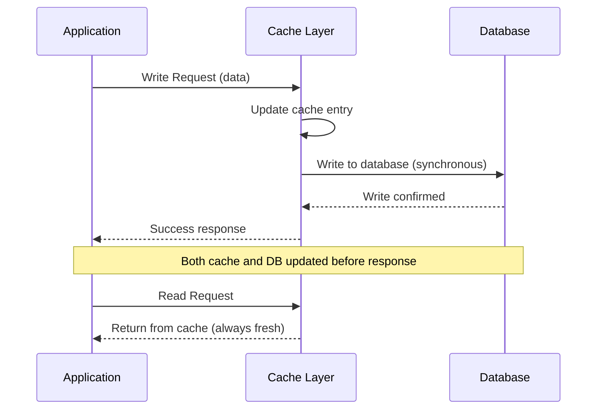
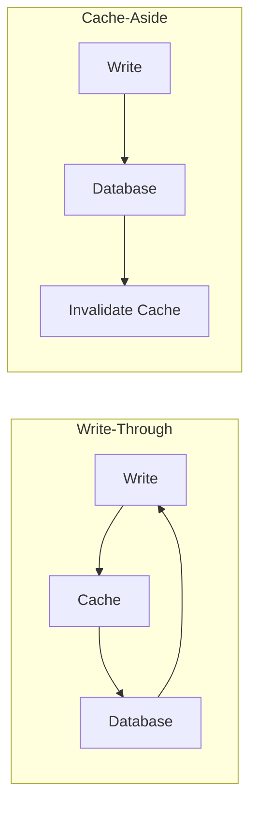
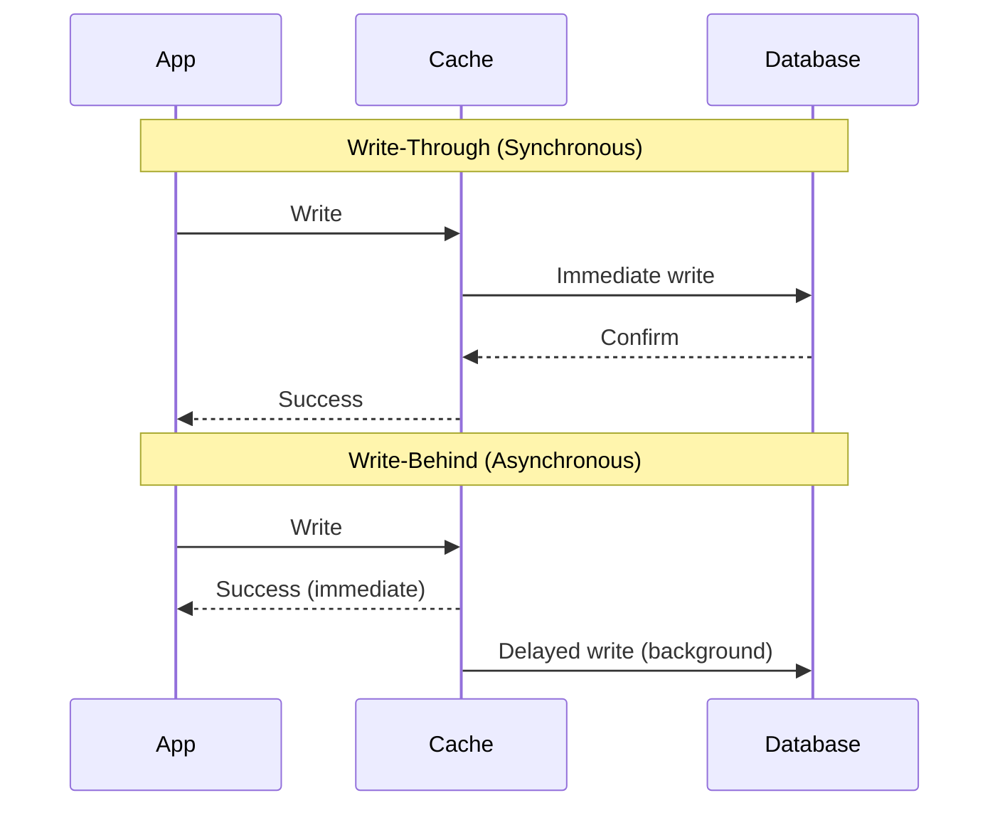
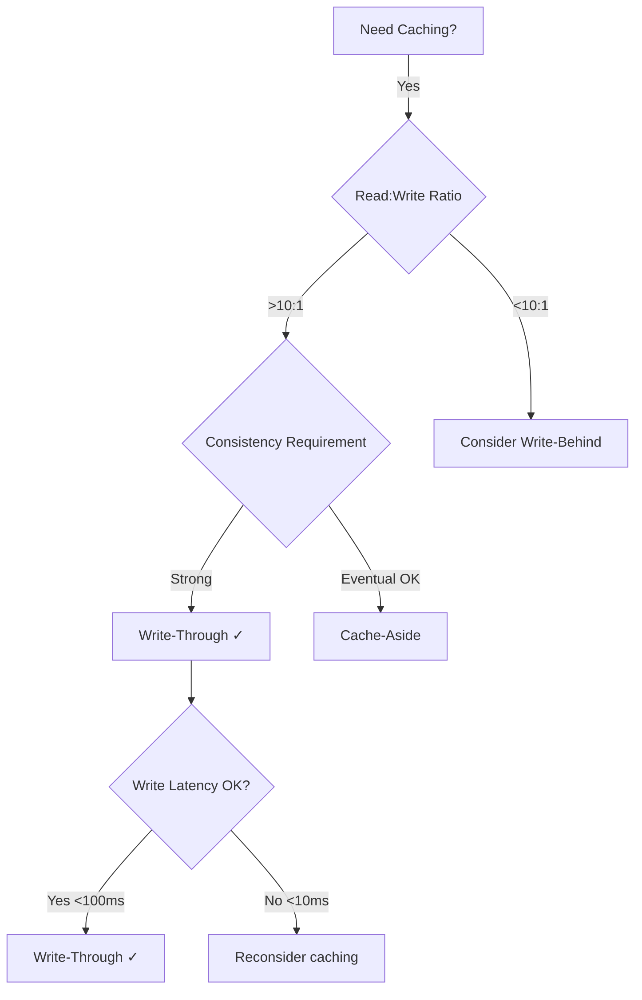

# Write-Through Cache Pattern

## What is Write-Through Caching?

**Write-Through Cache** is a caching strategy where every write operation updates both the cache and the database **synchronously** before returning success to the client. This ensures the cache is always consistent with the primary data store.

Think of it as a **two-way writing** approach: when data is written, it goes through the cache layer first, then immediately to the database, with both operations completing before acknowledging the write.

---

## Why Use Write-Through?

### Business Value

- **Strong Data Consistency**: Cache never contains stale data - it always reflects the current database state
- **Simplified Read Logic**: Applications can confidently read from cache without worrying about freshness
- **Reduced Complexity**: Eliminates the need for complex cache invalidation strategies
- **Audit & Compliance**: Immediate database persistence ensures regulatory requirements are met

### System Design Impact

- **Read Performance**: Subsequent reads after writes are extremely fast (always cache hit)
- **Write Performance**: Higher latency due to dual updates (cache + database)
- **Reliability**: Data is persisted immediately, reducing data loss risk
- **Consistency Guarantee**: No window of inconsistency between cache and database

---

## How Write-Through Works

### Flow Diagram

### Conceptual Flow

**Write Operation:**
1. Application sends write request
2. Cache layer receives request
3. Cache updates its own storage
4. Cache forwards write to database (waits for completion)
5. Database confirms write success
6. Cache returns success to application
7. **Critical**: If either step fails, entire operation fails (rollback)

**Read Operation:**
1. Application sends read request
2. Cache checks for data
3. **Cache Hit**: Return immediately (data is guaranteed fresh)
4. **Cache Miss**: Load from database, populate cache, return data

---

## Key Characteristics

| Characteristic | Description | Impact |
|---------------|-------------|--------|
| **Write Path** | Through cache → database | Higher write latency |
| **Consistency** | Always consistent | Strong guarantee |
| **Read Performance** | Excellent (cache always populated) | Fast response times |
| **Write Performance** | Slower (dual updates) | Trade-off for consistency |
| **Complexity** | Medium (failure handling) | Rollback logic needed |
| **Data Loss Risk** | Very low | Immediate persistence |

---

## Trade-offs

### Advantages ✅

**Strong Consistency**
- Cache and database are always in sync
- No stale data concerns
- Simplified application logic

**Read Optimization**
- Written data immediately available in cache
- Subsequent reads are extremely fast
- High cache hit rate for recently written data

**Durability**
- Data persisted to database immediately
- Survives cache failures
- No data loss if cache crashes

**Simplified Cache Management**
- No complex invalidation needed
- No cache warming after writes
- Predictable cache state

### Disadvantages ❌

**Higher Write Latency**
- Must wait for both cache and database
- Typically 2-10x slower than cache-only writes
- Can impact user experience for write-heavy apps

**Write Amplification**
- Every write hits both cache and database
- Unnecessary if data rarely read
- Wasted cache updates for write-once data

**Partial Failure Complexity**
- Must handle cache success + database failure
- Requires rollback mechanisms
- Error handling complexity

**Not Ideal for Write-Heavy Workloads**
- Cache becomes bottleneck
- Database load remains high
- Limited benefit if read:write ratio is low

---

## When to Use Write-Through

### ✅ Ideal Use Cases

**Read-Heavy Workloads with Consistent Updates**
- Product catalogs with frequent updates
- User profiles that are frequently viewed
- Configuration data that must be consistent
- Reference data with moderate update frequency

**Strong Consistency Requirements**
- Financial account balances
- Inventory counts (though may need stronger guarantees)
- User session data
- Shopping cart contents

**Simple Data Models**
- Single-entity updates
- No complex relationships
- Clear ownership boundaries
- Straightforward update patterns

**When Cache Miss is Expensive**
- Complex database queries
- Multi-table joins
- Aggregations
- Data transformation required

### ❌ Avoid When

**Write-Heavy Workloads**
- Analytics/logging systems (use write-behind)
- Event streaming (use async patterns)
- High-frequency counters (use batching)
- IoT sensor data (use write-behind)

**Very Large Data Sets**
- Cannot cache everything
- Wasted cache updates for rarely-read data
- Better with selective caching

**Strict Latency Requirements for Writes**
- Real-time systems requiring <10ms writes
- High-throughput write APIs
- Time-sensitive operations

**Complex Transactions**
- Multi-entity updates
- Cross-service transactions
- Distributed transactions

---

## Comparison with Other Patterns

### Write-Through vs Cache-Aside

| Aspect | Write-Through | Cache-Aside |
|--------|---------------|-------------|
| **Write Path** | Cache → Database | Database only |
| **Cache Update** | On every write | On next read (lazy) |
| **Consistency** | Strong | Eventual |
| **Write Latency** | Higher | Lower |
| **Complexity** | Medium | Low |
| **Best For** | Read-heavy, consistency critical | General purpose |

### Write-Through vs Write-Behind

| Aspect | Write-Through | Write-Behind |
|--------|---------------|--------------|
| **Database Write** | Synchronous | Asynchronous |
| **Write Speed** | Slower | Very fast |
| **Consistency** | Strong | Eventual |
| **Data Loss Risk** | Very low | Higher |
| **Complexity** | Medium | High |
| **Best For** | Consistency critical | Write-heavy, high throughput |

---

## Conceptual Best Practices

### Handle Partial Failures Gracefully

**Principle**: If cache succeeds but database fails, rollback the cache
- Implement compensating transactions
- Log failures for debugging
- Return error to client (don't hide failures)

**Principle**: If database succeeds but cache update fails, acceptable to continue
- Use TTL as safety net
- Log cache failures
- Consider circuit breaker pattern

### Use TTL as a Safety Net

Even with write-through, always set expiration times:
- Protects against bugs in update logic
- Handles external database updates
- Provides eventual consistency guarantee
- Recommended: 1-24 hours depending on data volatility

### Implement Circuit Breakers

Protect against cache service degradation:
- If cache is down, write directly to database
- Don't fail user requests due to cache issues
- Graceful degradation maintains availability
- Monitor and alert on circuit breaker activations

### Monitor Write Performance

Track key metrics:
- Write latency (p50, p95, p99)
- Cache write success rate
- Database write success rate
- Rollback frequency
- End-to-end write duration

### Consider Async Updates for Non-Critical Paths

For some updates, immediate consistency isn't critical:
- Update database synchronously (critical path)
- Update cache asynchronously (background)
- Use events/messages to notify cache
- Balance consistency vs performance

---

## Decision Framework

**Use Write-Through when:**
1. Read-heavy workload (reads >> writes)
2. Strong consistency required
3. Write latency <100ms is acceptable
4. Simple update patterns
5. Data frequently accessed after update

**Consider alternatives when:**
1. Write-heavy workload
2. Eventual consistency acceptable → Cache-Aside
3. Very low latency writes required → Write-Behind
4. Complex transactions → Direct database access

---

## Common Pitfalls to Avoid

### ❌ Not Handling Rollbacks

Problem: Cache updated, database fails, cache left stale
- Always implement rollback logic
- Use try-catch-finally patterns
- Test failure scenarios

### ❌ Ignoring Cache Failures

Problem: Database updated, cache fails, treating as success
- Log all cache failures
- Set up monitoring/alerting
- Consider cache failure as degraded service

### ❌ No TTL on Cached Data

Problem: Bugs in update logic leave stale data forever
- Always set expiration times
- TTL provides eventual consistency guarantee
- Balance freshness vs cache hit rate

### ❌ Caching Everything

Problem: Writing data that's never read again
- Be selective about what to cache
- Profile access patterns
- Avoid write amplification

### ❌ Synchronous Batch Updates

Problem: Updating 1000 items one-by-one through write-through
- Use batch APIs when available
- Consider async updates for bulk operations
- May need different strategy for bulk writes

---

## Key Takeaways

1. **Write-Through ensures cache consistency** by updating both cache and database synchronously before returning success

2. **Best for read-heavy workloads** where consistency matters and write latency <100ms is acceptable

3. **Trade higher write latency** for simpler application logic and guaranteed data freshness

4. **Always implement rollback logic** to handle partial failures gracefully

5. **Use TTL as a safety net** even with write-through to protect against bugs

6. **Monitor write performance carefully** - both cache and database must be fast

7. **Not suitable for write-heavy systems** or very low latency requirements - consider write-behind instead

8. **Combine with circuit breakers** to maintain availability when cache service degrades

---