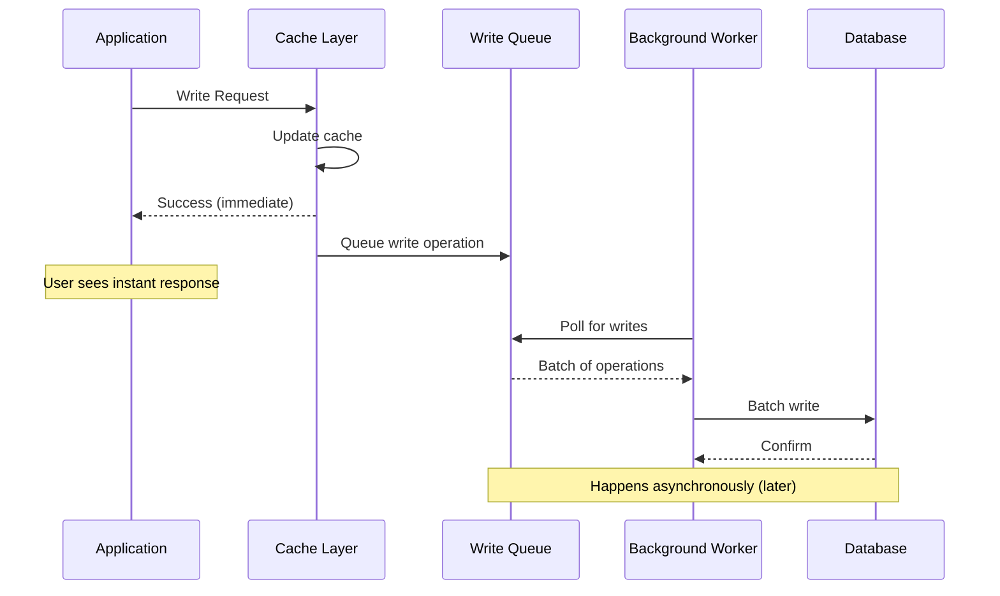
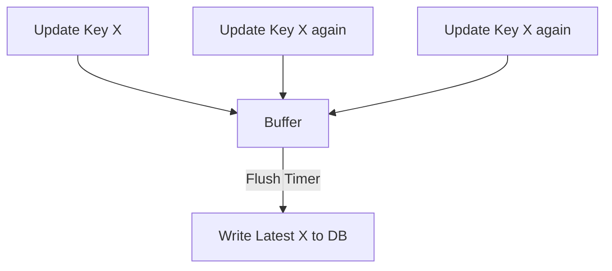
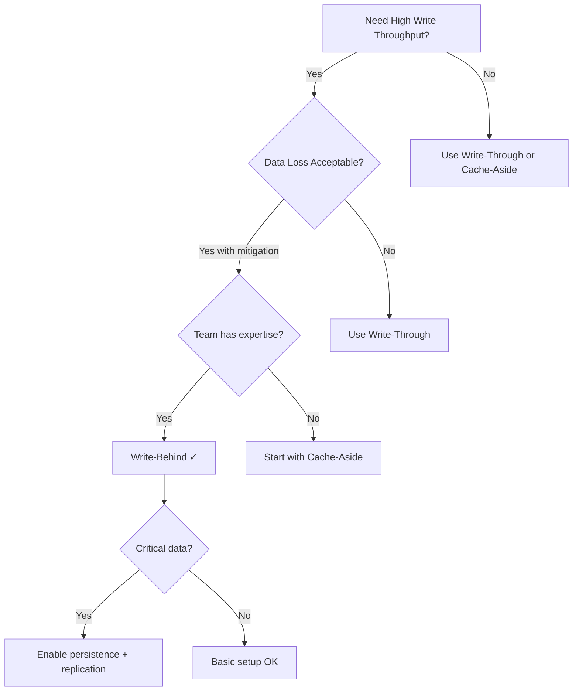

# Write-Behind (Write-Back) Cache Pattern

## What is Write-Behind Caching?

**Write-Behind** (also called **Write-Back**) is a caching strategy where write operations are immediately stored in the cache and asynchronously written to the database later. The application receives an instant success response after the cache update, while database writes happen in the background.

Think of it as **optimistic writing**: trust the cache to eventually persist data to the database, prioritizing speed over immediate durability.

---

## Why Use Write-Behind?

### Business Value

- **Superior User Experience**: Sub-millisecond write responses create perception of instant updates
- **High Throughput**: Handle 10-100x more write operations than synchronous patterns
- **Cost Efficiency**: Reduce database load through write coalescing and batching
- **Scalability**: Absorb write spikes without overwhelming the database

### System Design Impact

- **Write Performance**: 10-50x faster than write-through (cache only, no waiting for DB)
- **Database Load**: Significantly reduced through batching and coalescing
- **Complexity**: Higher - requires queue management, background workers, failure handling
- **Data Loss Risk**: Present - if cache fails before database write, data may be lost

---

## How Write-Behind Works

### Flow Diagram



### Conceptual Flow

**Write Operation (User Perspective):**
1. Application sends write request
2. Cache layer updates cache immediately (1-2ms)
3. Cache returns success to application **immediately**
4. User sees instant confirmation ✓

**Background Process (System Perspective):**
5. Cache queues write operation for later processing
6. Background worker picks up queued operations
7. Worker batches multiple operations together
8. Worker writes batch to database
9. Database confirms persistence

**Timeline Example:**
```
T=0ms:    Client: UPDATE product price
T=1ms:    Cache: Updated ✓
T=2ms:    Client: Receives success response
T=2ms:    Queue: Operation queued
T=100ms:  Worker: Batch processing starts
T=550ms:  Database: Updated ✓

Client latency: 2ms (50x faster than write-through)
```

---

## Key Characteristics

| Characteristic | Description | Impact |
|---------------|-------------|--------|
| **Write Path** | Cache only (immediate) | Very fast writes |
| **Database Write** | Asynchronous (background) | Database updated later |
| **Consistency** | Eventual | Cache ahead of database |
| **Write Performance** | Excellent (<5ms) | Best write performance |
| **Data Loss Risk** | Moderate to high | Cache failure = data loss |
| **Complexity** | High | Queue, workers, monitoring |

---

---

## Trade-offs

### Advantages ✅

**Extremely Fast Writes**
- Sub-millisecond to low millisecond response times
- 10-50x faster than synchronous patterns
- Excellent user experience

**Write Coalescing**
- Multiple updates to same key = single database write
- Example: Update same product 100 times → 1 final DB write
- Massive efficiency gains for frequently updated data

**Reduced Database Load**
- Batching reduces connection overhead
- Fewer transactions = less database CPU
- Can absorb traffic spikes gracefully

**High Write Throughput**
- Handle 100,000+ writes/second to cache
- Database processes at its own pace
- Queue acts as buffer

**Better Resource Utilization**
- Database writes during low-traffic periods
- Smooth out load patterns
- Optimize batch sizes dynamically

### Disadvantages ❌

**Risk of Data Loss**
- Cache crashes before DB write = permanent data loss
- No guarantee of persistence
- Mitigation: Redis persistence (AOF/RDB), replication

**Eventual Consistency**
- Database lags behind cache (seconds to minutes)
- Different services reading from DB see stale data
- Can confuse users or cause bugs

**Complex Failure Handling**
- Database write fails: retry? dead-letter queue? alert?
- Queue full: reject writes? slow down? scale?
- Worker crashes: restart? recover state? reprocess?

**Ordering Challenges**
- Out-of-order writes possible with multiple workers
- Same-key updates may arrive out of sequence
- Requires careful versioning/timestamping

**Difficult Debugging**
- Asynchronous = harder to trace
- "My update didn't save" - where did it fail?
- Need extensive logging and monitoring

**Queue Management Overhead**
- Monitor queue depth
- Handle queue full scenarios
- Prevent queue from becoming bottleneck

---

## When to Use Write-Behind

### ✅ Ideal Use Cases

**Write-Heavy Workloads**
- Analytics and metrics collection
- Event logging and auditing
- User activity tracking
- Clickstream data

**High-Frequency Updates**
- Gaming leaderboards and scores
- Real-time counters (views, likes)
- Session state updates
- IoT sensor data streams

**Acceptable Data Loss Window**
- Non-critical data where brief loss is acceptable
- Data that can be reconstructed
- Systems with redundancy/replication

**Time-Series Data**
- Metrics and monitoring data
- Application performance monitoring (APM)
- Time-stamped events
- Log aggregation

**Bursty Traffic Patterns**
- Flash sales and promotions
- Social media viral events
- Breaking news traffic spikes
- Seasonal peak loads

### ❌ Avoid When

**Zero Data Loss Requirements**
- Financial transactions and payments
- Medical records and prescriptions
- Legal and compliance data
- Authentication and authorization changes

**Strong Consistency Required**
- Inventory management (exact counts needed)
- Booking systems (no overbooking)
- Account balances
- Critical state transitions

**Simple Systems**
- Overhead not justified for low-traffic apps
- Team lacks expertise to operate complex queues
- Monitoring and operational costs too high

**Immediate Read-After-Write**
- User must see own writes immediately
- Cross-service dependencies on latest data
- Strict consistency guarantees

---

## Conceptual Patterns

### Pattern 1: Simple Write Queue

**Concept**: FIFO queue with single background worker


**Characteristics:**
- Simple to understand and implement
- Preserves write order
- Single point of processing

**When to use:**
- Small to medium scale
- Sequential writes important
- Team new to write-behind

### Pattern 2: Write Coalescing Buffer

**Concept**: Collect multiple updates, write only latest version



**Example:**
```
T=0s:  Update product:123 (price=100)
T=1s:  Update product:123 (price=150)
T=2s:  Update product:123 (price=200)
T=5s:  Flush: Only 1 DB write (price=200)

Result: 3 cache updates, 1 database write (99% reduction!)
```

**Characteristics:**
- Dramatic write reduction for hot keys
- Eventual consistency per key
- Memory buffer management needed

**When to use:**
- High-frequency updates to same keys
- Latest value is all that matters
- Write reduction critical

### Pattern 3: Batch Processing

**Concept**: Collect writes into batches, process together


**Characteristics:**
- Efficient database operations
- Reduces connection overhead
- Tunable batch size and timing

**When to use:**
- Database supports batch operations
- Write efficiency critical
- Can tolerate small delays (seconds)

---

## Best Practices

### Handle Data Loss Risk

**Use Redis Persistence:**
- Enable AOF (Append Only File) with `appendfsync everysec`
- Enable RDB snapshots for point-in-time recovery
- Both together provide best protection

**Implement Replication:**
- Primary-replica setup for Redis
- Automatic failover with Sentinel
- Geographic distribution for disaster recovery

**Consider Hybrid Approach:**
- Critical writes: synchronous to DB
- Non-critical writes: write-behind
- Different strategies for different data

### Implement Dead Letter Queue

**Purpose**: Capture writes that consistently fail

**Process:**
1. Worker attempts database write
2. If failure, retry N times (e.g., 3)
3. After N failures, move to dead-letter queue
4. Alert operations team
5. Manual investigation and recovery

### Monitor Queue Health

**Key Metrics:**
- Queue depth (size)
- Queue growth rate
- Processing rate (items/second)
- Time in queue (age of oldest item)
- Failure rate

**Alert Conditions:**
- Queue depth > 1000 (backing up)
- Queue depth > 10000 (critical)
- Age of oldest > 60 seconds
- Failure rate > 1%

### Graceful Shutdown

**Critical**: Flush pending writes before stopping

**Process:**
1. Stop accepting new writes
2. Wait for queue to drain (with timeout)
3. Force-flush remaining writes
4. Log any unflushed writes for recovery
5. Shutdown complete

### Version/Timestamp Ordering

**Problem**: Out-of-order writes corrupt data

**Solution**: Include version or timestamp with each write

**Process:**
1. Attach version number or timestamp to write
2. Worker checks version before applying
3. Only apply if newer than current database version
4. Discard stale writes

### Batch Size Tuning

**Factors to Consider:**
- Database batch operation efficiency
- Write latency SLA (how long can data wait?)
- Memory constraints (buffer size)
- Network bandwidth

**Example Tuning:**
- Small batches (10-50): Low latency, more DB calls
- Medium batches (100-500): Balanced
- Large batches (1000+): High efficiency, higher latency

---

## Comparison with Other Patterns

### Write-Behind vs Write-Through

| Aspect | Write-Behind | Write-Through |
|--------|--------------|---------------|
| **Speed** | Very fast (<5ms) | Slower (50-100ms) |
| **Database Write** | Asynchronous | Synchronous |
| **Consistency** | Eventual | Strong |
| **Data Loss Risk** | Yes | No |
| **Use Case** | Write-heavy, high throughput | Read-heavy, consistency critical |

### Write-Behind vs Cache-Aside

| Aspect | Write-Behind | Cache-Aside |
|--------|--------------|-------------|
| **Write Target** | Cache first | Database first |
| **Cache Population** | On write | On read (lazy) |
| **Complexity** | High | Low |
| **Write Performance** | Excellent | Good |
| **Best For** | High write volume | General purpose |

---

## Common Pitfalls

### ❌ No Persistence for Cache

- **Problem**: Redis has no persistence, crash = total data loss
- **Solution**: Enable both AOF and RDB persistence

### ❌ Unbounded Queue Growth

- **Problem**: Queue fills up memory, system crashes
- **Solution**: Set max queue size, reject/slow when full

### ❌ No Ordering Guarantees

- **Problem**: Later update processed before earlier one
- **Solution**: Add timestamps/versions, validate before applying

### ❌ Ignoring Write Failures

- **Problem**: Database failures silently lose data
- **Solution**: Implement retry logic and dead-letter queue

### ❌ No Monitoring

- **Problem**: Don't know queue is backing up until system fails
- **Solution**: Monitor queue depth, age, processing rate

### ❌ Not Testing Failure Scenarios

- **Problem**: Don't know how system behaves when cache/DB fails
- **Solution**: Chaos engineering - test all failure modes

---

## Decision Framework



**Use Write-Behind when:**
1. Write throughput is critical (>1000 writes/sec)
2. Write latency must be very low (<10ms)
3. Temporary data loss is acceptable (with mitigation)
4. Team can manage queue complexity
5. Database can process writes asynchronously

**Avoid Write-Behind when:**
1. Zero data loss required
2. Strong consistency needed
3. Simple system requirements
4. Limited operational expertise
5. Critical financial/medical data

---

## Key Takeaways

1. **Write-Behind provides extremely fast writes** (10-50x faster) by making database updates asynchronous

2. **Risk of data loss exists** - cache crashes before DB write means lost data; mitigate with persistence and replication

3. **Eventual consistency** - database lags behind cache, different services may see different data states

4. **Best for write-heavy workloads** - analytics, logging, metrics, gaming, IoT where throughput matters most

5. **Write coalescing reduces database load** - 100 updates to same key → 1 database write

6. **Requires operational maturity** - queue management, monitoring, dead-letter queues, graceful shutdown

7. **Not suitable for critical data** - financial transactions, medical records, or anything requiring guaranteed persistence

8. **Test failure scenarios extensively** - cache crashes, database failures, queue full, worker crashes

---

