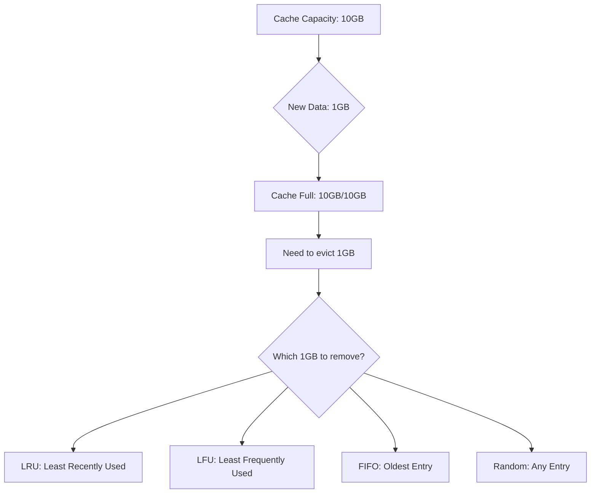
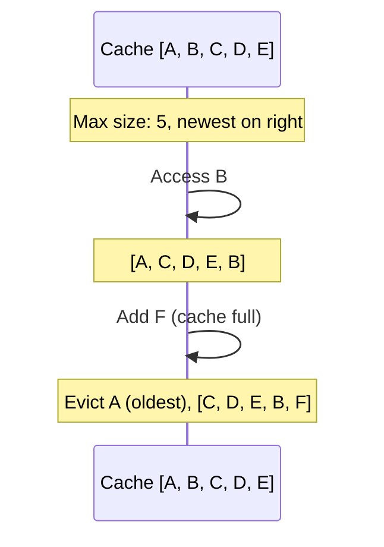
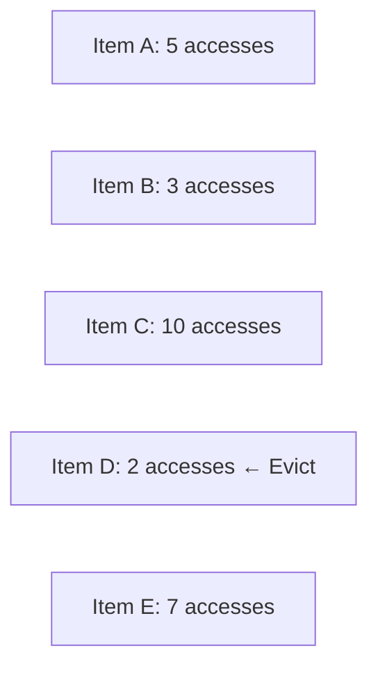
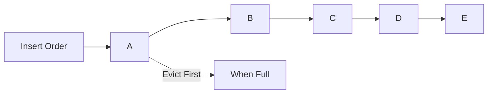
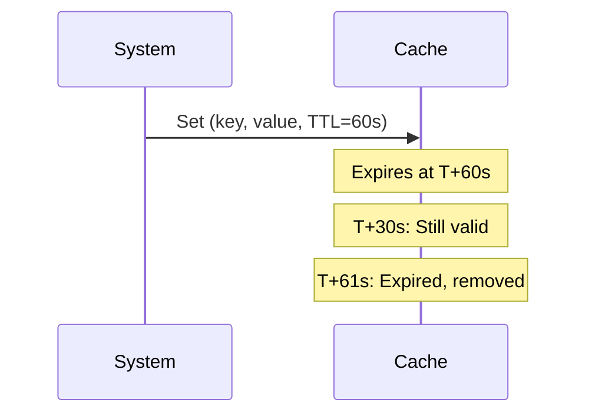
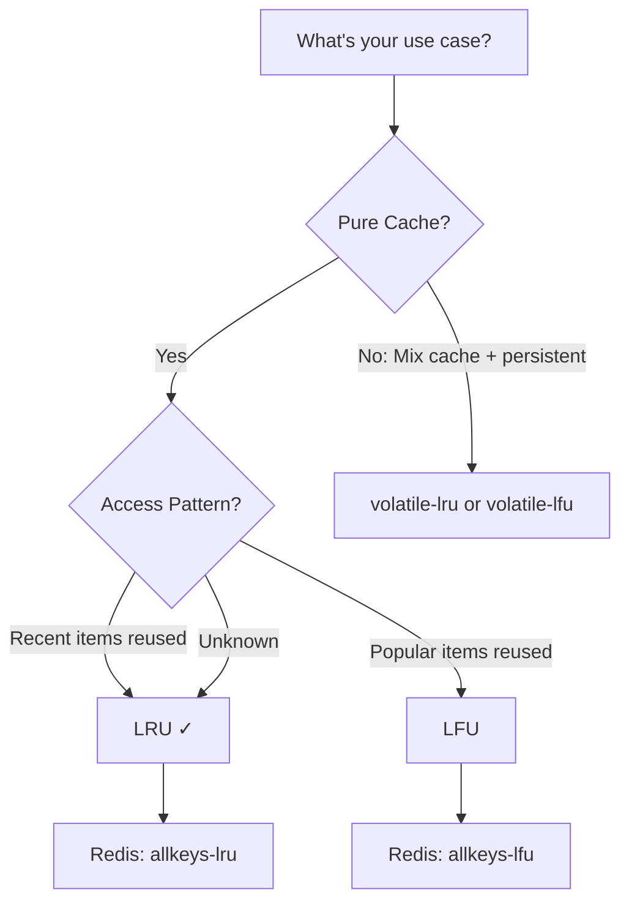

# Cache Eviction Policies

## What are Cache Eviction Policies?

**Cache eviction policies** determine which data to remove from cache when it reaches capacity limits. Since cache memory is finite and expensive, systems must decide which entries to keep and which to discard to make room for new data.

Think of it like managing a limited shelf space in a library - you need rules to decide which books to remove when new ones arrive.

---

## Why Eviction Policies Matter

### Business Impact

- **Cache Hit Rate**: Better policies = higher hit rates = faster responses
- **Cost Efficiency**: Maximize value from limited cache memory
- **User Experience**: Keeping "hot" data cached improves performance
- **System Stability**: Prevents memory overflow and crashes

### The Fundamental Problem



**Reality**: Can't cache everything
- Cache: 10,000 items
- Potential data: 1,000,000 items
- Must choose which 10,000 items maximize value

---

## Common Eviction Policies Comparison

| Policy | Hit Rate | Complexity | Memory Overhead | Best For |
|--------|----------|------------|-----------------|----------|
| **LRU** | High | O(1) | Low-Medium | General purpose, temporal patterns |
| **LFU** | High | O(log N) | Medium | Stable access patterns |
| **FIFO** | Medium | O(1) | Very Low | Simple, predictable needs |
| **Random** | Low | O(1) | Very Low | No clear pattern |
| **TTL** | N/A | O(1) | Low | Time-sensitive data |

---

## LRU (Least Recently Used)

### What Is It?

Evict the item that hasn't been accessed for the **longest time**. Based on the principle of **temporal locality**: recently accessed data is likely to be accessed again soon.

### How It Works Conceptually



**Visual Flow:**
```
Initial:      [A, B, C, D, E]  ← E is newest, A is oldest
Access B:     [A, C, D, E, B]  ← B moved to newest position
Add F:        [C, D, E, B, F]  ← A evicted (oldest), F added
Access D:     [C, E, B, F, D]  ← D moved to newest
Add G:        [E, B, F, D, G]  ← C evicted (oldest)
```

---

### Key Characteristics

**Advantages** ✅
- High cache hit rate for workloads with temporal locality
- O(1) operations with proper data structure
- Simple to understand and debug
- Industry standard - well-tested

**Disadvantages** ❌
- Memory overhead for tracking access order
- Scan-resistant issue: one-time bulk scan can evict hot data
- Not optimal if frequency matters more than recency

**When to Use:**
- Web applications (user sessions, recent queries)
- API response caching (recent requests repeated)
- Database query cache
- General-purpose caching (default choice)

---

## LFU (Least Frequently Used)

### What Is It?

Evict the item accessed the **fewest number of times**. Based on the principle that frequently used items are more valuable than recently used items.

### How It Works Conceptually



**Example:**
```
Cache: [(A,5), (B,3), (C,10), (D,2), (E,7)]
       (key, access_frequency)

Access B:  [(A,5), (B,4), (C,10), (D,2), (E,7)]  ← B frequency++
Add F:     [(A,5), (B,4), (C,10), (F,1), (E,7)]  ← D evicted (lowest frequency)
```

---

### Key Characteristics

**Advantages** ✅
- Protects truly popular ("hot") data
- High hit rate for stable access patterns
- Good for long-running caches
- Resistant to one-time scans

**Disadvantages** ❌
- More complex implementation
- Higher memory overhead (frequency counters)
- Slow adaptation to changing patterns
- Old popular items may stay cached even when no longer relevant

**When to Use:**
- Content Delivery Networks (CDN) - popular videos/images
- Static asset serving
- Reference data lookup tables
- Systems with stable, predictable access patterns

---

## FIFO (First In First Out)

### What Is It?

Evict the **oldest inserted item**, regardless of access pattern. Simple queue: first added, first removed.

### How It Works Conceptually



**Example:**
```
Cache: [A, B, C, D, E]  (insertion order, A is oldest)
Add F: [B, C, D, E, F]  (A evicted - first in, first out)
Add G: [C, D, E, F, G]  (B evicted)
```

---

### Key Characteristics

**Advantages** ✅
- Simplest to implement
- Very low memory overhead
- Completely predictable behavior

**Disadvantages** ❌
- Ignores access patterns entirely
- Poor hit rate in most scenarios
- May evict frequently accessed data

**When to Use:**
- Logging buffers (order matters)
- Event queues
- When simplicity is paramount
- Rarely used in production caching

---

## Random Eviction

### What Is It?

Evict a **random entry** when cache is full. No tracking of access or insertion order.

### Key Characteristics

**Advantages** ✅
- Simplest eviction logic
- Zero overhead for tracking
- O(1) eviction

**Disadvantages** ❌
- Worst hit rate
- Unpredictable - may evict hot data
- Rarely optimal

**When to Use:**
- Academic baseline for comparison
- Extremely constrained memory (no room for metadata)
- When access pattern is truly random

---

## TTL-Based Eviction

### What Is It?

Items expire after a **fixed time period**, regardless of usage or capacity. Not capacity-based, but time-based.

### How It Works Conceptually



**Example:**
```
T=0:    Cache item with TTL=60s
T=30s:  Still valid, can be accessed
T=60s:  Expires automatically
T=61s:  Access returns MISS, item gone
```

---

### Key Characteristics

**Advantages** ✅
- Guarantees data freshness
- Automatic cleanup
- Simple logic

**Disadvantages** ❌
- Not capacity-based (cache can grow unbounded)
- May evict hot data if TTL expires
- Requires background cleanup process

**When to Use:**
- Session management (30-minute timeout)
- API rate limiting windows
- Temporary data (OTPs, verification codes)
- **Combined with capacity-based policies** for best results

---

## Redis Eviction Policies

Redis provides built-in eviction policies you can configure:

### Policy Options

| Policy | Description | When to Use |
|--------|-------------|-------------|
| **noeviction** | Return errors when full | Data loss unacceptable |
| **allkeys-lru** | Evict any key using LRU | Pure cache (recommended) |
| **allkeys-lfu** | Evict any key using LFU | Stable access patterns |
| **volatile-lru** | Evict keys with TTL using LRU | Mix of cache + persistent |
| **volatile-lfu** | Evict keys with TTL using LFU | TTL + frequency matters |
| **volatile-ttl** | Evict key with shortest TTL | TTL indicates priority |
| **allkeys-random** | Evict random key | All keys equal (rare) |

### Redis LRU Approximation

Redis uses **approximated LRU** for efficiency - samples a few keys rather than tracking all:

```
Configuration: maxmemory-samples 5

How it works:
1. Sample 5 random keys
2. Evict the least recently used among the 5
3. Repeat as needed

Trade-off:
- Fewer samples (3): Faster, less accurate
- More samples (10): Slower, more accurate
```

---

## Choosing the Right Policy

### Decision Tree



**General Guidelines:**

**Use LRU when:**
- General purpose caching
- Temporal locality (recent = important)
- Web applications, API caching
- **Default choice** - works well for most cases

**Use LFU when:**
- Access patterns are stable
- Popularity matters more than recency
- Content delivery, static assets
- Long-running caches

**Use TTL-based when:**
- Data freshness critical
- Time-sensitive data
- **Always combine with capacity-based policy**

**Use FIFO when:**
- Simplicity is paramount
- Order matters more than access
- Rare in practice

---

## Best Practices

### 1. Always Set Max Memory

**Why**: Prevent unbounded cache growth

**How**: Configure max memory limit
- Redis: `maxmemory 2gb`
- Local cache: Set maximum size

### 2. Combine TTL with Eviction Policy

**Defense in depth approach:**
```
Primary: Capacity-based eviction (LRU/LFU)
Fallback: TTL expiration (data freshness)

Result: Cache can't grow unbounded AND data stays fresh
```

### 3. Monitor Eviction Rates

**Key metrics:**
- Evictions per second
- Cache hit rate
- Memory usage percentage

**High evictions = undersized cache:**
- Consider increasing cache size
- Review what you're caching
- Adjust TTLs

### 4. Test with Production Patterns

**Access patterns vary:**
- Develop: Different than production
- Test: Load testing with realistic patterns
- Monitor: Actual hit rates in production

**Adjust based on data:**
- Start with LRU (safe default)
- Monitor hit rates
- Switch to LFU if stable patterns emerge

---

## Common Pitfalls

### ❌ No Max Memory Set

- **Problem**: Cache grows until OOM (Out of Memory)
- **Solution**: Always configure maxmemory

### ❌ Wrong Policy for Workload

- **Problem**: Using FIFO for web app (poor hit rate)
- **Solution**: Match policy to access pattern (use LRU)

### ❌ Only Using TTL

- **Problem**: No capacity limit, memory can still overflow
- **Solution**: Use TTL + capacity-based policy

### ❌ Not Monitoring

- **Problem**: Don't know if eviction policy is working
- **Solution**: Track hit rates, eviction rates, memory usage

---

## Key Takeaways

1. **LRU is the default choice** - good hit rates, simple, O(1) operations

2. **LFU for stable patterns** - protects truly popular data from eviction

3. **Always set maxmemory** - prevent unbounded cache growth

4. **Combine TTL with eviction** - both capacity limits AND freshness guarantees

5. **Monitor eviction metrics** - high eviction rate = cache too small

6. **Redis uses approximated LRU** - adjust samples for accuracy vs performance

7. **Choose based on access pattern** - temporal (LRU) vs frequency (LFU)

8. **Test with real workloads** - production access patterns differ from development

---

---
