# Cache Invalidation


## 1. What Is Cache Invalidation? (Pure Concept)

**Cache invalidation** is the act of ensuring cached data does **not lie**.

A cache is a *copy* of data. The moment the original data changes, the copy becomes suspicious.

```
Truth (DB) changes
        ↓
Cache becomes potentially wrong
        ↓
System must react
```

If the system fails to react correctly, users see **outdated reality**.

---

## 2. The Core Mental Model

> Cache is an **optimization**, not a source of truth.

Think of cache as:

* A *hint* to speed things up
* A *temporary shortcut*
* Something that is **allowed to be wrong briefly**

Never design systems that *depend on cache correctness*.

---

## 3. Why Cache Invalidation Is Fundamentally Hard

### The Time Gap Problem

The hardest part is the **gap between change and awareness**.

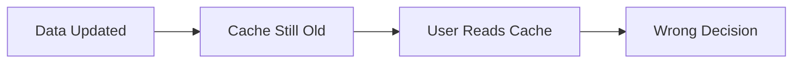

Even a very small gap can cause damage.

---

### Four Root Causes (Conceptual)

#### 1. Time & Ordering

Operations do not happen in a clean sequence.

```
Read happens
Update happens
Invalidate happens
```

But **not always in that order**.

---

#### 2. Partial Failure

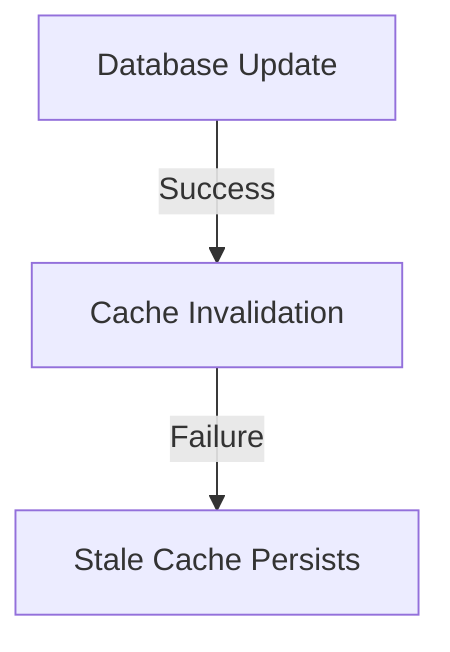

Databases and caches fail **independently**.

---

#### 3. Hidden Relationships

One data change affects many views of reality.

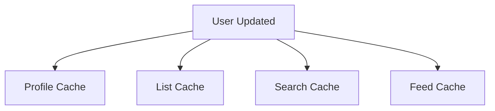

Missing *one* relationship breaks correctness.

---

#### 4. Distribution

Multiple machines hold different memories.

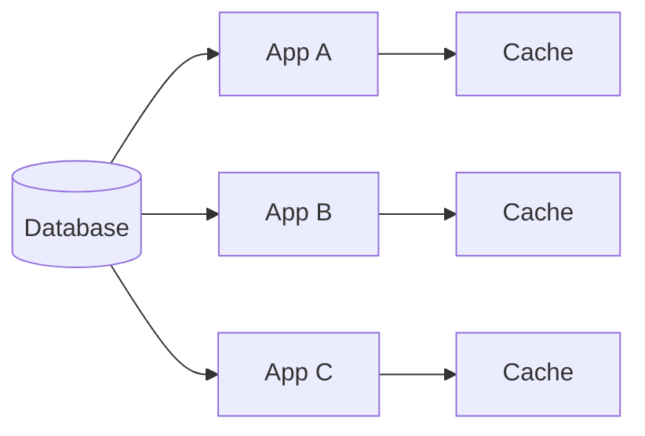

Invalidation must **travel**, not just happen.

---

## 4. Strategy Landscape (Concept-Only View)

| Strategy         | Core Idea                       | Key Trade-off          |
| ---------------- | ------------------------------- | ---------------------- |
| TTL              | Let time fix the problem        | Temporary wrongness    |
| Delete-on-Change | Remove copy after truth changes | Must know all copies   |
| Event-Based      | React to change events          | High coordination cost |
| Tag-Based        | Invalidate groups               | Over-invalidation risk |
| Version-Based    | Ignore old reality              | Memory overhead        |

---

## 5. Time-Based Invalidation (TTL)

### Concept

Data expires **whether or not it was updated**.

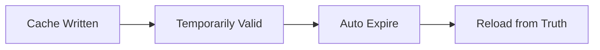

### Why TTL Exists

TTL is not about freshness — it is about **safety**.

> TTL guarantees that *no lie lives forever*.

### Core Trade-off

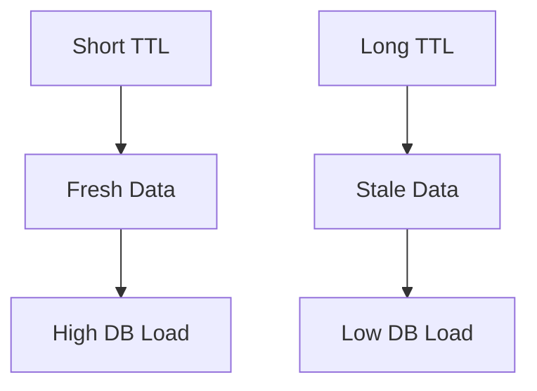

---

## 6. Delete-on-Change (Purge Model)

### Concept

When truth changes, **destroy the copy**.

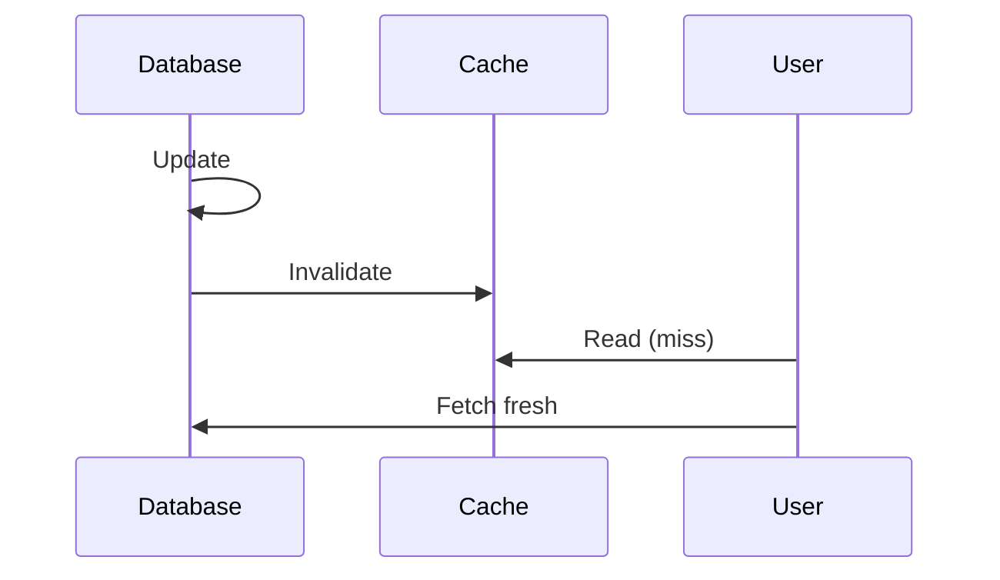

### Key Insight

Deleting is safer than updating because it avoids **late-arriving stale writes**.

---

## 7. Event-Based Invalidation

### Concept

Changes emit signals. Caches react.

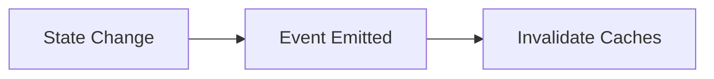

### Why It’s Powerful

* Targeted
* Immediate
* Precise

### Why It’s Dangerous

* Requires perfect knowledge
* Missed events = silent corruption

---

## 8. Tag-Based Invalidation

### Concept

Cache entries belong to **groups**.

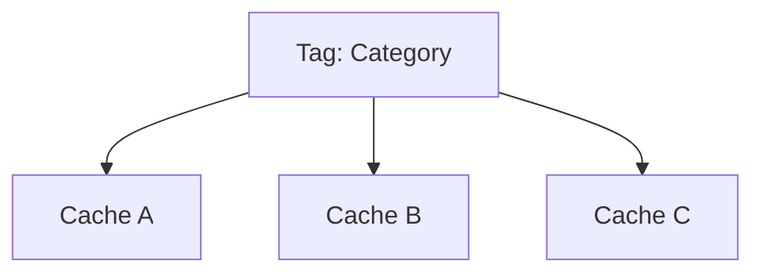

Invalidate the group, not individuals.

---

## 9. Version-Based Invalidation

### Concept

Reality moves forward. Old reality is ignored.

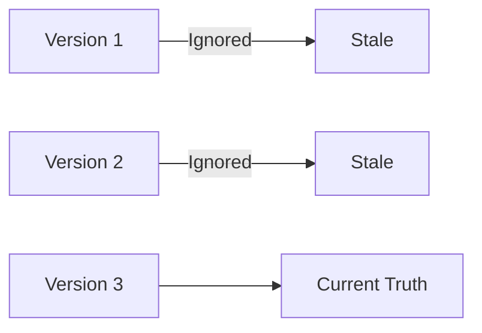

No deletion. No coordination. Just progression.

---

## 10. Distributed Invalidation (Big Picture)

### Core Problem

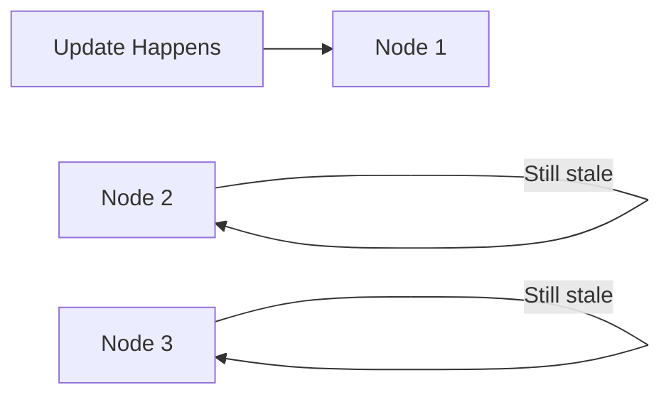

### Conceptual Solution

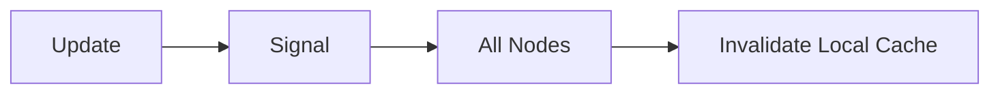

---

## 11. Strategy Selection (Thinking Flow)

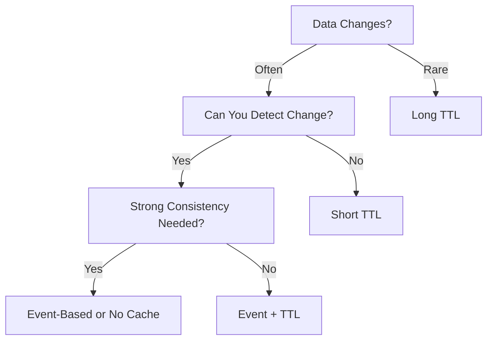

---

## 12. Golden Rules (Conceptual)

1. Cache must **never define truth**
2. TTL is mandatory — always
3. Deleting copies is safer than fixing copies
4. Invalidation failures must not break business logic
5. Distributed systems need distributed signals
6. Expect failure — design for it

---

## 13. Final Mental Model

> Cache invalidation is not about perfection.

It is about:

* Limiting damage
* Bounding inconsistency
* Recovering automatically

A good system assumes cache will lie — and survives anyway.
