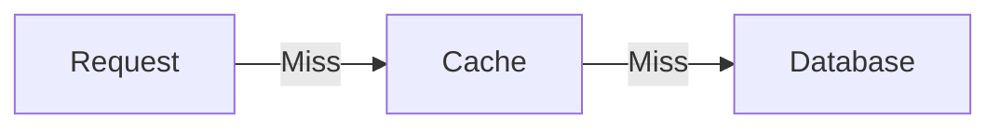
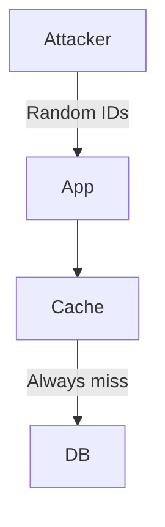
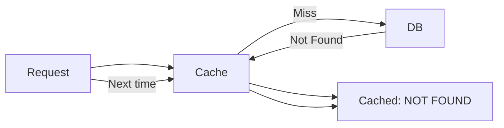
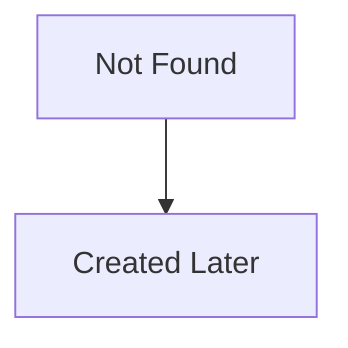
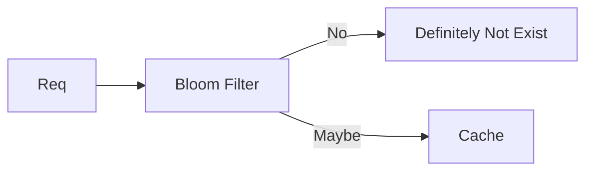
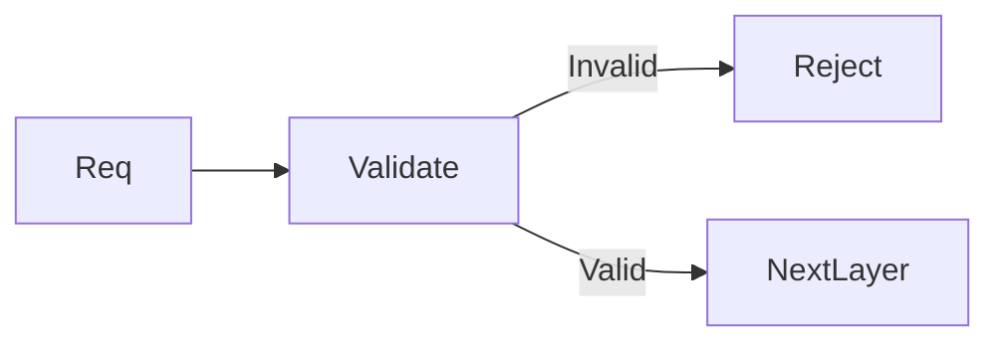
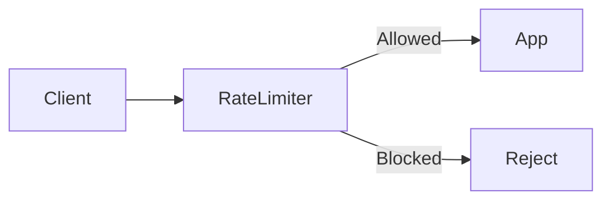
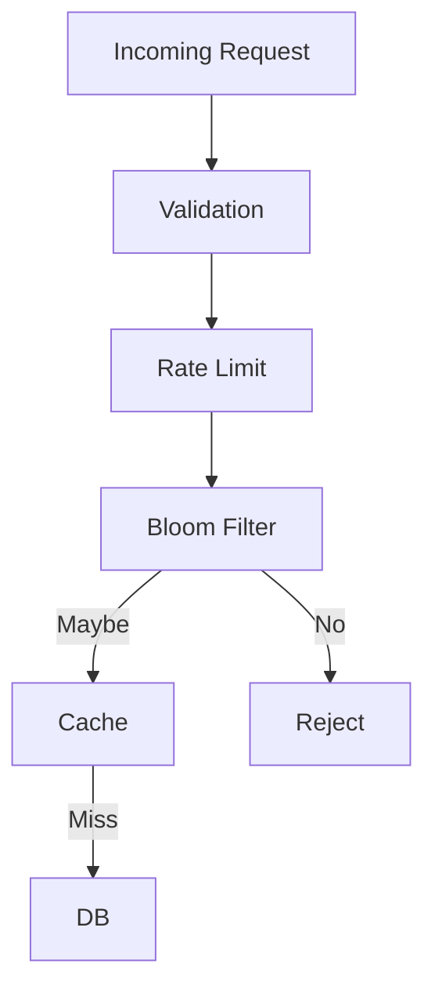
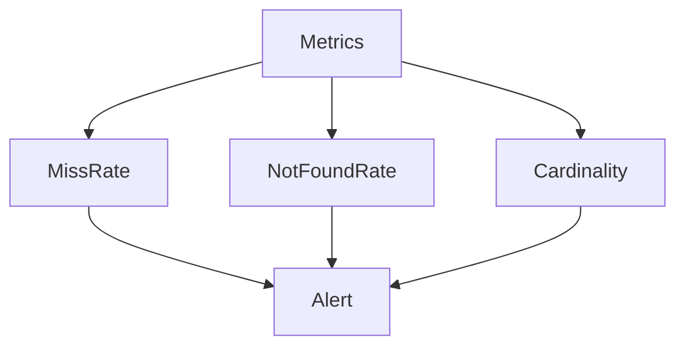

# Cache Penetration


## 1. What Is Cache Penetration? 

**Cache penetration** happens when requests repeatedly ask for data that **does not exist anywhere** — neither in cache nor in the database.

Because the data does not exist:

* It is **never cached**
* Every request goes straight to the database
* Cache provides *zero protection*

```
Request → Cache (MISS) → Database (NOT FOUND)
```

Repeated enough times, this becomes a **database denial-of-service vector**.

---

## 2. Why Cache Penetration Is Dangerous

### The Core Failure

Cache is designed to protect the database.

Cache penetration **bypasses that protection entirely**.



When this happens at scale, **database load grows linearly with traffic**.

---

### Why Normal Caching Fails Here

Normal caching assumes:

* Data exists
* Cache miss is temporary

Cache penetration violates both assumptions.

```
Normal case: MISS → HIT → HIT → HIT
Penetration: MISS → MISS → MISS → MISS
```

---

## 3. How Cache Penetration Happens (Scenarios)

### Scenario 1: Randomized Attacks

Attackers generate **high-cardinality invalid keys**.



Each request is unique → cache never learns.

---

### Scenario 2: Sequential Scanning

Attackers or bots scan numeric or predictable ID ranges.

```
1, 2, 3, 4, 5, ...
```

Most IDs do not exist → database hit for each.

---

### Scenario 3: Accidental Penetration

Not all penetration is malicious.

* Typos
* Broken clients
* Old bookmarks
* API misuse

Many small mistakes can still overload a system.

---

## 4. Key Insight: Cache Penetration Is About *Non-Existence*

> The cache cannot protect what it does not know.

Cache penetration is fundamentally a **negative-knowledge problem**.

The system must learn:

```
“This thing does NOT exist.”
```

And remember that knowledge efficiently.

---

## 5. Strategy Landscape (Conceptual View)

| Strategy         | What It Teaches the System                 | Core Risk         |
| ---------------- | ------------------------------------------ | ----------------- |
| Negative Caching | “This key does not exist”                  | Memory usage      |
| Bloom Filter     | “This key almost certainly does not exist” | False positives   |
| Validation       | “This key is impossible”                   | Limited scope     |
| Rate Limiting    | “Slow down the attacker”                   | Collateral damage |
| Layering         | “Fail early, fail cheap”                   | Design complexity |

---

## 6. Negative Caching (Caching Non-Existence)

### Core Concept

Cache the **absence of data**, not just its presence.



Now the cache *knows* the data does not exist.

---

### Why TTL Must Be Short

Non-existence is **less stable than existence**.



Short TTL ensures the system can recover when reality changes.

---

### Senior Insight

Negative caching trades:

* **Database safety**
* For **cache memory pressure**

This is usually a *good trade*.

---

## 7. Bloom Filters (Probabilistic Non-Existence)

### Core Idea

Before touching cache or database, ask:

> “Is this key even *allowed* to exist?”



---

### Mental Model

A Bloom filter is a **pre-filter**.

* If it says **NO** → trust it
* If it says **YES** → verify

There are **no false negatives**, only false positives.

---

### Why Bloom Filters Are Powerful

* Constant time
* Tiny memory footprint
* Extremely effective against random attacks

They stop penetration *before* it reaches cache.

---

### Senior Trade-off

Bloom filters shift cost from:

* Runtime load
* To upfront correctness and lifecycle management

---

## 8. Request Validation (Cheap Rejection)

### Concept

Reject requests that are **structurally impossible**.



This is the **cheapest defense**.

---

### Limitation

Validation protects format, **not existence**.

It is necessary but never sufficient alone.

---

## 9. Rate Limiting (Damage Containment)

### Concept

When behavior looks abnormal:

> Reduce its ability to cause harm.



---

### Senior Insight

Rate limiting does not solve penetration.

It **buys time**.

---

## 10. Layered Defense (The Only Real Answer)

Cache penetration is rarely solved by one technique.



Each layer:

* Is cheaper than the next
* Reduces load progressively

---

## 11. Observability as a Defense

### What to Watch



Rising *unique misses* is the strongest signal of penetration.

---

## 12. Relationship to Other Cache Failures

| Problem     | What Exists? | Root Cause          |
| ----------- | ------------ | ------------------- |
| Penetration | ❌ Data       | Never cached        |
| Stampede    | ✅ Data       | Cache expired       |
| Avalanche   | ✅ Many       | Simultaneous expiry |
| Breakdown   | ✅ Hot key    | Sudden miss surge   |

Understanding the difference matters for correct fixes.

---

## 13. Key Takeaways

1. Cache penetration is a **non-existence problem**, not a caching problem
2. Caches must learn *negative knowledge*
3. Bloom filters stop attacks early and cheaply
4. Negative caching trades memory for safety
5. TTL is mandatory even for non-existence
6. Layered defenses beat clever single solutions
7. Observability is part of correctness

---

## Final Mental Model

> Cache penetration is what happens when your system keeps asking reality questions that have no answers.

A resilient system:

* Learns quickly
* Rejects cheaply
* Recovers automatically
* Never lets the database be the first line of defense
