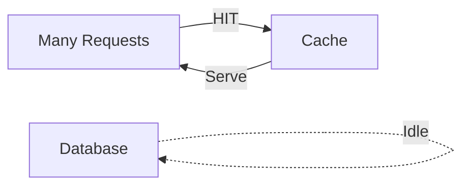
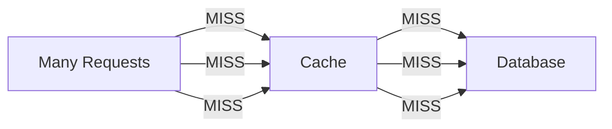
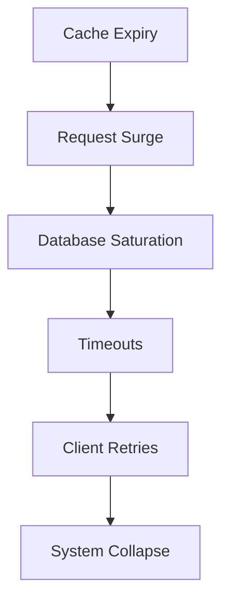
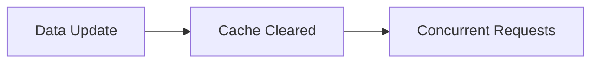
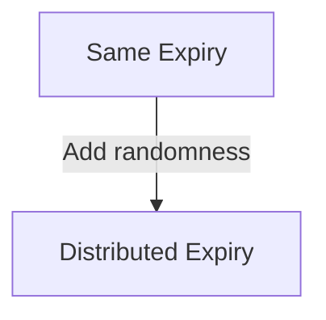
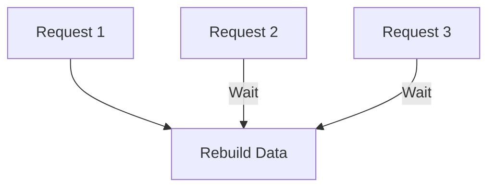
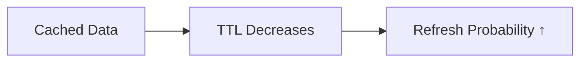
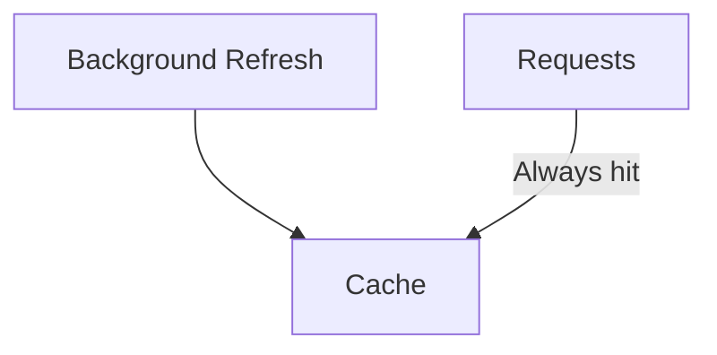
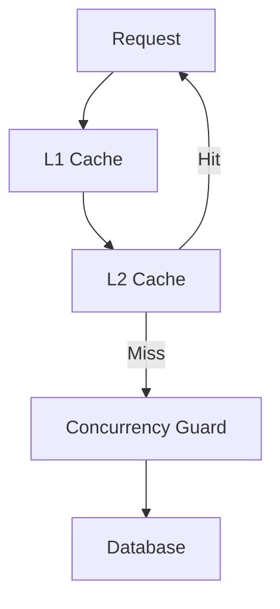
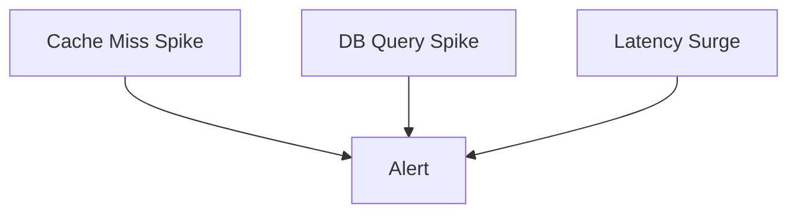

# Cache Stampede (Thundering Herd) 

---

## 1. What Is Cache Stampede? (Pure Concept)

**Cache Stampede** occurs when **many requests simultaneously miss the cache for the same key** and all attempt to rebuild it at once.

Key condition:

> The data **exists**, but the cache is temporarily empty.

```
Requests → Cache (MISS for same key) → Backend overload
```

---

## 2. The Core Invariant That Breaks

### Normal Cache Invariant

> *Only a small, controlled number of requests should ever hit the database.*

Cache stampede **breaks this invariant** by allowing *unbounded concurrency* to reach the backend.



---

### Stampede Invariant Violation



The cache stops acting as a *gatekeeper*.

---

## 3. Why Cache Stampede Is Dangerous

### Amplification Effect

One expired key can create:

```
1 cache miss
→ 100s or 1000s of backend calls
```

This is **load amplification**, not just high traffic.

---

### Cascading Failure Chain



Stampedes rarely fail alone — they trigger **system‑wide collapse**.

---

## 4. When Cache Stampede Happens

### 1️⃣ Time‑Based Expiration

All requests hit immediately after TTL expiry.

```
Time T: Cache valid
Time T+1ms: Cache expired
Time T+2ms: Thousands of requests arrive
```

---

### 2️⃣ Event‑Based Invalidation

Mass invalidation creates an *instant cold cache*.



---

### 3️⃣ Hot Key Access

A **single highly popular key** dominates traffic.

> The hotter the key, the more destructive its expiry.

---

## 5. Cache Stampede vs Other Cache Failures

| Problem     | Does Data Exist? | Failure Cause       |
| ----------- | ---------------- | ------------------- |
| Penetration | ❌ No             | Non‑existence       |
| Stampede    | ✅ Yes            | Concurrent rebuild  |
| Avalanche   | ✅ Yes (many)     | Synchronized expiry |
| Hot Key     | ✅ Yes            | Skewed access       |

Correct identification determines the correct fix.

---

## 6. Core Insight: Stampede Is a *Concurrency* Problem

> Cache stampede is not about caching — it is about **coordination**.

Multiple actors try to rebuild the *same thing* at the *same time*.

---

## 7. Conceptual Defense Strategies

### Strategy Landscape (No Implementation)

| Strategy      | What It Controls | Core Idea                     |
| ------------- | ---------------- | ----------------------------- |
| TTL Jitter    | Time             | Avoid synchronized expiry     |
| Single‑Flight | Concurrency      | One rebuild, many wait        |
| Early Refresh | Probability      | Spread rebuilds over time     |
| Refresh‑Ahead | Scheduling       | Rebuild before expiry         |
| Never‑Expire  | Control          | Manual ownership of freshness |
| Rate Limiting | Damage           | Cap backend pressure          |

---

## 8. TTL Jitter — Breaking Time Alignment

### Mental Model

The problem is **many keys expiring at the same moment**.

The fix: *make time fuzzy*.



Instead of one spike → many small ripples.

---

## 9. Single‑Flight (Request Coalescing)

### Core Idea

> For a given key, **only one rebuild is allowed at a time**.



Everyone shares the result.

---

### Key Insight

Waiting is *cheaper* than rebuilding.

---

## 10. Early Refresh (Probabilistic Thinking)

### Concept

Instead of refreshing **after** expiry, refresh **before**, randomly.



Load is smoothed across time.

---

### Trade‑off

* Slight staleness
* Massive stability gain

---

## 11. Refresh‑Ahead (Predictive Defense)

### Concept

Known hot data is refreshed *proactively*.



Users never trigger rebuilds.

---

## 12. Never‑Expire Strategy

### Concept

Expiration is removed as a failure trigger.

> Freshness becomes a *business responsibility*, not a cache side‑effect.

Used when:

* Data is critical
* Updates are explicit

---

## 13. Layered Mental Model (Correct Architecture)



Each layer reduces:

* Cost
* Concurrency
* Blast radius

---

## 14. Observability: Detecting Stampedes Early

### Signals That Matter



**Single‑key miss concentration** is the strongest indicator.

---

## 15. Key Takeaways

1. Cache stampede is a **coordination failure**, not a cache failure
2. Expiration is a *dangerous event*, not a convenience
3. Time synchronization creates risk
4. One rebuild per key is the golden rule
5. Waiting is cheaper than rebuilding
6. Layered defenses beat clever tricks
7. Stability > freshness under load

---

## Final Mental Model

> A resilient cache does not answer requests faster — it decides *who is allowed to rebuild reality*.

If your database is the first responder to traffic spikes, the system is already broken.
