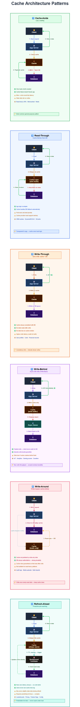

# Caching in System Design

---

## Table of Contents

1. [Caching Fundamentals](#01-caching-fundamentals)
2. [Local vs Distributed Cache](#02-local-vs-distributed-cache)
3. [Redis Basics](#03-redis-basics)
4. [Cache-Aside Pattern](#04-cache-aside-lazy-loading)
5. [Read-Through Pattern](#05-read-through-cache-pattern)
6. [Write-Through Pattern](#06-write-through-cache-pattern)
7. [Write-Behind Pattern](#07-write-behind-write-back-cache-pattern)
8. [Cache Eviction Policies](#08-cache-eviction-policies)
9. [Cache Invalidation](#09-cache-invalidation)
10. [Cache Penetration](#10-cache-penetration)
11. [Cache Stampede](#11-cache-stampede-thundering-herd)
12. [Multi-Tenant Caching](#12-multi-tenant-caching)
13. [Architect Quick Reference](#architect-quick-reference--decision-guides)

---

# 01. Caching Fundamentals

- Caching is the practice of storing copies of data in fast-access storage
- So future requests can be served faster — without going back to the original (slower) data source, typically a database.

---

## 1.1 Cache Hit vs Cache Miss

Every cache request results in one of two outcomes:

| Outcome        | What Happens                                          | Latency       | DB Impact    |
|----------------|-------------------------------------------------------|---------------|--------------|
| **Cache HIT**  | Data found in cache — returned immediately            | ~ 1 ms        | None         |
| **Cache MISS** | Data not found — query DB, then store result in cache | ~ 50 – 100 ms | One DB query |
| **Cold MISS**  | Cache is empty (after restart / first deploy)         | DB latency    | 100% DB load |

**Hit Rate** — The percentage of requests served from cache. 
- Target: **80–95%+**. A 95% hit rate means only 5 in 100 requests reach the database.

---

## 1.2 Cache Hierarchy (Multiple Layers)

Modern systems use layered caches. Each layer trades speed for capacity:

| Layer          | Location               | Latency     | Scope              | Example              |
|----------------|------------------------|-------------|--------------------|----------------------|
| Browser Cache  | User device            | 0 ms        | Single user        | Chrome cached images |
| CDN / Edge     | Edge servers near user | 10–50 ms    | Geographic region  | Cloudflare           |
| L1 Local Cache | Inside app process     | 0.1–1 ms    | Single server      | Caffeine             |
| L2 Distributed | Separate cache server  | 1–5 ms      | All servers shared | Redis                |
| DB Buffer Pool | Inside database        | 5–20 ms     | DB-level           | MySQL InnoDB Buffer  |
| CPU Cache      | CPU chip hardware      | Nanoseconds | Single core        | L1/L2/L3 CPU cache   |

---

## 1.3 Why Caching Matters — Business Impact

```
Without Cache:
  1000 req/sec → Each hits DB at 50ms → 50,000ms total DB load → Crash!

With Cache (95% hit rate):
  950 req hit cache (1ms each  = 950ms)
   50 req hit DB    (50ms each = 2,500ms)
  Total: 3,450ms vs 50,000ms = 14x improvement!

Cost Impact:    Less DB load → fewer DB servers → lower infrastructure cost
Scalability:    Horizontal scaling feasible without scaling DB proportionally
```

---

## 1.4 Cache Performance Metrics

| Metric        | Definition                   | Target           | Action if Bad                   |
|---------------|------------------------------|------------------|---------------------------------|
| Hit Rate      | % requests served from cache | > 80–95%         | Increase TTL or cache more data |
| Miss Rate     | % requests hitting the DB    | < 5–20%          | Review caching strategy         |
| Eviction Rate | Keys removed due to capacity | Low              | Increase cache size             |
| Cache Latency | Time to read/write cache     | < 1 ms           | Check Redis server load         |
| Memory Usage  | % of max memory used         | 70–80%           | Scale cache or tune TTLs        |
| Throughput    | Operations per second        | Redis: 100K+/sec | Check network / CPU             |

---

## 1.5 When to Cache and When NOT to Cache

### Good Candidates for Caching

- **Read-heavy data** — Product catalogs, user profiles, news feeds (reads >> writes)
- **Expensive computations** — ML predictions, complex reports, aggregation queries
- **Third-party API responses** — External APIs with rate limits or slow response (2–3 seconds)
- **Static/reference data** — Country/state lists, config settings, feature flags, currency rates
- **80/20 Rule** — 20% of data is accessed 80% of the time; cache that 20%

### Do NOT Cache These

- **Real-time data** — Live stock prices, live cricket scores (changes every second)
- **Write-heavy systems** — More writes than reads; cache becomes a liability
- **Strict consistency** — Bank balances, inventory counts (stale data causes real harm)
- **Sensitive PII/passwords** — Only cache if encrypted, with careful key management
- **Very large, rarely read** — Wastes expensive cache memory

---

## 1.6 Cache Architecture Patterns

| Pattern       | Who Loads Cache | Write Timing            | Consistency | Best For                   |
|---------------|-----------------|-------------------------|-------------|----------------------------|
| Cache-Aside   | Application     | On next read miss       | Eventual    | General read-heavy apps    |
| Read-Through  | Cache layer     | On miss (automatic)     | Eventual    | Simple apps, clean code    |
| Write-Through | Cache layer     | Synchronous with DB     | Strong      | Consistency-critical reads |
| Write-Behind  | Cache layer     | Async in background     | Eventual    | High write throughput      |
| Refresh-Ahead | Background job  | Proactive before expiry | Near-fresh  | Predictable hot data       |

---

# 02. Local vs Distributed Cache

One of the first architectural decisions when designing a caching layer is: 
- where does the cached data live? 
- The answer profoundly affects performance, consistency, scalability, and cost.

---

## 2.1 Local Cache (L1)

- Local cache stores data inside the application process memory. 
- Each server has its own independent copy. No network call needed — it is a direct memory read.

| Aspect       | Details                                            |
|--------------|----------------------------------------------------|
| Location     | Application heap memory (same JVM/process)         |
| Scope        | Only that one server — not shared                  |
| Latency      | 0.1–1 microsecond (sub-millisecond)                |
| Network      | None — direct memory access                        |
| Consistency  | Per-server — each server may have different values |
| Tools (Java) | Caffeine, Guava Cache, Ehcache                     |

### Advantages

- **Ultra-fast** — Sub-microsecond latency; 10–100x faster than distributed cache
- **Zero network overhead** — No serialization, no connection pooling, no network calls
- **High throughput** — Millions of reads/sec, limited only by CPU speed
- **No extra infrastructure** — Uses existing server RAM; completely free

### Disadvantages

- **Inconsistency** — Server A and Server B may have different values for the same key — dangerous in multi-server setups!
- **Limited memory** — Shares RAM with the application itself
- **Cold start every restart** — Cache empties on every deploy or server restart
- **Data duplication** — 3 servers = 3 copies of same data in memory — wasteful
- **Global invalidation is hard** — Deleting a key on one server does NOT delete it on others

---

## 2.2 Distributed Cache (L2)

- Distributed cache lives in a separate, dedicated server (Redis, Memcached) that all application instances connect to. 
- Every server sees the same data.

| Aspect      | Details                                             |
|-------------|-----------------------------------------------------|
| Location    | External server (Redis / Memcached)                 |
| Scope       | Shared across ALL application servers               |
| Latency     | 1–5 milliseconds (network round trip)               |
| Network     | Yes — TCP connection required                       |
| Consistency | Single source of truth — all servers see same value |
| Storage     | Gigabytes to Terabytes — scales independently       |

### Advantages

- **Consistency** — One server updates a key; ALL other servers immediately see it
- **Scalable storage** — Not limited to one server's RAM; can cache GBs of data
- **Survives restarts** — Redis persistence (AOF/RDB) means cache survives app restarts
- **Global invalidation** — Delete a key once; gone for ALL servers immediately
- **Rich features** — Redis supports sorted sets, pub/sub, distributed locks, streams

### Disadvantages

- **Network latency** — 1–5ms per call vs nanoseconds for local cache
- **Serialization overhead** — Objects must be serialized and deserialized on every call
- **Extra infrastructure** — Redis cluster to manage, monitor, and secure
- **SPOF risk** — If Redis goes down without replication/sentinel, all servers are affected

---

## 2.3 Comparison between L1 and L2 cache

| Aspect              | Local Cache (L1)         | Distributed Cache (L2) |
|---------------------|--------------------------|------------------------|
| Latency             | 0.1–1 microsecond        | 1–5 milliseconds       |
| Throughput          | Millions/sec             | 100K–1M/sec            |
| Network Required    | No                       | Yes                    |
| Consistency         | Per-server (can differ)  | Shared (all same)      |
| Memory Capacity     | Limited (MBs)            | Scalable (GBs)         |
| Cost                | Free (uses existing RAM) | Extra infra cost       |
| Global Invalidation | Hard (per-server only)   | Easy (delete once)     |
| Survives Restart    | No (empty on restart)    | Yes (with persistence) |
| Data Sharing        | No (isolated per server) | Yes                    |

**Summary:** 
- Local Cache wins on speed, simplicity, cost. 
- Distributed Cache wins on consistency, storage capacity, sharing.

---

## 2.4 Multi-Level Caching (L1 + L2)

Use both layers simultaneously. Check L1 first (ultra-fast), then L2 (shared), then database (slow).

```
Read Flow:
  Step 1: Check L1 (Local Cache)  →  HIT? Return immediately       (~0.1 ms)
        |
        |
  Step 2: Check L2 (Redis)        →  HIT? Save to L1 too, return   (~2 ms)
        |
        |
  Step 3: Query Database          →  Save to L2 AND L1, return     (~50 ms)

Target Hit Rates:
  L1:   70–80% of total traffic  (hottest data)
  L2:   15–25% of remaining traffic
  DB:   Only 1–5% of requests should reach the database
```

### The Invalidation Problem with Multi-Level Cache

Server A updates a key and clears its L1 + L2. But Servers B and C still have stale data in their local L1 cache.

**Solution: Redis Pub/Sub for L1 Invalidation**

```
Server A updates key "user:123":
  1. Update database
  2. Delete from own L1 cache
  3. Delete from Redis (L2)
  4. Publish message to Redis channel: "cache:invalidate" → "user:123"

Servers B and C (subscribed to "cache:invalidate"):
  → Receive the message automatically
  → Delete "user:123" from their own L1 cache
  → All servers are now consistent
```

---

## 2.5 Common Mistakes

- **No size limit on local cache** — Will cause OutOfMemoryError; always set `maxSize`
- **No fallback when Redis fails** — Cache failure must NEVER crash the app; always fall back to DB
- **No TTL on distributed keys** — Cache grows forever without TTL; always set expiry on every key
- **Slow serialization** — Avoid JSON for large objects in hot paths; use Protocol Buffers or MessagePack

---

# 03. Redis Basics

- Redis (Remote Dictionary Server) is an open-source, in-memory data structure store used as a cache, database, and message broker. 
- It is the most widely used distributed cache in production systems today.

---

## 3.1 Core Characteristics

| Property    | Details                                                      |
|-------------|--------------------------------------------------------------|
| Storage     | Primarily in-memory (with optional disk persistence)         |
| Performance | 100,000+ operations per second on a single node              |
| Latency     | Sub-millisecond for most operations                          |
| Data Model  | Key-Value, but values can be complex data structures         |
| Execution   | Single-threaded core — no locking needed for most operations |
| Persistence | Optional — RDB snapshots and/or AOF log                      |
| Replication | Primary-Replica with automatic failover via Sentinel         |
| Clustering  | Redis Cluster for horizontal sharding across nodes           |

---

## 3.2 Redis Data Structures — When to Use Each

| Type            | Use Case                                      | Example                         |
|-----------------|-----------------------------------------------|---------------------------------|
| **String**      | Simple cache values, counters, session tokens | Cache JSON blob, OTP storage    |
| **Hash**        | Object/record with multiple fields            | User profile (name, email, age) |
| **List**        | Queues, recent activity feeds (ordered)       | Recent 10 orders for user       |
| **Set**         | Unique items, membership checks               | Set of active session IDs       |
| **Sorted Set**  | Ranked lists, leaderboards                    | Top 10 products by sales rank   |
| **Bitmap**      | Compact boolean flags                         | User login streak tracking      |
| **HyperLogLog** | Approximate unique count (memory-efficient)   | Unique visitors per day         |
| **Stream**      | Append-only log, event streaming              | Audit logs, event sourcing      |

---

## 3.3 TTL (Time To Live) — Reference Guide

Every Redis key **must** have a TTL. Without TTL, keys accumulate forever and memory fills up.

| Data Type                     | Recommended TTL         | Reason                                |
|-------------------------------|-------------------------|---------------------------------------|
| OTP / Verification codes      | 5–10 minutes            | Security — expires before brute-force |
| User session tokens           | 15–30 minutes (sliding) | Security + memory hygiene             |
| Live scores / prices          | 10–30 seconds           | Data changes very fast                |
| User profiles                 | 1–6 hours               | Rarely changes                        |
| Product details               | 1–24 hours              | Infrequent updates                    |
| Reference data (country list) | 12–48 hours             | Almost never changes                  |
| Computed reports              | 15–60 minutes           | Expensive to compute                  |
| Feature flags / config        | 1–5 minutes             | Must propagate changes quickly        |
| Null / NOT FOUND results      | 60–300 seconds          | Short — data may be created later     |

---

## 3.4 Redis Persistence Options

| Option                 | How It Works                                   | Pros                      | Cons                         | Use When                                 |
|------------------------|------------------------------------------------|---------------------------|------------------------------|------------------------------------------|
| No Persistence         | Data lost on restart                           | Fastest                   | All data gone on restart     | Pure cache — losing cache is acceptable  |
| RDB (Snapshots)        | Periodic full dump to disk (e.g., every 5 min) | Small files, fast restart | Data loss between snapshots  | Can tolerate losing last few minutes     |
| AOF (Append-Only File) | Log every write — replay on restart            | Minimal data loss         | Larger files, slower restart | Must not lose individual writes          |
| RDB + AOF              | Both enabled simultaneously                    | Best durability           | Highest overhead             | Critical caches with strict requirements |

---

## 3.5 Redis High Availability Architectures

| Architecture     | How It Works                                         | Best For                             |
|------------------|------------------------------------------------------|--------------------------------------|
| Standalone       | Single Redis instance                                | Development, non-critical            |
| Primary-Replica  | One primary (writes) + replicas (reads)              | Read scaling, basic redundancy       |
| Sentinel         | Auto failover: promotes replica if primary fails     | High availability for single dataset |
| Redis Cluster    | Data sharded across 6+ nodes (3 primary + 3 replica) | Horizontal scale, large datasets     |
| Redis Enterprise | Managed with geo-replication, active-active          | Enterprise, multi-region             |

---

## 3.6 Redis Eviction Policies

When Redis reaches its `maxmemory` limit, it decides which keys to remove:

| Policy           | Behavior                                    | Recommended For                         |
|------------------|---------------------------------------------|-----------------------------------------|
| `noeviction`     | Return error when full — no eviction        | When data loss is unacceptable          |
| `allkeys-lru`    | Evict any key using LRU                     | **General-purpose cache (most common)** |
| `allkeys-lfu`    | Evict any key using LFU                     | Stable access patterns, CDN-style       |
| `volatile-lru`   | Evict only keys with TTL, using LRU         | Mix of cached and persistent data       |
| `volatile-ttl`   | Evict key with shortest remaining TTL first | When TTL correlates with priority       |
| `allkeys-random` | Evict random key                            | Rarely used — poor hit rate             |

> **Architect Recommendation:** Use `allkeys-lru` for pure cache workloads. Use `volatile-lru` when Redis also stores persistent data (sessions, etc.). **Always set `maxmemory`!**

---



---

# 04. Cache-Aside (Lazy Loading)

- Cache-Aside is the most widely used caching pattern.
- The application itself is fully responsible for managing the cache — checking it, populating it, and invalidating it.
- The cache sits "beside" the flow, not in it.

---

## 4.1 How It Works

### Read Flow

```
Step 1: Request arrives for "user:123"
Step 2: Application checks Redis

   → CACHE HIT:   Return data immediately  (~1 ms)  ✓

   → CACHE MISS:
Step 3: Application queries database  (~50 ms)
Step 4: Application stores result in Redis with TTL
Step 5: Return data to user  (~52 ms total on miss)
```

### Write Flow

```
Step 1: Update request arrives
Step 2: UPDATE the database  (DB is always source of truth)
Step 3: DELETE the cache key  (do NOT update — delete is safer, no race condition)
Step 4: Return success

Next read for this key: cache miss → fetches fresh data from DB → repopulates cache
```

> **Why DELETE instead of UPDATE ?** 
> - Avoids race conditions where a slow read thread writes a stale value AFTER a write thread has already invalidated the cache.

---

## 4.2 Advantages

- **Resilient to cache failure** — If Redis goes down, app still works by falling back to DB
- **Lazy loading** — Only data that is actually requested gets cached; memory-efficient
- **Fine control** — Application decides exactly what to cache, when, and for how long
- **DB is always source of truth** — No data integrity risk

---

## 4.3 Disadvantages & Solutions

| Problem              | Details                                                             | Solution                                            |
|----------------------|---------------------------------------------------------------------|-----------------------------------------------------|
| Cache miss penalty   | Miss = 3 ops: check cache + DB query + write cache (~52ms vs ~1ms)  | Accept it — warm cache on startup                   |
| Cold start           | After restart, all requests are misses — DB spikes                  | Cache warming: pre-load popular data before traffic |
| Stale data           | DB updated externally (admin tool) — cache has old value            | Short TTL + invalidate on write                     |
| Cache stampede       | 1000 requests hit same expired key simultaneously                   | TTL jitter + distributed locking                    |
| Write race condition | Read thread writes stale value after write thread invalidated cache | Shorter TTLs — eventual consistency                 |

---

## 4.4 Best Practices

### Always Set TTL with Jitter

```
TTL Guidelines by Data Type:
  Frequently changing (order status):      5–15 minutes
  Semi-static (user profile):              1–6 hours
  Rarely changing (product catalog):       12–24 hours
  Config / reference data (country list):  24–48 hours

Always add jitter:
  ttl = base_ttl + random(0, base_ttl * 0.1)
  Example: 3600 + random(0, 360) → expires between 3600 and 3960 seconds
  Prevents cache avalanche: keys expire at different times, not all at once
```

### Cache Null Results (Negative Caching)

If a user requests a non-existent product ID repeatedly, every request will miss cache and hit the DB. **Solution:** Cache the "not found" result with a short TTL (60–300 seconds).

```
if data found:
    cache.set(key, data, TTL=3600)        # Normal TTL
else:
    cache.set(key, "NOT_FOUND", TTL=60)   # SHORT TTL for nulls!
```

### Handle Cache Failures Gracefully

Cache is an enhancement, not a requirement. If Redis is unavailable, fall back to DB silently. **Never** let a cache failure crash the application — always wrap cache calls in try-catch.

### Use Consistent Key Naming

```
Pattern:   {entity}:{id}:{sub-resource}

Examples:
  user:12345:profile
  product:9876:details
  user:12345:orders:recent
  session:abc123

Benefits: Easy debugging, easy bulk invalidation ("user:12345:*"), clear ownership
```

---

## 4.5 Advanced Patterns

### Single-Flight (Request Coalescing)

When 100 concurrent requests miss the same key, only ONE should query the DB. The other 99 wait for the first result. This prevents stampede on cache miss.

```
function getData(key):
    data = cache.get(key)
    if data found: return data

    if acquire_lock(key, timeout=5s):
        try:
            data = cache.get(key)   # Double-check — another thread may have loaded it
            if data found: return data

            data = database.query(key)
            cache.set(key, data, TTL)
            return data
        finally:
            release_lock(key)
    else:
        sleep(100ms)
        return getData(key)   # Retry
```

### Bulk Loading

Instead of 100 separate cache.get() calls for 100 keys, use `cache.multiGet(ids)`. This reduces 100 network round trips to 1. Then query DB only for the missed keys in a single batch query.

---

## 4.6 When to Use Cache-Aside

| Use Cache-Aside When                     | Do NOT Use When                                 |
|------------------------------------------|-------------------------------------------------|
| Read-heavy workloads (reads >> writes)   | Strong consistency is required (financial data) |
| User profiles, product catalogs          | Very write-heavy workloads                      |
| Social media feeds (slight staleness OK) | Real-time data (live scores, stock prices)      |
| API rate limiting counters               | Very small datasets that fit in DB memory       |
| Configuration and feature flags          | Complex multi-entity transactions               |

---

# 05. Read-Through Cache Pattern

- In Read-Through, the cache layer itself handles loading data from the database on a miss. 
- The application only talks to the cache — it has no direct dependency on the database for reads.

---

## 5.1 Key Difference from Cache-Aside

| Pattern      | Who loads data from DB on cache miss? | App talks to DB?     | Code Complexity                 |
|--------------|---------------------------------------|----------------------|---------------------------------|
| Cache-Aside  | The Application                       | Yes (directly)       | Higher — logic in every service |
| Read-Through | The Cache layer                       | No (only cache does) | Lower — loader configured once  |

---

## 5.2 How It Works

```
CACHE HIT:
  App → cache.get("product:123") → cache returns data immediately  (~1 ms)

CACHE MISS:
  App → cache.get("product:456") → cache not found
  Cache → automatically queries the database  (app is just waiting)
  Cache → stores result with TTL
  Cache → returns data to app  (~52 ms)

KEY POINT: App never calls database directly. Cache handles everything.
```

---

## 5.3 Setup — Loader Function

Configure a "loader function" once at startup. The cache calls this function whenever there is a miss:

```java
// Java — Caffeine LoadingCache
productCache = Caffeine.newBuilder()
    .maximumSize(50000)
    .expireAfterWrite(2, TimeUnit.HOURS)
    .refreshAfterWrite(90, TimeUnit.MINUTES)   // Proactive refresh before expiry
    .build(sku -> productRepository.findBySku(sku));

// Usage everywhere — just one line:
Product product = productCache.get(sku);   // Cache handles miss automatically
```

**Popular Libraries Supporting Read-Through:**
- Java: Caffeine LoadingCache, Guava LoadingCache, Spring `@Cacheable`, Ehcache

---

## 5.4 Refresh-Ahead — Hot Keys Never Expire

```
Normal TTL (without refresh-ahead):
  T=0 min:   Data cached
  T=60 min:  TTL expires
  T=60 min:  Next user → cache MISS → user waits 50ms for DB query  (bad UX!)

With Refresh-Ahead (refreshAfterWrite = 50 min):
  T=0 min:   Data cached with TTL=60 min
  T=50 min:  Cache automatically refreshes in background (no user waiting!)
  T=60 min:  Fresh data already loaded → user gets instant cache HIT

Result: Popular keys NEVER expire for the user. Zero miss penalty on hot data.
```

---

## 5.5 Advantages & Disadvantages

**Advantages:**
- Clean application code — no cache boilerplate scattered everywhere
- Centralized loading logic — loader function written once, consistent behavior
- Transparent to DB — app does not know if data came from cache or DB
- Refresh-Ahead support — proactively refreshes popular keys before they expire

**Disadvantages:**
- Same miss penalty as Cache-Aside — first ever request still hits DB (~52ms)
- Cold start problem — after restart, first wave of requests hit DB
- Limited flexibility — only one global loader function; cannot vary logic per request
- Framework dependency — requires a caching library, not just raw Redis GET/SET

---

## 5.6 When to Use Read-Through

| Use Read-Through When                   | Avoid Read-Through When                 |
|-----------------------------------------|-----------------------------------------|
| Standard CRUD with simple loading logic | Custom per-request loading logic needed |
| Reference data (countries, categories)  | Data from multiple sources (JOIN logic) |
| Product catalogs, user profiles         | Different TTL logic per request context |
| Team wants cleaner, simpler code        | No caching framework available          |
| App config and feature flags            | Real-time or strict consistency data    |

---

# 06. Write-Through Cache Pattern

- In Write-Through, every write operation updates both the cache AND the database synchronously. 
- Success is returned only after both have been updated. 
- The cache always matches the database — no stale data ever.

---

## 6.1 How It Works

```
Write Flow:
  Step 1: App sends write request (e.g., update user name)
  Step 2: Cache layer receives request
  Step 3: Cache updates its own value  (~1 ms)
  Step 4: Cache writes to database and WAITS for DB confirmation  (~50 ms)
  Step 5: Both confirm success
  Step 6: Return "success" to application  (~51 ms total)

  CRITICAL: If EITHER step fails, the entire operation fails.
  If DB write fails → rollback the cache write → return error to app

Read Flow:
  Step 1: App requests data
  Step 2: Cache returns data immediately  (~1 ms)
  GUARANTEED: Cache always has the latest data — no staleness possible
```

---

## 6.2 Advantages & Disadvantages

**Advantages:**
- **Strong consistency** — Cache and database are ALWAYS in sync; zero stale data
- **Reads always fast** — Once written, data is in cache; next N reads all get instant hits
- **No invalidation logic** — No need to delete cache keys; you write to both simultaneously
- **Low data loss risk** — Synchronous DB write means data is always persisted immediately

**Disadvantages:**
- **Slower writes** — Must wait for both cache write AND DB write before returning success
- **Write amplification** — Every write touches cache even if that data is never read
- **Partial failure complexity** — Cache updated but DB fails? Must rollback cache
- **Not for write-heavy** — High write volume + dual-write = bottleneck

---

## 6.3 Handling Partial Failures (Critical for Production)

| Failure Scenario                     | Risk Level                                     | Recommended Action                               |
|--------------------------------------|------------------------------------------------|--------------------------------------------------|
| Cache write succeeds, DB write fails | **DANGEROUS** — cache has new data, DB has old | Rollback cache (delete the key) and return error |
| DB write succeeds, cache write fails | SAFE — DB has correct data                     | Log error, return success — TTL will fix cache   |
| Both fail                            | Safe                                           | Return error to client — no inconsistency        |
| Timeout mid-write                    | High risk                                      | Implement idempotent writes + retry logic        |

---

## 6.4 Decision Framework

```
Is workload is read-heavy (reads > writes)?
  YES → Is strong consistency required?
          YES → Use WRITE-THROUGH
          NO  → Use CACHE-ASIDE

  NO  → Is eventual consistency acceptable?
          YES → Use WRITE-BEHIND (fast async writes)
          NO  → Skip cache entirely, write directly to DB

Also consider:
  Write latency under 100ms acceptable?  → Write-Through is fine
  Write latency must be < 10ms?          → Use Write-Behind
  Complex multi-step transactions?        → Skip cache, use DB directly
```

---

## 6.5 When to Use Write-Through

| Use Write-Through When                      | Avoid Write-Through When                    |
|---------------------------------------------|---------------------------------------------|
| Read-heavy app with consistency requirement | Write-heavy system (analytics, logging)     |
| Financial data (balances, wallets)          | Data rarely read after write                |
| User sessions and shopping cart             | Bulk update operations (1000 items at once) |
| Product prices (must be immediately fresh)  | Very strict low-latency writes (< 10ms)     |
| App config / feature flags                  | Complex multi-entity transactions           |

---

# 07. Write-Behind (Write-Back) Cache Pattern

- In Write-Behind, writes go to the cache immediately and the application gets an instant success response. 
- The database is updated later, asynchronously by a background worker. 
- This prioritizes write speed over immediate durability.

---

## 7.1 How It Works

```
T=0 ms:    Client sends UPDATE product price
T=1 ms:    Cache layer updates cache immediately
T=2 ms:    Client receives SUCCESS response  (feels instant!)
T=2 ms:    Cache queues the DB write operation
T=100 ms:  Background worker picks up queued writes
T=550 ms:  Database is updated  (client has long moved on)

Client latency: 2ms  vs  Write-Through: 52ms  =  26x faster writes!
```

---

## 7.2 Write Coalescing

Multiple updates to the same key get merged: only the FINAL value is written to the database. This can reduce DB writes by 90%+ for frequently updated keys.

```
T=0s:   Update product:123 (price = 100)
T=1s:   Update product:123 (price = 150)
T=2s:   Update product:123 (price = 200)
T=5s:   Flush buffer → Only 1 DB write! (price = 200)

Result: 3 cache updates (fast) → 1 database write (only the latest value matters)
DB write reduction: 66% in this example, often 90%+ in real systems (e.g., view counters)
```

---

## 7.3 Trade-offs

| Aspect          | Write-Behind                 | Write-Through            | Cache-Aside           |
|-----------------|------------------------------|--------------------------|-----------------------|
| Write speed     | Sub-millisecond (best)       | 50–100ms (slower)        | Fast (DB only)        |
| DB write timing | Asynchronous (delayed)       | Synchronous (immediate)  | Synchronous (on miss) |
| Consistency     | Eventual                     | Strong                   | Eventual              |
| Data loss risk  | Yes (if cache crashes)       | No                       | Low                   |
| Complexity      | High                         | Medium                   | Low–Medium            |
| Best for        | Write-heavy, high throughput | Read-heavy + consistency | General purpose       |

---

## 7.4 Key Risks and Mitigations

| Risk                          | Consequence                             | Mitigation                                     |
|-------------------------------|-----------------------------------------|------------------------------------------------|
| Cache crashes before DB write | Permanent data loss                     | Enable Redis AOF persistence + replication     |
| Out-of-order writes           | Later update applied before earlier one | Attach version/timestamp to each write         |
| Queue fills up                | Out of memory, writes rejected          | Set max queue size, monitor depth, alert early |
| DB write fails repeatedly     | Silent data loss                        | Retry N times, then move to dead-letter queue  |
| Worker crashes mid-batch      | Partial writes to DB                    | Idempotent writes + checkpointing              |

---

## 7.5 Production Checklist for Write-Behind

```
☐  Enable Redis AOF persistence (appendfsync everysec) + RDB snapshots
☐  Set up Redis primary-replica replication for failover
☐  Implement dead-letter queue for failed DB writes (with alerts)
☐  Monitor queue depth, queue age, and write failure rate
☐  Graceful shutdown: drain queue before stopping worker
☐  Version/timestamp writes to prevent out-of-order application
☐  Test failure scenarios: cache crash, DB crash, queue full, worker crash
☐  Set maxmemory to prevent unbounded queue growth
```

---

## 7.6 When to Use Write-Behind

| Use Write-Behind When                 | Avoid Write-Behind When                       |
|---------------------------------------|-----------------------------------------------|
| Write throughput > 1000/sec           | Financial transactions (no data loss allowed) |
| Write latency must be < 10ms          | Medical records or legal/compliance data      |
| Analytics, logging, event tracking    | Strong consistency required across services   |
| Gaming leaderboards, like/view counts | Team lacks expertise to operate queues        |
| IoT sensor data streams               | Simple system — complexity not justified      |
| Flash sale / bursty write traffic     | Read-after-write consistency required         |

---

# 08. Cache Eviction Policies

- When cache memory is full, the eviction policy decides which keys to remove to make space for new ones. 

---

## 8.1 Policy Comparison

| Policy        | Eviction Rule                                           | Hit Rate | Memory Overhead | Best For                             |
|---------------|---------------------------------------------------------|----------|-----------------|--------------------------------------|
| **LRU**       | Remove least recently used (accessed longest ago)       | High     | Low-Medium      | **General purpose — default choice** |
| **LFU**       | Remove least frequently used (fewest total accesses)    | High     | Medium          | Stable access patterns, CDN          |
| **FIFO**      | Remove oldest inserted entry regardless of access       | Medium   | Very Low        | Log buffers, event queues            |
| **Random**    | Remove random entry                                     | Low      | Very Low        | Rarely used in practice              |
| **TTL-based** | Remove expired entries (time-based, not capacity-based) | N/A      | Low             | Always combine with LRU/LFU          |

---

## 8.2 LRU — Least Recently Used (The Default)

- Evicts the item that has not been accessed for the longest time.
- 
```
Cache state (left = oldest, right = newest):  [A, B, C, D, E]

Access B:   [A, C, D, E, B]   ← B moved to newest position
Add F:      [C, D, E, B, F]   ← A evicted (oldest, not accessed recently)
Access D:   [C, E, B, F, D]   ← D moved to newest position
Add G:      [E, B, F, D, G]   ← C evicted
```

- **Use LRU when:** General web applications, API caching, user sessions, database query cache
- **Watch out for:** One-time bulk scans evict hot data from LRU — switch to LFU if this happens

---

## 8.3 LFU — Least Frequently Used

- Evicts the item with the fewest total accesses over its lifetime.
- Protects truly popular data even if not accessed in the last few seconds.

```
Cache: [(A: 5 accesses), (B: 3), (C: 10), (D: 2), (E: 7)]

Access B:   [(A:5), (B:4), (C:10), (D:2), (E:7)]   ← B frequency incremented
Add F:      [(A:5), (B:4), (C:10), (F:1), (E:7)]   ← D evicted (lowest frequency: 2)
```

- **Use LFU when:** CDN-style caching, static assets, stable access patterns where popularity matters more than recency
- **Watch out for:** Old popular items that are no longer relevant may stay cached — frequency counters decay slowly

---

## 8.4 Redis Eviction Configuration

```
# Always set max memory limit (critical — prevents OOM crashes):
maxmemory 4gb

# Set eviction policy:
maxmemory-policy allkeys-lru    # recommended for pure cache

# Tune LRU sampling accuracy (higher = more accurate but slightly slower):
maxmemory-samples 5    # samples 5 random keys, evicts least recently used
                       # increase to 10 for more accuracy at slight CPU cost
```

---

## 8.5 How to Choose the Right Policy

| Scenario                                       | Recommended Policy                        |
|------------------------------------------------|-------------------------------------------|
| Pure cache — all keys are cache entries        | `allkeys-lru` (default choice)            |
| Access patterns stable over time (CDN, assets) | `allkeys-lfu`                             |
| Mix of cache + persistent data in Redis        | `volatile-lru` (only evict keys with TTL) |
| TTL represents data priority                   | `volatile-ttl` (evict shortest TTL first) |
| Data loss completely unacceptable              | `noeviction` (return errors when full)    |

---

## 8.6 Common Mistakes

- **Not setting maxmemory** — Cache grows until server OOM; always set `maxmemory` in Redis config
- **Using only TTL** — TTL handles freshness but not capacity; combine with LRU/LFU for both
- **Wrong policy for workload** — FIFO for a web app gives poor hit rates; match policy to access pattern
- **Not monitoring eviction rate** — High evictions/second = cache is too small; scale up or reduce TTL

---

# 09. Cache Invalidation

- Cache invalidation is the act of ensuring cached data does not lie. 
- The cache is a copy of truth (the database). The moment the original changes, the copy becomes potentially wrong.

---

## 9.1 Why Cache Invalidation Is Hard — The Four Root Causes

**1. Time & Ordering** — Updates and invalidations happen asynchronously; not always in the right order.

**2. Partial Failure** — Database and cache fail independently. DB can be updated but cache invalidation can fail silently.

**3. Hidden Relationships** — One data change affects multiple cached views:
```
User profile updated
  → user:profile:123     (must invalidate)
  → user:list:page:1     (must invalidate)
  → user:search:results  (must invalidate)
  → user:friends:feed    (must invalidate)

Miss even one → stale data in that view
```

**4. Distribution** — Multiple app servers have local L1 caches. Invalidation message must reach ALL of them, not just the one that made the change.

---

## 9.2 Invalidation Strategies

| Strategy             | Core Idea                                              | Key Trade-off                                       | Best For                               |
|----------------------|--------------------------------------------------------|-----------------------------------------------------|----------------------------------------|
| **TTL (Time-based)** | Let time fix the problem — data expires automatically  | Temporary staleness vs DB load                      | Safety net — always use as fallback    |
| **Delete-on-Change** | Remove cached copy the moment truth changes            | Must know all cache keys for this data              | Most common — use with Cache-Aside     |
| **Event-Based**      | DB change emits event → cache reacts and invalidates   | High coordination; missed event = silent corruption | Microservices, CDC with Kafka/Debezium |
| **Tag-Based**        | Group keys under tags; invalidate entire group at once | Over-invalidation — too much cleared                | One entity maps to many cache entries  |
| **Version-Based**    | Include version in key — old version keys are ignored  | Memory overhead — old keys linger until TTL         | Blue-green deploys, schema changes     |

---

## 9.3 Why DELETE is Safer Than UPDATE on Cache Write

```
UPDATING cache on write (dangerous — race condition):
  Thread A (READ):  1. Cache miss → 2. DB query (gets old value) ...
  Thread B (WRITE): 3. Update DB → 4. Update cache with new value
  Thread A:         5. Writes OLD value to cache  ← RACE CONDITION!
  Result: Cache now has stale data despite the write

DELETING cache on write (safe):
  Thread B (WRITE): 1. Update DB → 2. Delete cache key
  Thread A (READ):  3. Cache miss → 4. Fetches fresh value from DB → 5. Stores in cache
  Result: Always correct — next read gets the latest value from DB

Rule: On writes, always DELETE (invalidate) the cache key. NEVER UPDATE it.
```

---

## 9.4 Distributed Invalidation (Multi-Server)

When multiple app servers have local L1 caches, deleting a key on one server does not delete it on others.

```
Solution: Redis Pub/Sub for L1 Invalidation

Server A (writes "user:123"):
  1. Update database
  2. Delete from own L1 cache
  3. Delete from Redis (L2)
  4. Publish to Redis channel: "invalidate" → "user:123"

Servers B and C (subscribed to "invalidate" channel):
  → Receive the message automatically
  → Delete "user:123" from their local L1 cache
  → All servers are now consistent

Alternative: Use short L1 TTL (30–60 seconds) as safety net instead of pub/sub
Trade-off: Pub/sub = immediate consistency, Short TTL = simpler but briefly stale
```

---

## 9.5 Tag-Based Invalidation

When one database entity affects many cache keys, use tags to invalidate them all at once:

```
Cached entries tagged with "category:electronics":
  - products:list:category:electronics
  - products:count:category:electronics
  - products:featured:category:electronics

When category "electronics" is updated:
  → Invalidate tag "category:electronics"
  → All 3 keys deleted in one operation

Redis implementation: Use SCAN + prefix matching, or maintain a tag-to-keys mapping
```

---

## 9.6 Golden Rules of Cache Invalidation

1. Cache must **NEVER** be the source of truth — DB is always truth
2. TTL is **MANDATORY** — always set expiry; never leave keys without TTL
3. Deleting copies is **safer** than updating copies — always prefer DELETE over SET on write
4. Cache failures must **NEVER** break business logic — fallback to DB always
5. Distributed systems need **distributed signals** — pub/sub or short TTL for L1 caches
6. **Design for failure** — assume cache will lie, and ensure the system survives it

---

## 9.7 Strategy Selection Guide

```
Data changes rarely?                  → Long TTL only
Can you detect changes?
  NO  → Short TTL (safety net)
  YES → Strong consistency needed?
          YES → Event-based invalidation + short TTL fallback
          NO  → Delete-on-change + TTL

Complex data (one entity → many cache keys)?  → Tag-based or version-based
Microservices with CDC (Kafka/Debezium)?       → Event-based with message queue
```

---

# 10. Cache Penetration

- Cache penetration occurs when requests repeatedly query for data that does not exist anywhere — not in cache, not in the database. 
- Because it can never be cached, every request hits the database and cache provides zero protection.

---

## 10.1 Why It Is Dangerous

```
Normal cache flow (data exists):
  Request 1: Cache MISS → DB query → Store in cache
  Request 2: Cache HIT  → Return immediately  (DB protected!)
  Request 3: Cache HIT  → Return immediately  (DB protected!)

Cache Penetration (data does not exist):
  Request 1: Cache MISS → DB: NOT FOUND  (cannot cache "nothing")
  Request 2: Cache MISS → DB: NOT FOUND  (again!)
  Request 3: Cache MISS → DB: NOT FOUND  (again!)

At scale: 10,000 requests/sec of non-existent IDs = 10,000 DB queries/sec → Crash!
```

---

## 10.2 How Penetration Happens

- **Randomized attacks** — Attacker generates random IDs (user:99999999); cache never learns
- **Sequential scanning** — Bot scans sequential IDs, most of which do not exist
- **Accidental penetration** — Typos, stale bookmarks, broken clients
- **Business edge cases** — Searching for products that were removed from catalog

---

## 10.3 Defense Strategies

| Strategy             | How It Works                                                 | Protects Against                                | Limitation                                                |
|----------------------|--------------------------------------------------------------|-------------------------------------------------|-----------------------------------------------------------|
| **Negative Caching** | Cache "NOT FOUND" result with short TTL (60–300s)            | Repeated queries for same non-existent key      | Does not help with randomized attacks (new key each time) |
| **Bloom Filter**     | Pre-filter: "Does this key possibly exist?"                  | Random attacks — reject at edge, never touch DB | False positives (~1% say "maybe" when should say "no")    |
| **Input Validation** | Reject structurally invalid IDs (negative IDs, wrong format) | Format-based invalid requests                   | Does not catch valid-format non-existent IDs              |
| **Rate Limiting**    | Limit requests from single IP/user to N per second           | Attack traffic floods                           | Collateral damage — also limits legitimate users          |

---

## 10.4 Negative Caching Deep Dive

```python
def getData(key):
    cached = cache.get(key)

    if cached == "NOT_FOUND":
        return None   # Cache HIT for non-existent data (DB protected!)

    if cached:
        return cached

    data = database.query(key)

    if data:
        cache.set(key, data, TTL=3600)        # Normal TTL
    else:
        cache.set(key, "NOT_FOUND", TTL=60)   # SHORT TTL for nulls!

    return data

# IMPORTANT: Use SHORT TTL for null results (60–300s)
# Why? Data might be created later — don't cache "not found" for 24 hours
```

---

## 10.5 Bloom Filter Deep Dive

A Bloom filter is a memory-efficient probabilistic data structure that acts as a pre-filter before touching cache or database.

```
If Bloom Filter says "NO"  → Definitely does not exist. Reject immediately. Never touch DB.
If Bloom Filter says "YES" → Probably exists. Continue to cache/DB check.

FALSE NEGATIVES: Impossible (if it says "no", it is definitely "no")
FALSE POSITIVES: Possible (it might say "yes" for non-existent keys ~1% of the time)

Memory efficiency: Stores 1 billion entries in ~1.2GB (vs 20GB+ for a hash set)

Use Case: Load all valid product IDs into Bloom filter at startup.
           Any query for an ID not in the filter → immediately return 404,
           without touching cache or DB.
```

---

## 10.6 Layered Defense Architecture

```
Layer 1: Input Validation     → Reject format violations immediately  (cheapest)
Layer 2: Rate Limiting        → Limit to N requests/sec per user/IP
Layer 3: Bloom Filter         → Reject keys that definitely do not exist
Layer 4: Negative Caching     → Serve cached "NOT FOUND" for known non-existent keys
Layer 5: Database             → Only reached if ALL above layers pass

Each layer is cheaper than the next.
Most attacks are stopped at Layer 3 without touching cache or DB.
```

---

## 10.7 Penetration vs Related Problems

| Problem           | Data Exists?                      | Root Cause                     | Fix                              |
|-------------------|-----------------------------------|--------------------------------|----------------------------------|
| Cache Penetration | No — never existed                | Cannot cache non-existence     | Negative caching + Bloom filter  |
| Cache Stampede    | Yes — just expired                | Concurrent rebuild of same key | Single-flight + TTL jitter       |
| Cache Avalanche   | Yes — many expired simultaneously | Synchronized TTL expiration    | TTL jitter across all keys       |
| Cache Hot Key     | Yes — accessed too frequently     | Skewed access to single key    | Key replication + L1 local cache |

---

# 11. Cache Stampede (Thundering Herd)

- Cache stampede occurs when many requests simultaneously miss the same cache key and all attempt to rebuild it by querying the database at once. 
- One expired key can generate hundreds or thousands of concurrent DB queries.

---

## 11.1 The Core Problem

```
Step 1: Key "trending_products" cached with TTL = 3600s
Step 2: TTL expires at exactly 12:00:00.000
Step 3: 1,000 requests arrive at 12:00:00.001
Step 4: All 1,000 find CACHE MISS
Step 5: All 1,000 go to database simultaneously
Step 6: Database receives 1,000 identical complex queries
Step 7: DB saturates → response times spike → timeouts cascade
Step 8: Clients retry → 2,000 more requests → system collapse

KEY INSIGHT: 1 expired key = potentially infinite damage through retry amplification
```

---

## 11.2 Defense Strategies

| Strategy          | Core Idea                                              | Effectiveness                             | Complexity |
|-------------------|--------------------------------------------------------|-------------------------------------------|------------|
| **TTL Jitter**    | Add randomness to TTL — keys expire at different times | Prevents mass simultaneous expiry         | Very Low   |
| **Single-Flight** | Only 1 request rebuilds the key — rest wait for result | Eliminates concurrent DB calls completely | Medium     |
| **Refresh-Ahead** | Proactively refresh before expiry (background job)     | Users never experience a miss             | Medium     |
| **Never-Expire**  | Remove TTL — manage freshness explicitly               | Eliminates expiry as failure vector       | High       |
| **Rate Limiting** | Cap concurrent DB queries for same key                 | Limits damage, does not eliminate         | Low        |

---

## 11.3 TTL Jitter (Easiest Solution)

```
WITHOUT jitter (dangerous):
  All 10,000 product keys cached at deployment with TTL=3600
  → All 10,000 expire at the same second → STAMPEDE

WITH jitter (safe):
  ttl = 3600 + random(0, 360)   # 10% variance
  Each key gets a TTL between 3600 and 3960 seconds
  → Keys expire spread over 6 minutes → No stampede, just a smooth trickle

Rule: ALWAYS add jitter to TTL. No exceptions.
Best practice: jitter = base_ttl * 0.1   (10% randomness is usually enough)
```

---

## 11.4 Single-Flight Pattern (Best for Hot Keys)

```python
def getData(key):
    data = cache.get(key)
    if data:
        return data

    # Acquire distributed lock for this key
    if acquire_lock(key, timeout=5s):
        try:
            # Double-check: maybe another thread already loaded it
            data = cache.get(key)
            if data:
                return data

            data = database.query(key)
            cache.set(key, data, TTL)
            return data
        finally:
            release_lock(key)
    else:
        sleep(100ms)
        return getData(key)   # Retry — lock holder will have populated cache

# Benefit: Database gets exactly 1 query instead of 1000 for the same key
```

---

## 11.5 Refresh-Ahead (Zero Miss Experience)

```
Normal TTL expiration:
  T=0:    Key cached
  T=3600: Key expires → Next user waits for DB query  (bad UX!)

Refresh-Ahead:
  T=0:    Key cached with TTL=3600
  T=3000: Background worker detects TTL < 600 seconds remaining
  T=3000: Worker refreshes cache in background (no user waiting!)
  T=3600: TTL expires but cache already has fresh data — no miss!

Best for: Predictable hot data like dashboards, trending lists, config values
```

---

## 11.6 Stampede vs Avalanche vs Penetration

| Problem         | Data Exists? | Trigger                         | Scale of Impact         | Primary Fix                     |
|-----------------|--------------|---------------------------------|-------------------------|---------------------------------|
| **Stampede**    | Yes          | Single popular key expires      | Concentrated — one key  | Single-flight + TTL jitter      |
| **Avalanche**   | Yes (many)   | Many keys expire simultaneously | Broad — many keys       | TTL jitter across all keys      |
| **Penetration** | No           | Queries for non-existent data   | Grows with attack scale | Bloom filter + negative caching |

---

# 12. Multi-Tenant Caching

- In a multi-tenant system, a single application instance serves multiple customers (tenants). 
- The critical requirement: cached data from one tenant must **NEVER** be visible to another tenant.

---

## 12.1 The Golden Rule

> **Every single cache operation (read, write, delete, invalidate) must be TENANT-AWARE.**

```
Wrong:  cache.get("account:123")         → Which tenant's account 123?
Right:  cache.get("tenantA:account:123") → Unambiguous, isolated
```

A cache key without tenant context is a data leakage waiting to happen.

---

## 12.2 Strategy 1: Tenant-Aware Cache Keys (Most Common)

Include the tenant ID in every cache key. Simple to implement, works with any cache backend.

```
Format:   {tenantId}:{resourceType}:{resourceId}

Examples:
  bank_001:account:12345
  corp_xyz:user:profile:678
  tenant_a:products:list:page:1

Bulk invalidation for one tenant:
  SCAN cursor MATCH "tenant_a:*"   → get all keys for tenant A
  DEL all matched keys              → full tenant cache clear
```

- **Pros:** Simple, works with Redis/Caffeine/Memcached, easy per-tenant invalidation
- **Cons:** Logical isolation only; one noisy tenant can evict others via LRU

---

## 12.3 Strategy 2: Cache Namespace per Tenant

Provide each tenant a logical isolated namespace inside the cache:

- Redis: Use a separate DB index per tenant (e.g., `SELECT 1` for tenant A, `SELECT 2` for tenant B)
- Application-level: Inject tenant context into cache client wrapper that automatically namespaces all operations
- Better isolation than key prefixing — reduces risk of accidental cross-tenant access due to code bugs

---

## 12.4 Strategy 3: Dedicated Cache per Tenant

Each tenant gets their own Redis instance — maximum isolation, maximum cost.

| Aspect                 | Details                                                            |
|------------------------|--------------------------------------------------------------------|
| Isolation level        | Complete — no shared infrastructure at cache level                 |
| Data leakage risk      | Zero — completely separate instances                               |
| Cost                   | High — N tenants = N Redis clusters to manage                      |
| Operational complexity | Very high — monitoring, patching, scaling each separately          |
| Best for               | Large enterprise tenants, compliance requirements (HIPAA, PCI-DSS) |

---

## 12.5 Strategy 4: Hybrid Model (Recommended for SaaS)

- Small/medium tenants share a cache pool (with key prefixing). 
- Large/enterprise tenants get dedicated instances. 
- This is the most cost-effective architecture for SaaS platforms.

```
Tenant size < 1000 users       → Shared cache pool with tenant-aware keys
Tenant size 1000–10,000 users  → Dedicated namespace or Redis DB index
Tenant size > 10,000 users     → Dedicated Redis cluster
Enterprise with compliance     → Dedicated Redis + encryption at rest

Result: Small tenants get efficiency, large tenants get isolation.
This is how Salesforce, Shopify, and most SaaS platforms approach it.
```

---

## 12.6 Cache Fairness and Memory Control

In a shared cache, a single large tenant can fill the entire cache and evict all other tenants' data.

| Solution                | How It Works                                                             |
|-------------------------|--------------------------------------------------------------------------|
| Per-tenant quota        | Assign memory limits per tenant (e.g., Tenant A: 500MB, Tenant B: 100MB) |
| Tenant-aware eviction   | Custom eviction policy that considers tenant quota, not just global LRU  |
| Rate limit cache writes | Limit how many keys per second a tenant can write to cache               |
| Tiered limits by plan   | Free tier: 10MB, Pro: 500MB, Enterprise: unlimited                       |

---

## 12.7 Multi-Tenant Cache Invalidation

```
1. Prefix-based eviction:
   SCAN + DEL all keys matching "tenantA:*"
   Use case: Tenant offboarding, full tenant cache reset

2. Tenant versioning (best for schema changes):
   Key format: {tenantId}:v{version}:{resource}:{id}
   To invalidate all tenant A cache: increment version number
   Old keys auto-expire via TTL, new requests use new version

3. Event-based invalidation:
   Tenant data changes → emit event → invalidate specific keys for that tenant
   Use for real-time consistency requirements
```

---

## 12.8 Real-World FinTech Architecture Example

```
Tenant        = Bank
Data          = Account Statements
Key pattern   = {bankId}:{branchId}:statement:{accountId}:{period}
Example       = hdfc_001:mumbai:statement:ACC123456:2024-01

Eviction policy: volatile-lru (statements have TTL, auth tokens are persistent)
TTL:             15 minutes (statements refresh frequently)
Isolation:       Each bank gets dedicated Redis cluster (regulatory requirement)
Invalidation:    Bank updates account → delete specific statement keys
Compliance:      Cache contents encrypted at rest (tenant data isolation)
```

---

## 12.9 What NOT to Cache in Multi-Tenant Systems

- **Cross-tenant shared mutable data** — Never cache data shared across tenants without strict access control
- **PII without encryption** — If caching names, emails, phone numbers — ensure encryption at rest
- **Tenant metadata without versioning** — Tenant config that changes should use versioned keys
- **Auth tokens without tenant scope** — Always include tenant ID in session/auth token cache keys

---

# Architect Decision Guides

## Pattern Selection Matrix

| Requirement                             | Recommended Pattern                         |
|-----------------------------------------|---------------------------------------------|
| Read-heavy, slight staleness OK         | Cache-Aside with TTL jitter                 |
| Read-heavy, strong consistency needed   | Write-Through                               |
| Write-heavy, eventual consistency OK    | Write-Behind with persistence               |
| Simplest code, standard data loading    | Read-Through with loader function           |
| Very high write throughput (> 1000/sec) | Write-Behind with write coalescing          |
| Multiple services sharing data          | Distributed Cache (Redis)                   |
| Ultra-low latency reads (sub-ms)        | L1 Local Cache + L2 Redis                   |
| Multi-tenant isolation                  | Tenant-aware keys + hybrid dedicated/shared |
| Non-existent key attacks                | Bloom filter + negative caching             |
| Popular key expiry storm                | Single-flight + TTL jitter + refresh-ahead  |

---

## TTL Reference Guide

| Data Type                     | TTL         | Notes                             |
|-------------------------------|-------------|-----------------------------------|
| OTP / Verification codes      | 5–10 min    | Security critical — do not extend |
| Rate limit counters           | 1–60 min    | Matches rate limit window         |
| Live data (prices, scores)    | 10–30 sec   | Low TTL = near real-time          |
| User sessions                 | 15–30 min   | Sliding window, reset on activity |
| User profiles                 | 1–6 hours   | Add jitter: ±10%                  |
| Product details               | 2–24 hours  | Invalidate on update              |
| Reports / computed data       | 15–60 min   | Expensive to recompute            |
| Config / feature flags        | 1–5 min     | Fast propagation needed           |
| Reference data (country list) | 12–48 hours | Rarely changes                    |
| Null / NOT FOUND results      | 60–300 sec  | Short — data may be created later |

---

## Cache Problem → Solution Matrix

| Problem        | Symptom                                        | Solution                                                |
|----------------|------------------------------------------------|---------------------------------------------------------|
| Stampede       | DB spike when popular key expires              | TTL jitter + single-flight pattern                      |
| Penetration    | DB hammered by non-existent key queries        | Bloom filter + negative caching (TTL=60s)               |
| Avalanche      | Mass DB queries when many keys expire together | Random TTL jitter on ALL keys                           |
| Hot Key        | Single cache node overwhelmed                  | Replicate key to multiple nodes + L1 cache              |
| Stale Data     | Users see outdated information                 | Invalidate on write + shorter TTL                       |
| Cold Start     | All DB queries after restart                   | Cache warming: pre-load top items at startup            |
| Memory OOM     | Redis crashes out of memory                    | Set maxmemory + eviction policy + size limits           |
| Split Brain    | Different servers have different values        | Redis Pub/Sub L1 invalidation + short L1 TTL            |
| Tenant Leakage | Tenant A sees Tenant B data                    | Tenant ID in every key + dedicated cache for enterprise |

---

## Redis Production Checklist

```
☐  Set maxmemory limit              → maxmemory 8gb
☐  Set eviction policy              → maxmemory-policy allkeys-lru
☐  Enable AOF persistence           → appendfsync everysec
☐  Enable RDB snapshots             → save 900 1 / save 300 10
☐  Set up primary-replica           → min 1 replica for redundancy
☐  Configure Redis Sentinel         → automatic failover
☐  Secure access                    → bind address + requirepass + TLS
☐  Connection pool sizing           → appropriate max connections
☐  Better LRU accuracy             → maxmemory-samples 10
☐  Monitor hit rate                 → alert if < 80%
☐  Monitor eviction rate            → alert on sudden spikes
☐  Monitor memory usage             → alert if > 80%
☐  Monitor connected clients        → alert on connection count
☐  Test Redis failover              → what happens when Redis goes down?
☐  Every key has TTL                → no orphaned keys ever
```

---
