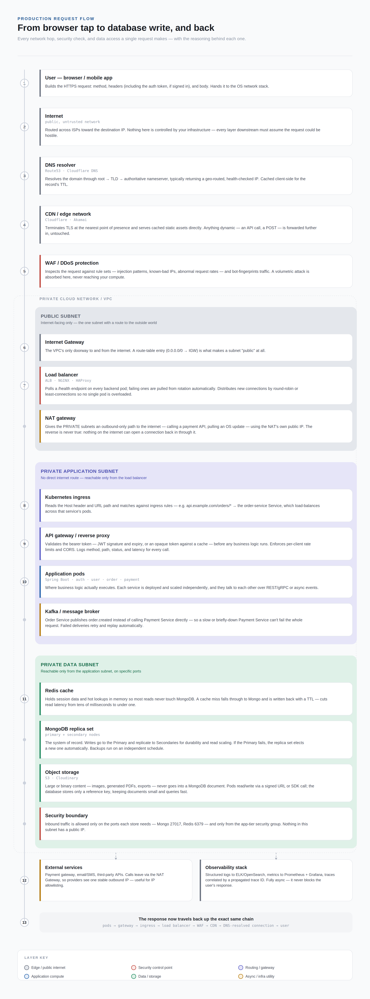

# Request Flow

A production request usually crosses several network and infrastructure layers before application code runs.

```text
Browser or mobile app
  -> DNS resolver
  -> CDN or edge network
  -> Load balancer
  -> Reverse proxy or API gateway
  -> Application service
  -> Cache/database/downstream service
  -> Response back to user
```



## Responsibilities

| Layer                     | Responsibility                             | Common Failure                                     |
|---------------------------|--------------------------------------------|----------------------------------------------------|
| DNS                       | Convert name to address or target          | Wrong record, stale cache, bad TTL                 |
| CDN                       | Cache and serve content near users         | Stale content, wrong cache key, origin unavailable |
| Load balancer             | Send traffic to healthy targets            | No healthy targets, bad health check               |
| Reverse proxy/API gateway | Route, authenticate, rate limit, transform | Bad route, `502`, `504`                            |
| Application               | Execute business logic                     | Bug, slow dependency, exception                    |
| Cache/database            | Store and retrieve data                    | Timeout, connection limit, failover                |

## Public API Example

```text
User
  -> Route 53
  -> CloudFront
  -> Application Load Balancer
  -> ECS service in private subnet
  -> RDS in private data subnet
```

## Internal Service Example

```text
Order service
  -> internal DNS/service discovery
  -> internal load balancer or Kubernetes Service
  -> Payment service
  -> Redis/PostgreSQL
```

Ask these in order:

1. Did DNS resolve to the expected target?
2. Did the request reach the CDN or edge layer?
3. Did the load balancer find a healthy backend?
4. Did firewall rules, security groups, or NACLs allow the traffic?
5. Did TLS terminate successfully?
6. Did the proxy route to the correct service?
7. Did the application time out while calling a dependency?
8. Did retries create duplicate work or extra load?