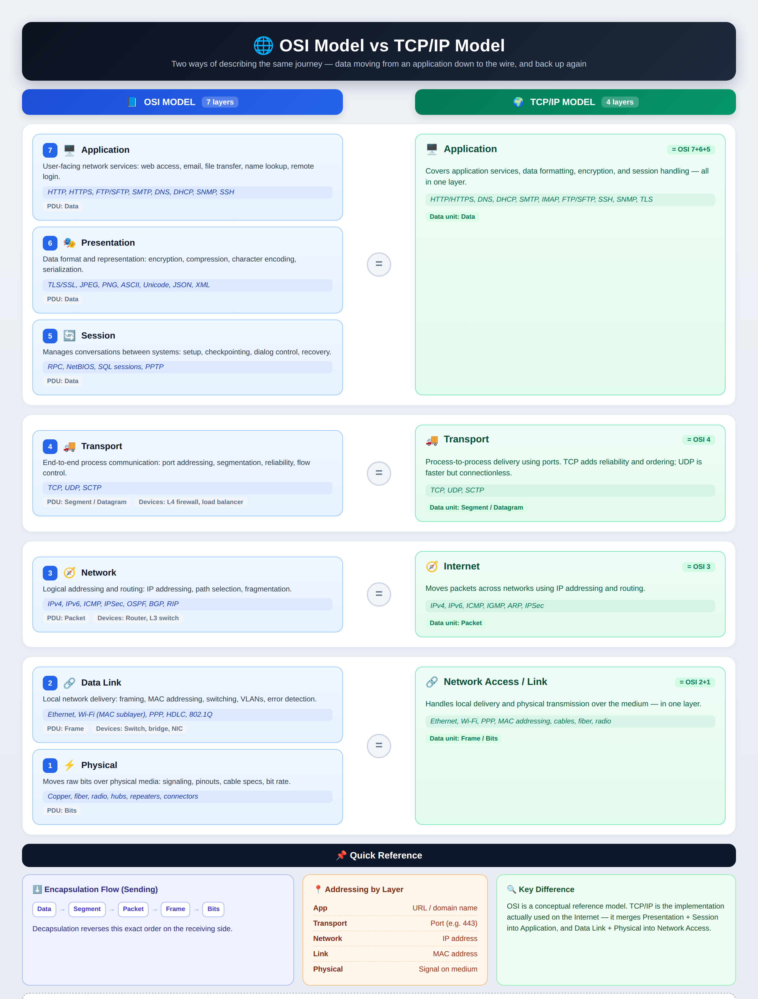

# Network Layers

Layer models help you separate networking concerns while debugging. They are maps, not implementation code.

The two useful models are:

- OSI model: good for learning and troubleshooting vocabulary.
- TCP/IP model: closer to how internet systems are usually discussed.



## OSI Model

| OSI Layer | Name         | Responsibility                                                | Examples                                      |
|-----------|--------------|---------------------------------------------------------------|-----------------------------------------------|
| 7         | Application  | Application-level protocols and messages                      | HTTP, DNS, SMTP, SSH                          |
| 6         | Presentation | Data format, encoding, compression, encryption representation | JSON, UTF-8, gzip, TLS concepts               |
| 5         | Session      | Start, maintain, and close sessions                           | Login session, WebSocket session, RPC session |
| 4         | Transport    | Process-to-process communication                              | TCP, UDP, QUIC, ports                         |
| 3         | Network      | Addressing and routing between networks                       | IP, ICMP, routers, route tables               |
| 2         | Data Link    | Local network delivery                                        | Ethernet, Wi-Fi, MAC addresses, switches      |
| 1         | Physical     | Physical transmission of bits                                 | Cable, fiber, radio, network card             |

Simple mental model:

```text
Layer 7: What application message is being sent?
Layer 4: Which process or port should receive it?
Layer 3: Which machine or network should receive it?
Layer 2: How does it move on the local network?
Layer 1: How do bits physically move?
```

## Backend Debugging by Layer

| Symptom                   | Likely Layer             | What to Check                                             |
|---------------------------|--------------------------|-----------------------------------------------------------|
| DNS name does not resolve | Application              | DNS record, resolver, hosted zone, TTL                    |
| No route to destination   | Network                  | Route table, subnet, VPC peering, Transit Gateway         |
| Connection timeout        | Network/Transport        | Security group, NACL, route, service listener             |
| Connection refused        | Transport                | Target process is not listening on that port              |
| TLS certificate error     | Presentation/Application | Certificate, hostname, trust chain, expiry                |
| HTTP `404`                | Application              | Path, route, API deployment, ingress rule                 |
| HTTP `502`                | Proxy/Application        | Bad upstream response, crashed backend, protocol mismatch |
| HTTP `504`                | Proxy/Application        | Upstream timeout, slow dependency, overloaded service     |

Most cloud debugging happens around:

- Layer 3: IPs, routes, subnets, NAT, VPC peering.
- Layer 4: TCP/UDP, ports, security groups, connection limits.
- Layer 7: DNS, HTTP, TLS, load balancer routing, application behavior.

## TCP/IP Model

| TCP/IP Layer   | Responsibility                         | OSI Mapping | Examples                            |
|----------------|----------------------------------------|-------------|-------------------------------------|
| Application    | Application protocols and data formats | OSI 7, 6, 5 | HTTP, DNS, TLS, SSH                 |
| Transport      | Process-to-process communication       | OSI 4       | TCP, UDP, QUIC                      |
| Internet       | IP addressing and routing              | OSI 3       | IP, ICMP, route tables              |
| Network Access | Local network and physical delivery    | OSI 2, 1    | Ethernet, Wi-Fi, network interfaces |

Example HTTPS request:

```text
Application:    HTTP request protected by TLS
Transport:      TCP connection to port 443
Internet:       IP packet routed to destination
Network Access: Local/cloud network delivers frames
```

## Encapsulation

Encapsulation means each layer wraps data from the layer above.

```text
HTTP data
  -> TLS record
  -> TCP segment
  -> IP packet
  -> Ethernet/Wi-Fi frame
  -> bits on the network
```

Different tools show different layers:

| Tool/Log           | What It Shows                                            |
|--------------------|----------------------------------------------------------|
| Application logs   | Method, path, status code, user ID, request ID           |
| Load balancer logs | Client IP, target IP, status, latency, target status     |
| VPC Flow Logs      | Source IP, destination IP, port, protocol, accept/reject |
| Packet capture     | Packets, flags, retransmissions, connection behavior     |
