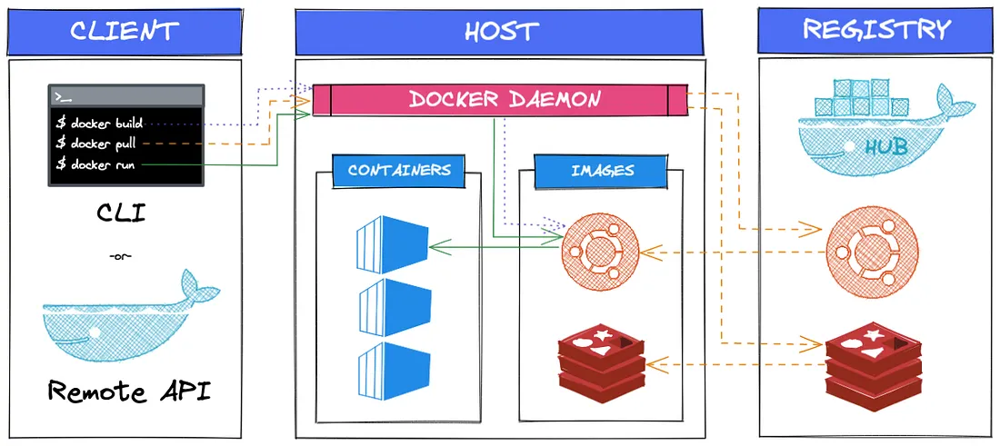

# Docker Fundamentals

## 1. What is Docker?

- Docker is a containerization platform that packages applications and their dependencies into a standardized unit called a **container**. 
- It ensures consistency across different environments
---

## 2. Why do Developers use Docker?

* **Environment consistency** – dev, test, and prod run identically
* **Dependency encapsulation** – JDK, libraries, and runtime are bundled inside the container; no system-level conflicts
* **Lightweight & efficient** – containers share the host OS kernel (unlike VMs); faster startup times and lower resource usage
* **Simplified deployment** – build once, deploy anywhere; same image works across local machines, cloud, on-premises
* **Microservices-friendly** – isolate each service in its own container with independent scaling and updates
* **CI/CD automation** – containerized builds are reproducible and automatable

---

## 3. Docker Concepts

### Image

* **Blueprint** of application with all dependencies, code, runtime, and configuration
* **Built once, reused many times** – create the image once, run it in multiple containers
* **Read-only** – images don't change; containers create a writable layer on top
* Contains layered filesystems for efficient storage and reuse

### Container

* **Isolated running instance** of an image
* Lightweight and temporary; contains your actual application process
* Each container has its own filesystem, network interface, and process space
* Can be started, stopped, paused, and deleted without affecting other containers
* Multiple containers can run from the same image

### Dockerfile

* Plain text file containing instructions to build a Docker image
* Each instruction creates a new layer in the image
* Enables reproducible, version-controlled image builds

### Registry

* **Centralized repository** for storing and sharing Docker images
* Images can be versioned using tags (e.g., `myapp:v1.0`, `myapp:latest`)

### Volumes

* **Persistent storage mechanism** that exists outside the container's writable layer
* Data survives on container deletion and restarts
* **Three types**: named volumes (managed by Docker), bind mounts (host filesystem), tmpfs mounts (in-memory)
* Essential for databases, logs, and any data that shouldn't be lost

### Networks

* **Enable communication** between containers and external systems
* Container services automatically discover each other by name on the same network
* **Types**: bridge (default), host, overlay (swarm), macvlan
* Essential in microservices architectures where services need to communicate with each other

---

## 4. Architecture
- **High-level Architecture** →  
Docker’s higher level of architecture revolves around a client-server model, where the client interacts with the Docker daemon (server) to manage containers and related resources. 
- At its core, Docker consists of three key components: the client, the daemon, and images. 
- Client and daemon communicate using a REST API, over UNIX sockets or a network interface.



* **Docker Client** → is a command-line tool, API, or graphical interface that users interact with to issue commands and manage Docker resources. The client sends requests to the Docker daemon, which orchestrates the execution of those commands.
* **Docker Daemon** → also known as Docker Engine, is a background service and long-running process that runs on the host machine and actually does the work of running and managing both containers and container images. The Docker daemon is responsible for managing the lifecycle of containers and orchestrating their operations. It listens for requests from the Docker client, manages containers, and coordinates various Docker operations. The daemon interacts with the host operating system’s kernel and leverages kernel features and modules for containerization, networking, and storage.
* **Registry** → stores images
* **Objects** → images, containers, volumes, networks
---

## 5. Workflow

1. **Write `Dockerfile`** – define how to build application image
2. **Build image** – compile the image from Dockerfile
   ```bash
   docker build -t my-java-app .
   ```
3. **Test locally** – run and verify the container works as expected
   ```bash
   docker run -it my-java-app
   ```
4. **Push to registry** – upload your image to a registry for team/production use
   ```bash
   docker push registry.example.com/my-java-app:v1.0
   ```
5. **Deploy to production** – pull and run the same image anywhere

---

## 6. Docker Commands

**Image operations:**

```bash
docker build -t app-name .                # Build image from Dockerfile
docker images                             # List all images
docker pull <image>                       # Download image from registry
docker push <image>                       # Upload image to registry
docker rmi <image-id>                     # Delete image
```

**Container operations:**

```bash
docker run -d -p 8080:8080 app-name       # Run container in background, map port
docker run -it app-name /bin/bash         # Run container in interactive mode
docker ps                                 # List running containers
docker ps -a                              # List all containers (including stopped)
docker stop <container-id>                # Gracefully stop container
docker kill <container-id>                # Force stop container
docker rm <container-id>                  # Delete container
```

**Debugging & inspection:**

```bash
docker logs <container-id>                # View container output
docker logs -f <container-id>             # Follow live logs
docker exec -it <container-id> /bin/bash  # Execute command inside running container
docker inspect <container-id>             # Detailed container information
```

---

## 7. Dockerfile

**Instructions:**

* **`FROM`** – base image to build upon (e.g., `openjdk:17`, `ubuntu:22.04`); must be first instruction
* **`RUN`** – execute commands during build (install dependencies, compile, etc.); each RUN creates a layer
* **`COPY`** – copy files from host into the image
* **`ADD`** – like COPY but can also download from URLs and extract archives (use COPY when possible)
* **`WORKDIR`** – set working directory for subsequent instructions
* **`CMD`** – default command to run when container starts (can be overridden)
* **`ENTRYPOINT`** – configure container as executable; combined with CMD for flexibility
* **`EXPOSE`** – document which ports the app listens on (doesn't actually open ports)
* **`ENV`** – set environment variables inside the image
* **`ARG`** – build-time variables (not available at runtime)

---

## 8. Dockerfile Examples

**Simple single-stage build:**
```dockerfile
FROM openjdk:17-slim
WORKDIR /app
COPY target/app.jar app.jar
EXPOSE 8080
CMD ["java", "-jar", "app.jar"]
```

**Multi-stage build (best practice – reduces image size):**
```dockerfile
# Build stage
FROM maven:3.9-openjdk-17 AS builder
WORKDIR /build
COPY . .
RUN mvn clean package -DskipTests

# Runtime stage
FROM openjdk:17-slim
WORKDIR /app
COPY --from=builder /build/target/app.jar app.jar
EXPOSE 8080
CMD ["java", "-jar", "app.jar"]
```

**With additional optimization:**
```dockerfile
FROM openjdk:17-slim
WORKDIR /app

# Set environment
ENV JAVA_OPTS="-Xmx512m -Xms256m"

# Copy and run
COPY target/app.jar app.jar
EXPOSE 8080

# Use exec form for graceful shutdown
ENTRYPOINT ["java", "-jar", "app.jar"]
```

**Best practices in Dockerfiles:**
- Use specific base image versions (not `latest`)
- Prefer `-slim` or `-alpine` variants to reduce size
- Order instructions from least to most frequently changed (for layer caching)
- Use multi-stage builds to keep final images lean
- Minimize layers by combining RUN commands
- Use `.dockerignore` to exclude unnecessary files

---

## 9. Docker Compose & Multi-Container Applications

**What is Docker Compose?**
- Defines and runs multiple containers as a single service
- Uses YAML configuration files (`docker-compose.yml`)
- Ideal for microservices: app + database + cache + message queue

**Basic docker-compose.yml:**
```yaml
version: '3.8'
services:
  app:
    build: .
    ports:
      - "8080:8080"
    environment:
      - SPRING_DATASOURCE_URL=jdbc:mysql://db:3306/mydb
      - REDIS_HOST=redis
    depends_on:
      - db
      - redis
    networks:
      - app-network

  db:
    image: mysql:8.0
    environment:
      - MYSQL_ROOT_PASSWORD=root
      - MYSQL_DATABASE=mydb
    volumes:
      - db-data:/var/lib/mysql
    networks:
      - app-network

  redis:
    image: redis:7-alpine
    ports:
      - "6379:6379"
    networks:
      - app-network

volumes:
  db-data:

networks:
  app-network:
    driver: bridge
```

**Key commands:**
```bash
docker-compose up                    # Start all services
docker-compose up -d                 # Start in background
docker-compose down                  # Stop and remove containers
docker-compose logs -f app           # Follow app logs
docker-compose ps                    # List running services
docker-compose exec app bash         # Execute command in service
```

**Service discovery in Compose:**
- Services can communicate by hostname (e.g., `redis`, `db`)
- Automatic DNS resolution within the network
- Port 3306 is accessible as `db:3306` from app service

---

## 10. Container Resource Management & JVM Tuning

**Critical for Java applications to prevent OOMKill**

**Memory limits:**
```bash
docker run -m 1g -e JAVA_OPTS="-Xmx768m -Xms256m" my-java-app
```

**Docker Compose resource limits:**
```yaml
services:
  app:
    image: my-java-app
    deploy:
      resources:
        limits:
          cpus: '2'
          memory: 1G
        reservations:
          cpus: '1'
          memory: 512M
```

**JVM Configuration in Containers:**
- Container memory limit should be **larger** than JVM heap (for GC, native memory, threads)
- Formula: `Xmx` ≤ (container limit - 25%)
- Example: For 1GB container → `Xmx=768m`

**Memory Flags for Containers:**
```dockerfile
ENV JAVA_OPTS="-Xmx512m -Xms256m \
  -XX:MaxRAMPercentage=75.0 \
  -XX:+UseStringDeduplication \
  -XX:+UseG1GC"
```

**Monitoring resource usage:**
```bash
docker stats <container-id>          # Real-time CPU, memory, network usage
docker inspect <container-id>        # Detailed container info
```

---

## 11. Health Checks & Readiness/Liveness Probes

**Docker HEALTHCHECK instruction:**
```dockerfile
FROM openjdk:17-slim
WORKDIR /app
COPY target/app.jar app.jar
EXPOSE 8080

# Health check every 30s, timeout 5s, fail after 3 retries
HEALTHCHECK --interval=30s --timeout=5s --retries=3 \
  CMD curl -f http://localhost:8080/actuator/health || exit 1

ENTRYPOINT ["java", "-jar", "app.jar"]
```

**Spring Boot Actuator Integration:**
```yaml
# application.yml
management:
  endpoints:
    web:
      exposure:
        include: health,ready,live
  endpoint:
    health:
      show-details: always
  health:
    livenessState:
      enabled: true
    readinessState:
      enabled: true
```

**Docker Compose with health checks:**
```yaml
services:
  app:
    build: .
    healthcheck:
      test: ["CMD", "curl", "-f", "http://localhost:8080/actuator/health"]
      interval: 30s
      timeout: 5s
      retries: 3
      start_period: 40s
    depends_on:
      db:
        condition: service_healthy
  
  db:
    image: mysql:8.0
    healthcheck:
      test: ["CMD", "mysqladmin", "ping", "-h", "localhost"]
      interval: 10s
      timeout: 5s
      retries: 5
```

**Kubernetes Readiness/Liveness:**
- Docker health checks prepare you for K8s probes
- Readiness: Is the service ready to accept traffic?
- Liveness: Is the service still running?

---

## 12. Networking & Debugging

**Network Types:**
- **bridge** (default): Each container on isolated network, NAT to host
- **host**: Container shares host's network stack (no isolation)
- **overlay**: Multi-host networking (Docker Swarm, Kubernetes)
- **macvlan**: Assign MAC address to container (legacy)

**Port mapping nuances:**
```bash
# Publish port
docker run -p 8080:8080 app         # Host:Container
docker run -p 127.0.0.1:8080:8080 app  # Bind to localhost only

# Host network mode
docker run --network host app       # No port mapping needed, port conflicts possible
```

**Debugging network issues:**
```bash
# Enter container and test connectivity
docker exec -it <container> /bin/bash
  curl http://redis:6379/          # Service discovery
  ping db                            # Check DNS resolution
  netstat -tlnp                      # Open ports
  
# Inspect network
docker network ls
docker network inspect bridge
docker network inspect <network-name>

# Log DNS queries
docker run --dns-search=example.com my-app
```

**Docker Compose network behavior:**
- All services automatically on same network
- Service name resolves to container IP
- No need for explicit port mapping between services

---

## 13. Logging & Observability

**Container logging basics:**
```bash
docker logs <container>              # View logs
docker logs -f <container>           # Follow logs (tail -f)
docker logs --tail 100 <container>   # Last 100 lines
docker logs -t <container>           # Include timestamps
```

**Docker log drivers (docker-compose.yml):**
```yaml
services:
  app:
    build: .
    logging:
      driver: "splunk"
      options:
        splunk-token: "${SPLUNK_TOKEN}"
        splunk-url: "https://your-splunk:8088"
        splunk-insecureskipverify: "true"
```

**Common log drivers:**
- `json-file`: Default, local JSON files
- `splunk`: Send to Splunk
- `awslogs`: CloudWatch Logs
- `stackdriver`: Google Cloud Logging
- `syslog`: System logging

**Spring Boot Logging Configuration:**
```dockerfile
FROM openjdk:17-slim
WORKDIR /app
COPY target/app.jar app.jar
COPY logback-spring.xml /app/

ENV JAVA_OPTS="-Dlogging.config=/app/logback-spring.xml"
ENTRYPOINT ["java", "-jar", "app.jar"]
```

**logback-spring.xml for containers:**
```xml
<?xml version="1.0" encoding="UTF-8"?>
<configuration>
  <appender name="STDOUT" class="ch.qos.logback.core.ConsoleAppender">
    <encoder>
      <pattern>%d{ISO8601} [%thread] %-5level %logger{36} - %msg%n</pattern>
    </encoder>
  </appender>
  
  <root level="INFO">
    <appender-ref ref="STDOUT"/>
  </root>
</configuration>
```

**Log aggregation stack (ELK):**
```yaml
services:
  app:
    build: .
    logging:
      driver: "splunk"

  elasticsearch:
    image: docker.elastic.co/elasticsearch/elasticsearch:8.0.0
    environment:
      - discovery.type=single-node

  kibana:
    image: docker.elastic.co/kibana/kibana:8.0.0
    ports:
      - "5601:5601"
```

---

## 14. Security Best Practices

**Run as non-root user:**
```dockerfile
FROM openjdk:17-slim
RUN groupadd -r appuser && useradd -r -g appuser appuser
WORKDIR /app
COPY target/app.jar app.jar
RUN chown -R appuser:appuser /app
USER appuser
EXPOSE 8080
ENTRYPOINT ["java", "-jar", "app.jar"]
```

**Secret management:**
```bash
# Use environment files (NOT SECURE for production)
docker run --env-file .env app

# Docker secrets (Swarm mode)
echo "db-password" | docker secret create db-password -
```

**Image scanning for vulnerabilities:**
```bash
docker scan my-java-app:latest       # Requires Docker Desktop
```

**In docker-compose.yml:**
```yaml
services:
  app:
    build: .
    # Don't run as root
    user: "1000:1000"
    # Read-only filesystem
    read_only: true
    # Limit capabilities
    cap_drop:
      - ALL
    cap_add:
      - NET_BIND_SERVICE
    # No new privileges
    security_opt:
      - no-new-privileges:true
```

**Network security:**
```yaml
networks:
  internal:
    internal: true     # No external access
  public:
    internal: false    # Can access external networks

services:
  app:
    networks:
      - public
  db:
    networks:
      - internal       # Only accessible from internal network
```

---

## 15. Image Optimization & Layer Caching

**.dockerignore file:**
```
.git
.gitignore
node_modules
.env
.DS_Store
*.log
build/
dist/
target/
.mvn/
.gradle/
*.jar
.idea/
.vscode/
```

**Build context optimization:**
- Reduce files sent to Docker daemon
- Decreases build time
- Example: `.dockerignore` can reduce context from 500MB to 50MB

**Layer caching mechanics:**
```dockerfile
# INEFFICIENT: Single RUN creates one layer, invalidates cache if code changes
FROM openjdk:17-slim
COPY . .
RUN mvn clean package

# EFFICIENT: Separate dependency and build layers
FROM maven:3.9-openjdk-17 AS builder
COPY pom.xml .
RUN mvn dependency:go-offline      # Cache dependencies separately

COPY src ./src
RUN mvn clean package               # Only rebuild when src changes

FROM openjdk:17-slim
COPY --from=builder /build/target/app.jar app.jar
ENTRYPOINT ["java", "-jar", "app.jar"]
```

**BuildKit (faster builds):**
```bash
# Enable BuildKit
export DOCKER_BUILDKIT=1

# Use in docker-compose
export COMPOSE_DOCKER_CLI_BUILD=1
export DOCKER_BUILDKIT=1
docker-compose build

# BuildKit features:
# - Parallel stage builds
# - Better caching
# - Secrets handling during build
```

---

## 16. Debugging & Troubleshooting

**Common debugging techniques:**
```bash
# Interactive debugging
docker run -it my-java-app /bin/bash

# Run specific command
docker exec -it <container> jps     # List Java processes
docker exec -it <container> jstat -gc <pid>  # GC stats

# Copy files from container
docker cp <container>:/app/logs/app.log ./
```

**Memory debugging:**
```bash
# Check memory stats
docker stats <container>

# Monitor GC in real-time
docker exec -it <container> \
  jstat -gc -h5 <pid> 1000          # GC stats every 1s

# Heap dump
docker exec -it <container> \
  jcmd <pid> GC.heap_dump /tmp/heap.bin
docker cp <container>:/tmp/heap.bin ./
```

**Port binding issues:**
```bash
# Check if port is in use
docker ps --all | grep :8080

# List all port mappings
docker inspect <container> | grep -A 5 PortBindings
```

**Volume mounting issues:**
```bash
# Check volume mounts
docker inspect <container> | grep -A 10 Mounts

# Verify file permissions
docker exec -it <container> ls -la /app
```

---

## 17. CI/CD Integration with Docker

**GitHub Actions example:**
```yaml
name: Build and Push Docker Image

on:
  push:
    branches: [main]

jobs:
  build:
    runs-on: ubuntu-latest
    steps:
      - uses: actions/checkout@v3
      
      - name: Set up JDK 17
        uses: actions/setup-java@v3
        with:
          java-version: '17'
      
      - name: Build JAR
        run: mvn clean package -DskipTests
      
      - name: Build Docker image
        run: docker build -t my-registry/my-app:${{ github.sha }} .
      
      - name: Login to registry
        run: |
          echo "${{ secrets.REGISTRY_PASSWORD }}" | \
          docker login -u "${{ secrets.REGISTRY_USER }}" --password-stdin
      
      - name: Push image
        run: docker push my-registry/my-app:${{ github.sha }}
      
      - name: Tag as latest
        run: |
          docker tag my-registry/my-app:${{ github.sha }} my-registry/my-app:latest
          docker push my-registry/my-app:latest
```

**Private registry authentication:**
```bash
# Docker login
docker login my-registry.com
# Credentials saved in ~/.docker/config.json

# In CI/CD, create credentials file
echo '{"auths":{"my-registry.com":{"auth":"base64-encoded-user:pass"}}}' > \
  ~/.docker/config.json
```

**Image tagging strategies:**
```bash
# Semantic versioning
docker tag my-app:latest my-registry/my-app:v1.2.3
docker push my-registry/my-app:v1.2.3

# Git SHA (immutable reference)
docker tag my-app:latest my-registry/my-app:sha-abc123def
docker push my-registry/my-app:sha-abc123def

# Environment-based
docker tag my-app:latest my-registry/my-app:prod
docker tag my-app:latest my-registry/my-app:staging
```

---

## 18. Spring Boot + Docker Best Practices

**Spring Boot 2.3+ Layered JAR builds:**
```dockerfile
# Efficient multi-stage build leveraging Spring Boot layers
FROM maven:3.9-openjdk-17 AS builder
WORKDIR /build
COPY . .
RUN mvn clean package

# Extract layers
RUN java -Djarmode=layertools -jar /build/target/app.jar extract --destination /layers

# Runtime stage
FROM openjdk:17-slim
WORKDIR /app

# Copy layers in order (least to most frequently changed)
COPY --from=builder /layers/dependencies/ ./
COPY --from=builder /layers/spring-boot-loader/ ./
COPY --from=builder /layers/snapshot-dependencies/ ./
COPY --from=builder /layers/application/ ./

EXPOSE 8080
ENTRYPOINT ["java", "org.springframework.boot.loader.JarLauncher"]
```

**Spring profiles for Docker:**
```yaml
# application.yml
spring:
  profiles:
    active: production

---
# application-docker.yml
spring:
  config:
    import: configserver:${CONFIG_SERVER_URL:http://localhost:8888}
  datasource:
    url: jdbc:mysql://${DB_HOST:db}:3306/${DB_NAME:app}
    username: ${DB_USER:root}
    password: ${DB_PASSWORD:root}
  redis:
    host: ${REDIS_HOST:redis}
    port: ${REDIS_PORT:6379}

server:
  servlet:
    context-path: /api
```

**Dockerfile with Spring Boot profiles:**
```dockerfile
FROM openjdk:17-slim
WORKDIR /app
COPY target/app.jar app.jar

ENV SPRING_PROFILES_ACTIVE=docker
ENV JAVA_OPTS="-Xmx512m -Xms256m"

EXPOSE 8080
ENTRYPOINT ["java", "-jar", "app.jar"]
```

**Spring Boot Testcontainers for integration tests:**
```java
@DataJpaTest
@Testcontainers
class UserRepositoryTest {
    
    @Container
    static PostgreSQLContainer<?> postgres = 
        new PostgreSQLContainer<>("postgres:14")
            .withDatabaseName("testdb")
            .withUsername("user")
            .withPassword("pass");
    
    @Test
    void testFindUser() {
        // Database automatically starts/stops with tests
    }
}
```

**Graceful shutdown in Spring Boot containers:**
```yaml
# application.yml
server:
  shutdown: graceful
spring:
  lifecycle:
    timeout-per-shutdown-phase: 30s
```

```dockerfile
# Handle SIGTERM gracefully
FROM openjdk:17-slim
WORKDIR /app
COPY target/app.jar app.jar
EXPOSE 8080

# exec form allows container to receive signals
ENTRYPOINT ["java", "-jar", "app.jar"]
```

---

## 19. Docker Desktop vs. Docker Engine

| Aspect              | Docker Desktop                           | Docker Engine        |
|---------------------|------------------------------------------|----------------------|
| **Platform**        | macOS, Windows, Linux                    | Linux only           |
| **Networking**      | DNS forwarding, port mapping             | Direct Linux network |
| **Performance**     | Virtualization overhead (WSL2, HyperKit) | Native (on Linux)    |
| **Volume mounting** | Slower on macOS/Windows                  | Fast on Linux        |
| **Development**     | Great for local development              | Production-ready     |


## 20. Open Container Initiative (OCI)

It is Open and vendor-neutral standards for container formats and runtimes. It ensures that container 
technologies are portable, interoperable and not locked into a single vendor's ecosystem.


## 21. Virtual Machine vs Container

**What is a Virtual Machine (VM)?**
- A complete simulation of a physical computer with its own OS, kernel, and hardware
- Managed by a hypervisor (VMware, Hyper-V, KVM)
- Runs a full guest operating system independently

**What is a Container?**
- Lightweight process isolation running on a shared host OS kernel
- No full OS overhead; shares the host kernel binaries and libraries
- Contains only the application and its specific dependencies

**Key Differences:**

| Aspect               | Virtual Machine                | Container                           |
|----------------------|--------------------------------|-------------------------------------|
| **Size**             | 1-2GB+ (includes full OS)      | 10-100MB (just app + deps)          |
| **Startup time**     | Minutes                        | Milliseconds                        |
| **OS isolation**     | Complete separate OS           | Shared kernel isolation             |
| **Memory overhead**  | High (full OS + runtime)       | Low (only app + libraries)          |
| **Performance**      | 5-10% overhead from hypervisor | <1% overhead (near-native)          |
| **Portability**      | OS-specific; less portable     | Highly portable across environments |
| **Resource density** | 10-20 VMs per server           | 100-1000+ containers per server     |
| **Deployment speed** | Takes minutes to provision     | Seconds to deploy                   |
| **Use case**         | Full OS isolation, legacy apps | Microservices, cloud-native apps    |

**Architectural Comparison:**

```
Virtual Machine Architecture:
┌─────────────────┐
│   Application   │
├─────────────────┤
│  Guest OS       │  ← Complete OS overhead
├─────────────────┤
│  Hypervisor     │
├─────────────────┤
│  Host OS        │
├─────────────────┤
│  Hardware       │
└─────────────────┘

Container Architecture:
┌──────────┬──────────┬──────────┐
│   App1   │   App2   │   App3   │
├──────────┴──────────┴──────────┤
│   Docker / Container Runtime   │
├────────────────────────────────┤
│   Host OS (Shared Kernel)      │  ← No OS duplication
├────────────────────────────────┤
│   Hardware                     │
└────────────────────────────────┘
```

**Why Containers are More Efficient:**
- **No OS duplication**: VMs each run a full OS (Windows, Linux, etc.); containers share the host kernel
- **Faster boot**: VMs need to initialize entire OS; containers just start the application process
- **Smaller size**: A Linux VM is 2GB; a Docker image is often 100MB
- **Better density**: Run 100s of containers on hardware that fits 10-20 VMs

**When to Use VMs:**
- Running **multiple different operating systems** on one server
- Running **legacy applications** requiring specific OS versions
- Running **untrusted code** (complete OS isolation for security)
- **Compliance requirements** demand OS-level isolation
- Windows/.NET legacy apps not containerized

**When to Use Containers:**
- **Microservices architecture** – isolated services, independent scaling
- **Cloud-native applications** – leveraging container orchestration (Kubernetes)
- **Rapid deployment** – push updates in seconds
- **Development/testing** – reproducible environments locally and in CI/CD
- **Resource efficiency** – maximize utilization of host hardware
- **DevOps/platform engineering** – containerized pipelines and toolchains

**Hybrid Approach: VMs + Containers**

In production, containers typically run **inside VMs** for additional isolation:
```
┌──────────────────────────────────────┐
│      Kubernetes Cluster (VMs)        │
│  ┌────────────────────────────────┐  │
│  │       Node VM 1                │  │
│  │  ┌──┐ ┌──┐ ┌──┐ ┌──┐           │  │
│  │  │C1│ │C2│ │C3│ │C4│ ...       │  │
│  │  └──┘ └──┘ └──┘ └──┘           │  │
│  ├────────────────────────────────┤  │
│  │      Node VM 2                 │  │
│  │  ┌──┐ ┌──┐ ┌──┐ ┌──┐           │  │
│  │  │C5│ │C6│ │C7│ │C8│ ...       │  │
│  │  └──┘ └──┘ └──┘ └──┘           │  │
│  └────────────────────────────────┘  │
└──────────────────────────────────────┘
```

**Performance Overhead Comparison:**

Language latency overhead (relative to native):
- Native application: 0%
- Container (Docker): ~0.5-2%
- VM (Docker on VM): ~3-8%
- VM without Docker: ~5-10%
- Kubernetes pod on VM: ~2-5%

**Example: Resource Usage**

Running 10 web server instances:

**With VMs (10GB total):**
```
- 10 VMs × 1GB per VM (OS + runtime) = 10GB
- Additional hypervisor overhead = 2-3GB
- Total: ~13GB
```

**With Containers (500MB total):**
```
- 10 containers × 50MB each = 500MB
- Shared kernel and libraries
- Total: ~600MB including Docker
```

**Cost Implication:** 20x more efficient resource utilization with containers

**Security Isolation Comparison:**

| Level                       | VM    | Container |
|-----------------------------|-------|-----------|
| **Kernel isolation**        | Yes   | Shared    |
| **Filesystem isolation**    | Yes   | Yes       |
| **Network isolation**       | Yes   | Yes       |
| **PID namespace isolation** | Yes   | Yes       |
| **User capability drop**    | Yes   | Yes       |
| **Escape risk to host OS**  | Low   | Medium*   |

- Containers share kernel; 
- VM escape is harder. 
- For untrusted workloads, run containers inside VMs.

**Real-world Example: Spring Boot Application**

**VM Approach:**
- Bare metal or cloud VM (2GB+ RAM)
- Install JDK, OS packages
- Deploy application
- Startup: 30-60 seconds
- Resource per instance: 1-2GB

**Container Approach:**
```yaml
# docker-compose.yml
services:
  app:
    image: my-app:latest
    ports:
      - "8080:8080"
    memory: 256m              # Strict memory limit
    environment:
      - JAVA_OPTS=-Xmx200m
```
- Container image: 300MB (pulled once, cached)
- Startup: 2-5 seconds
- Resource per instance: 256MB
- 4x more app instances on same hardware

## Linux Concepts
### Namespaces

**What is a Namespace?**

A namespace is a Linux kernel feature that **partitions/isolates kernel resources** so that one set of processes sees one set of resources while another set of processes sees a different set of resources. This creates the illusion of a complete, isolated system within each container.

**How Docker Uses Namespaces:**

Docker leverages namespaces to provide **process isolation** and create the boundary between containers. Each container gets its own set of namespaces, ensuring complete isolation at the OS level.

**Types of Namespaces:**

| Namespace      | Purpose                 | What Gets Isolated                                          |
|----------------|-------------------------|-------------------------------------------------------------|
| **PID**        | Process isolation       | Process IDs and process hierarchy                           |
| **Network**    | Network isolation       | Network interfaces, routing tables, ports                   |
| **Filesystem** | Mount isolation         | Mount points and filesystem views                           |
| **User**       | User isolation          | User and group IDs (UID/GID)                                |
| **IPC**        | Communication isolation | Inter-process communication (message queues, shared memory) |
| **UTS**        | Hostname isolation      | Hostname and domain name                                    |
| **Cgroup**     | Resource isolation      | CPU, memory, I/O limits                                     |

**Example:**
- Container A has PID 1 for its main process
- Container B has PID 1 for its main process
- Both can coexist because they're in different PID namespaces
- From each container's perspective, it looks like a standalone system

**Why It Matters for Docker:**
Namespaces are the foundational technology that enables Docker containers to be **lightweight, isolated, and secure**—they share the host OS kernel but have completely separate views of system resources.
